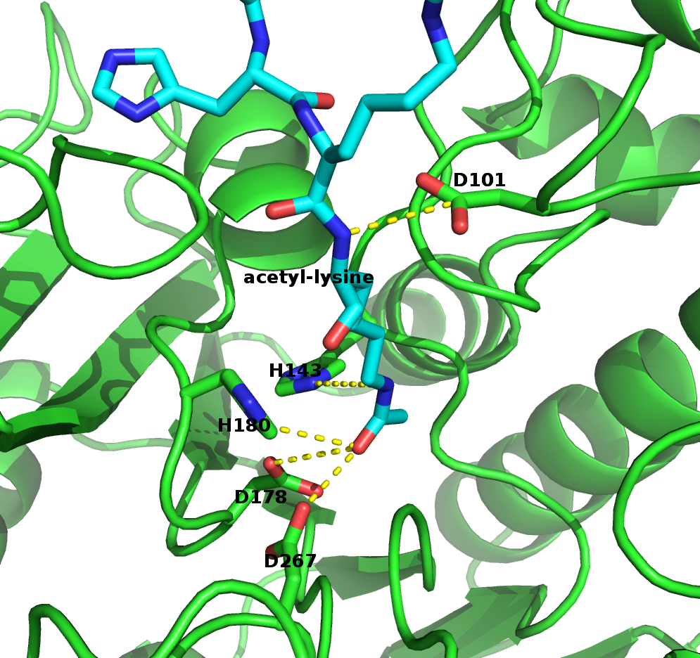

==============
Lior's Thesis
==============

Results
========

Description of the dataset
--------------------------

	The first step in training our classifier was obtaining a dataset of peptides that had their activity level with the respect to the HDAC8 enzyme verified experimentally. *Fierke et al* created a dataset composed of 361 6-mer peptides with the sequence GXK(Ac)YGC (where X,Y are all the amino acids except Cysteine). For each of these peptides, a level of activity with respect to HDAC8 was determined by measuring the percentage of deacetylation after 1 hour.(?) (**Add reference to the proper section in the supplementary material**)
	The dataset was divided to training and test sets by sorting the peptides by their activity , taking all the even rows to be the test set and all the odd rows to be the training set. That division assured even distribution of peptides with respect to their activity levels (avoiding a situation where one set holds a large number of high/low activity decoys).
	
Template selection
----------------------
	As we've previously discussed, our protocol models the interaction between a peptide and its corresponding receptor. FlexPepDock takes as input a three dimensional structure of the receptor and a low resolution approximation of the peptide. In our case, the receptor is HDAC8, its three dimensional structure was solved on numerous occasions and under different conditions in the last few years. In this study we tried to use multiple structures as our template, hoping that one of them will give an accurate complex with the peptidic substrates. Below is a table that summarizes the structures that were tested as templates for this study:

	======	=========	============================================================
	PDB ID	Reference	Description
	------	---------	------------------------------------------------------------
	2v5w	[1]_		HDAC8 in complex with a p53-derived diacetylated peptide 
				with a Y306F catalysis abolishing mutation
	3f07	[2]_		HDAC8 complexed with APHA
	3ew8	[3]_		HDAC8 solved as a monomer, with a 
				catalysis abolished mutation: D101L
	1t67	[4]_		HDAC8 complexed with hydroxamate inhibitor (MS-344), 
				residues 62-68 were discarded from the model
	======	=========	============================================================

	Choosing the right template is a formidable challenge - some structures were solved with inhibitors - a thing that could induce a different *bound* structure than the actual real substrates. Others were solved with mutations that abolished catalysis and/or binding. And most of all, most structures were solved as dimers that interacted with their highly flexible regions, creating crystal contacts and potential interactions that might have altered the specificity profile of the enzyme.

Preparation of starting structure
---------------------------------

	For each of the peptide sequences a coarse model of the complex was generated based on the selected template, that coarse model is the starting structure that serves as input to the FlexPepDock protocol. We tested 2 approaches to create the starting complex, one involved threading the peptide sequence onto the backbone configuration taken from solved structures, the other approach included the extension of peptide to a complete linear polypeptide (all phi angles were set to -135.0 degrees, all psi angles to +135.0 degrees) and superimposing only the acetylated Lysine onto a position taken from the crystal structure. 

	The *no free lunch* theorem suggests that all search algorithms have the same average performance over all problems, and thus implies that to gain in performance on a certain application one must use a specialized algorithm that includes some prior knowledge about that problem. In previous studies we found that incorporating key interactions between the peptide and the receptor as constraints in FlexPepDock's search algorithm greatly improves the performance of the resulting predictor. 

	Unlike previous studies, where the key interactions from which the constraints were derived relied heavily on backbone atoms, we found that the dominant interactions in our case are mostly concentrated around the acetylated Lysine. 

	**Figure 1:** The key interactions from which the constraints were derived, taken from a solved crystal complex (PDB: 2v5w).

		For example, the interaction between D101 in the receptor and the N atom in the acetylared Lysine is critically important, a mutation D101A resulted in a complete loss of enzyme activity on the peptidic substrate and also on purified histones. [1]_ Additional constraints were derived from the interaction between the acetyl group and the two His, Asp in the active site - mostly in the purpose of fixating the acetylated Lysine in the active site.

Calibration of the protocol
------------------------------
	Previous studies have shown that the calibration of a FlexPepBind protocol results in a more accurate predictor than one that created using a default set of parameters [citation]. The calibration process usually involves the selection of a template, adapting the scoring function[citation to bcl] and finding the right amount of sampling.  
	As we've previously discussed, there are several solved structures for HDAC8 each of them can be a potential template for our protocol. In addition, FlexPepDock uses several scoring schemas in addition to the generic scoring function used in Rosetta (*total score*) in the purpose of defining the relative binding energy of the peptide to the receptor;
	
	#) **Peptide score** - includes an estimation of the internal energy of the peptide
	#) **Interface score** - includes an estimation of the interactions across the interface
	#) **Reweighted score** - the sum of peptide score, interface score and total score.
	
	
	To select the most suitable template for our protocol we modeled each of the peptide sequences in the library with a HDAC8 template and evaluated the resulting complex based on each of the above scoring schemes. 

Whole data set analysis
--------------------------
	#) measures of success
	#) determination of cutoff
	#) statistical tests

Phosphosite database
------------------------

.. [1] Vannini A, Volpari C, Gallinari P, et al. Substrate binding to histone deacetylases as shown by the crystal structure of the HDAC8-substrate complex. EMBO Rep. 2007;8(9):879-84.
.. [2] Dowling DP, Gantt SL, Gattis SG, Fierke CA, Christianson DW. Structural studies of human histone deacetylase 8 and its site-specific variants complexed with substrate and inhibitors. Biochemistry. 2008;47(51):13554-63.
.. [3] Dowling DP, Gantt SL, Gattis SG, Fierke CA, Christianson DW. Structural studies of human histone deacetylase 8 and its site-specific variants complexed with substrate and inhibitors. Biochemistry. 2008;47(51):13554-63.
.. [4] Somoza JR, Skene RJ, Katz BA, et al. Structural snapshots of human HDAC8 provide insights into the class I histone deacetylases. Structure. 2004;12(7):1325-34.

.. footer::
	Page ###Page### of ###Total###
