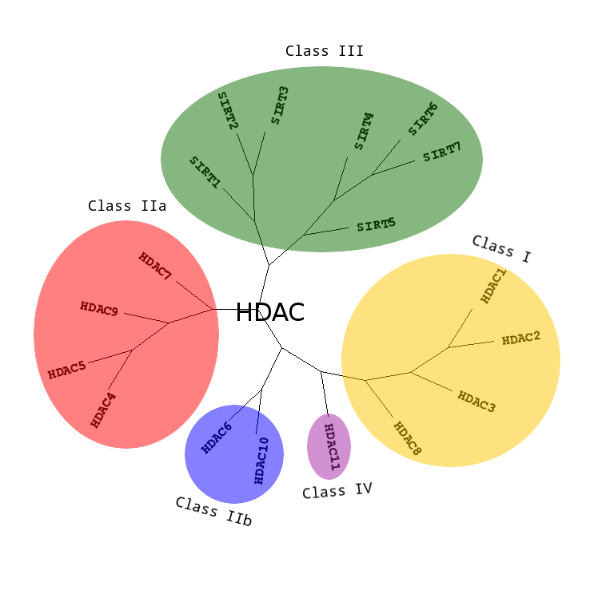
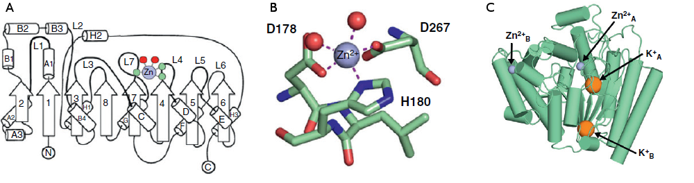
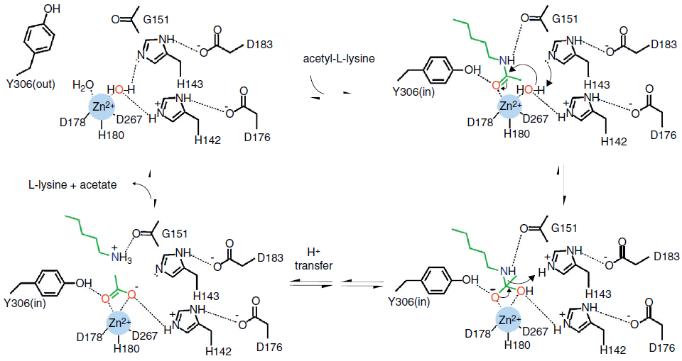
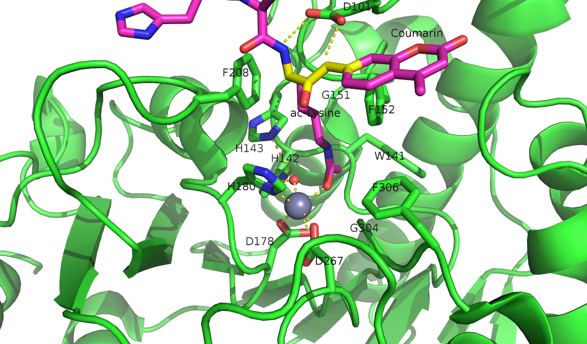
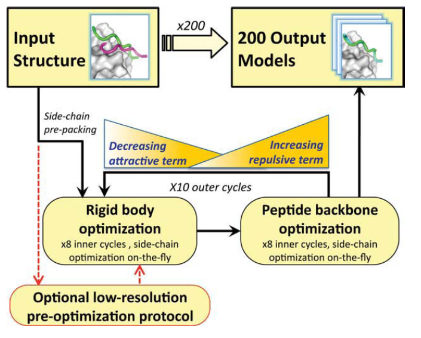
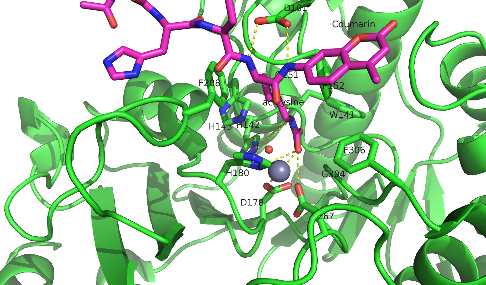
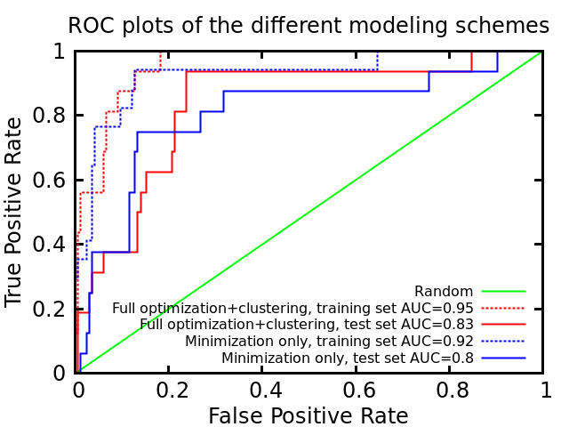
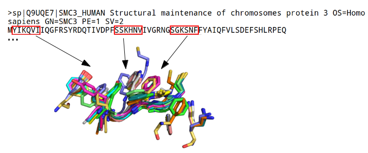
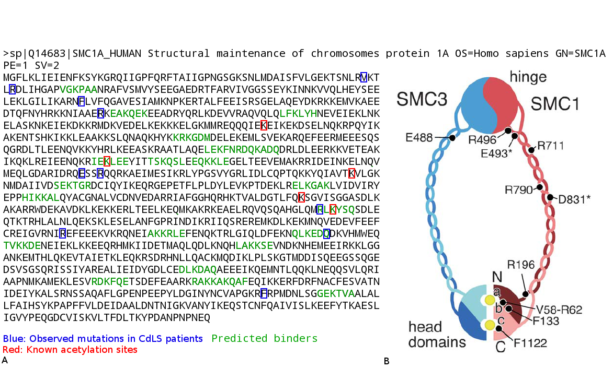
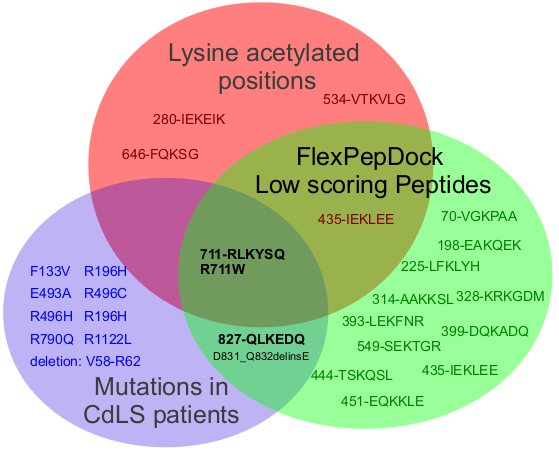

.. role:: ref

.. role:: label

.. raw::  latex

  \newcommand*{\docutilsroleref}{\ref}
  \newcommand*{\docutilsrolelabel}{\label}
  \newcommand*{\docutilsrolecaption}{\caption}
  
.. role:: raw-math(raw)
    :format: latex html

Introduction
=============

	Our study combines several disciplines, joined together to create a classifier that predicts new substrates for Histone Deacetylase 8 (HDAC8). First, we'll provide a brief introduction to HDAC8 and its biological significance. Then, we'll describe the computational framework used in this project. Finally, we'll review solutions and different approaches taken in similar studies.
	
Histone Deacetylase 8
----------------------
	
	Metal dependent Histone Deacetylases (HDACs) catalyze the hydrolysis of acetyl-L-lysine to acetate and L-lysine, a process that is commonly called *deacetylation*. This reaction is a basis to a magnificent number of regulatory processes and has been shown to be a prominent factor in a number of diseases [42]_ [23]_ . Histone deacetylases, as their name suggests are a class of enzymes that are responsible for the deacetylation of histone proteins, a process that typically alters the chromatin structure and leads to transcriptional repression; the hydrolysis of acetyl-lysine to lysine and acetate causes the histone tail to become positively charged, as the acetate ceases to mask the positive charge of lysine. This positively charged lysine contributes to the electrostatic interactions formed with the negatively charged DNA backbone, causing the DNA to wrap tighter around the histone and as a result become much less accessible to transcription factors and other proteins.
	
	HDAC8 is a key participant in a growing number of biological processes. As its name implies, HDAC8 is one of the regulatory components that enables the tight epigenetic control over the chromatin and was shown to regulate p53 levels [37]_ , participate in skull morphogenesis [38]_ and function as key factor in smooth muscle contractility [39]_ . HDAC8 was specifically found overexpressed above all other HDACs in neuroblastome [42]_  and various HDAC8 inhibitors were shown to induce apoptosis in Lymphoma cell lines [43]_ - findings that could imply that HDAC8 is involved in tumorigensis in some tissues.
	
	In recent years interesting evidence is accumulating, indicating that this is only the tip of the iceberg. Wilson *et al.* showed for the first time that HDAC8 together with Sirt-1 and p300 form an acetylation switch that modulates the transcriptional activity of Estrogen-Related receptor :raw-math:`$\alpha$` (ERR :raw-math:`$\alpha$`), but what's more intriguing is that HDAC8 was found to deacetylate ERR :raw-math:`$\alpha$` itself which is not a histone protein at all. Although it is known for quite some time that various HDACs have the ability to deacetylate non-histone substrates, particularly HDAC1 [40]_  [41]_ - this was the first time that HDAC8 was captured in such a mechanism. A recent study showed that HDAC8 also deacetylates SMC3 - a subunit of the cohesin complex that mediates sister chromatid cohesion. Failure to deacetylate this particular protein might cause CdLS (Cornelia de Lange syndrome) - a genetic disease whose patients suffer from retardation and overall deformity [63]_.
	
	HDAC1 was the first HDAC to be identified back in 1996 [27]_ and since then, 18 others were confirmed by various groups [citations]. These enzymes can be divided to 4 subclasses, I-IV, based on their evolutionary descent (see Figure :ref:`hdacphylo`). HDAC8 is unique among all the other HDACs - it possesses several features that make it a great model for studying the biological role of deacetylation. It is the only HDAC that is found as a single polypeptide *in vivo* [34]_ , the rest are found as high molecular weight multiprotein complexes. Furthermore, it is much easier to work with experimentally since most purified recombinant HDACs are enzymatically inactive [35]_. Therefore, we conclude that from a structural biology perspective, HDAC8 is the best model among mammalian HDACs.



	:label:`hdacphylo` A phylogenetic tree of currently known Histone deacetylases
	
	HDAC1,2,3 and 8 belong to class I, HDAC4,5,7 and 9 compose class IIa, HDAC6,10 belong to class IIb, an evolutionary distinct class that is made out of a family of enzymes called sirtuins compose class III, and HDAC11 is the only member of class IV.

..

	 HDACs have a well defined three-dimensional structure that is approximately similar. The central structural feature in all HDACs is the alpha-beta fold that is composed of 8 stranded parallel beta-sheets flanked by 11 alpha-helices, similar to the bacterial HDAC-like protein HDLP [33]_. Catalysis by HDACs and HDAC8 in particular requires a single transition metal ion. In HDAC8 this metal ion is located between the L4 and L7 loops, where conserved residues coordinate a single Zn\ :sup:`2+` ion that is a key participant in the catalytic mechanism. (see Figure :ref:`hdacfold`) [28]_ .
	 


	:label:`hdacfold` HDAC8 fold and metal binding
	
	**A:** HDAC8 exhibits a typical alpha/beta fold with a parallel beta sheet composed of 8 strands. **B:** Close up on the metal binding site (which is also a part of the active site) of HDAC8. **C:** A model of HDAC8 with K and Zn metal cofactor at their designated sites (Figure from [28]_). 

.. 

	  The basis of this catalytic mechanism, which is shared by all HDACs and other HDAC related enzymes such as some Arginases [29]_ , is a simple nucleophilic attack that is promoted by the active site transition metal and H143 that functions as a general base. The metal-bound water molecule attacks the metal coordinated C=O group of the acetylated lysine substrate (see Figure :ref:`catalyticmech`).



	:label:`catalyticmech` The catalytic mechanism of deacetylation.

	The catalytic mechanism of the reaction involves a simple water mediated nucleophilic attack. The nucleophilic lone electron pair on the metal-bound water molecule becomes available only upon proton abstraction. Christianson *et al.* suggest that the electron pair of the breaking O-H bond could add to the :raw-math:`$\pi^*$` orbital of the substrate carbonyl. [28]_ The oxyanion of the tetrahedral intermediate and its flanking transition states are stabilized by metal coordination as well as hydrogen bond interactions with Y306, H143, and H142. H143 serves as a general acid catalyst to facilitate the collapse of the tetrahedral intermediate to form acetate and lysine after an intervening proton transfer (Figure from [28]_).

.. (DONE) ORA: is this whole paragraph above part of the legend? If so it should be moved into the figure legend and away from the main text

..

	Vannini *et al.* solved a variant of a catalytically inactive HDAC8-substrate complex in which Y306 was mutated to F, with a diacetylated peptide substrate that was derived from p53, containing a fluorogenic coumarin group at its carboxy terminus [1]_ . The solved structure reveals an unexpected feature: At the rim of the active site, the carboxylate of D101 establishes two directional hydrogen bonds with two adjacent nitrogen atoms of the substrate backbone (see Figure :ref:`labeledactivesite`), constraining the latter in an unusual cis-conformation. 




	:label:`labeledactivesite` Close-up of the active site , with all the relevant residues . The cis conformation of the peptide backbone is clearly visible and colored in yellow. (PDB Code: 2v5w)
	
..
	
	This important structural feature is essential to catalysis - mutation of D101 to alanine results in a complete loss of enzyme activity on both histone and on the peptidic substrate that  *Vannini et al* used for their study. The authors suggest that the tight polar interactions that involves D101 keep the substrate in place during the deacetylation reaction. This particular residue shows remarkable conservation among class I and II HDACs despite the low overall sequence homology in this loop region. The alkyl chain of the acetylated lysine is  stabilized in the deep binding pocket by a stacking interaction with F152 and F208 and one hydrogen bond to G151.

.. (DONE) ORA: this hydrophobic interaction looks a little like a stacking interaction to me ...

	Although HDAC8 (and other HDAC-related deacetylases) are typically studied *in vitro* as Zn\ :sup:`2+` metal bound enzymes , the metal ion preference *in vitro* may differ. HDAC8 was shown to exhibit increased activity and even changed substrate specificity when substituted with Fe\ :sup:`2+` ions, suggesting that it could function with that metal also *in vivo* [30]_ and possibly have a cofactor based regulation. Crystal structures of HDAC8 coordinated with both Fe\ :sup:`2+` and Zn\ :sup:`2+` reveal similar metal coordination geometries [31]_. Additional monovalent cations such as K\ :sup:`+`  (was found to be the preferred metal *in vivo*) and Na\ :sup:`+` have also been identified in most crystal structures of HDAC8 in various peripheral sites and Gantt *et al* suggested that this interaction stabilizes the active conformation of the enzyme. [32]_ 

.. (DONE) ORA: what does the binding to peripheral sites indicate - what is the meaning of this finding?

	
	This study elaborates a high-throughput method for the discovery of novel non-histone substrates of zinc bound HDAC8 by applying various structural modeling techniques to the HDAC8-substrate complex. The structural approach we take in our study enables us not only to predict novel substrates but also to pinpoint the exact location of the interaction. We implemented our method within the Rosetta macromolecular modeling framework , that has a collection of generic modeling algorithms already built in. Using that pipeline we show that HDAC8 has a potential to deacetylate many other non-histone proteins and in particular, our results suggest that CdLS may be caused in various occasions by failure to deacetylate SMC1 - a component of the cohesin complex that in contrast to SMC3, has not been previously reported to be a target of HDAC8.
	
The Rosetta Framework
----------------------
	
	Rosetta is a well known framework that serves as a multi-purpose toolbox in a variety of scientific studies that involve the three dimensional modeling of a macro-molecule [65]_, ranging from design of new enzymes and symmetric proteins to predicting the structure of an RNA molecule [64]_ . In its early days, Rosetta started merely as a protocol for the prediction of the three-dimensional structure of a protein from sequence alone, *ab-initio* modeling, a heuristic to a difficult problem which has long been known to be NP-complete [9]_ . Critical to all molecular modeling problems - from design to *ab-initio* structure prediction - are a reasonably accurate free-energy function and a sampling method capable of locating the minima of this function for the biomolecular system under study. 
	
	**Rosetta's scoring function** attempts to capture several hallmark features that exist in all folded structures of macro-molecules, particularly in proteins. One of these features is the nearly void-free packing of non-polar groups, in which they are buried away from water. Another important feature captured by the scoring function is the change in the free energy caused by the formation of intramolecular hydrogen bonds among all buried polar atoms [10]_ . This feature is a direct consequence of the hydrophobic effect discovered by Kauzmann and was shown to be the dominant driving force in the folding of proteins [11]_ . Another feature reflects the Van-der Waals interactions between buried atoms - particularly the strong size dependence between the free energy cost of forming a cavity in the solvent to accommodate the macro molecule. Finally, Rosetta's scoring function also take into account the free energy cost of striping water molecules from polar residues, that has to be compensated by the formation of an intramolecular network of hydrogen bonds. 
	
.. (DONE) ORA: improve the sentence above - it is needs to be clearer. 
..

	These features are captured in Rosetta to some extent. Atom - atom interactions are computed using a Lennard-Jones potential to describe packing, an implicit solvation model, to describe the hydrophobic effect and the electrostatic desolvation cost associated with burial of polar atoms, and an explicit hydrogen-bonding potential to describe hydrogen bonding. Even though the energy function used in Rosetta has been shown to be robust in a plethora of studies, it represents only a coarse approximation. For start, long range electrostatic interactions that were shown to be incredibly difficult to compute because of the induced polarization effect are not handled in the classic implementation of the energy function of Rosetta (Lately, a coarse approximation yielded good results in a number of cases, particularly in the modeling of Protein-DNA interactions [5]_ ). Rosetta's scoring function also does not compute the entropic change that is associated with the protein attaining an ordered structure, the underlying assumption behind this omission is that entropies of different well-packed proteins are similar.
	
	With all that said, we must note that an accurate scoring function that captures all the physical properties that are associated with protein folding and interactions is not a necessity for the success of most variants of structural modeling problems such as structure prediction and protein docking, rather, the success stems from the large free-energy gap between the native structure and all the other possible conformations. 
	
	**Rosetta employs several sampling strategies** that battle the rugged energy landscape that is generally associated with macro-molecular modeling. One such method is *Simulated Annealing* [61]_ - a heuristical method for overcoming local minima and smoothing the energy landscape. Its name implies the mechanism by which this algorithm works, on each step a solution is sampled from a predefined distribution and is accepted with a probability that is dependent both on the quality of the solution (is it better than the current best?) and on a global parameter - T which is decreased as the simulation progresses. At the beginning of the simulation - T is large and new solutions are accepted even if they are worse (in terms of the objective function) than the current best. At the end of the simulations - new solutions are accepted only if they maximize/minimize the objective function. 
	
	Another interesting approach that was initially developed in *ab-initio* structure prediction is smoothing the energy landscape by modeling a low-resolution version of the interaction with a corresponding low-resolution energy function: In this model, each residue is assigned with a *centroid sphere* that encompasses its chemical properties - such as hydrophobicity, polarity and more, leading to a smoother energy landscape in which local minima are easily identified. Another important tool that aids in the location of local minima is the incorporation of a library of fragments of amino acids with defined backbones in the simulations in its early stages. The library is constructed based on sequence similarity to the query sequence, usually a short peptide, and on the secondary structure predicted for the peptide by Psipred [12]_ . Fragment libraries allow the simulation to focus the search on global interactions, since local interactions are assumed to be optimal as they are influenced mainly by the immediate environment within the fragment. Fragment libraries were used extensively in our study of flexible peptide protein interactions [13]_. 
	
..

	Rosetta scoring functions and its sampling methods can be used for more than just structure prediction. Since Rosetta's scoring function is an estimation of the complex stability, we can use it to rank substrates according to their relative affinity to a target enzyme or proteins, possibly revealing its substrate preferences. 
	
Specificity prediction of peptide protein interactions
-------------------------------------------------------

	In their evolutionary journey, many proteins have gone through series of adaptations that enabled them to interact with various, different partners [44]_. The key to understand the biological role of enzymes, as well as other functional proteins, is to identify the repertoire of their natural substrate(s). The specificity and thereby role of enzymes varies, primarily depending on their active sites, which display selectivity ranging from preferences for a number of specific amino acids at defined positions (e.g. thrombin and the caspases) to more generic sites with limited discrimination at one position (e.g. chymotrypsin) [45]_ [46]_.
	
	In addition to the primary amino acid sequence of the substrate, specificity is also influenced by the three-dimensional conformation of the substrate (secondary and tertiary structures). Proteases for example, preferentially cleave substrates within extended loop regions [47]_ while residues that are buried within the interior of the protein substrate are clearly inaccessible to the protease active site. Finally, the interaction between the two partners depends on the physical co-location of both the enzyme and substrate. Knowledge of the interaction specificity of functional proteins, and enzymes in particular, can dramatically improve our ability to predict target protein substrates. This information can at present be derived only from experimental approaches such as phage display [48]_ [49]_ and peptide libraries [50]_ that yield high degree of confidence. However, these methods are expensive and demand an extensive period of preparation and application. Computational substrate prediction, although less robust and accurate, is much simpler and cheaper to run.
	
.. (DONE) ORA: here you need a smoother transition: something like: People have worked on several systems, and one of the most studies is the MHC-peptide interaction…. %
..

	Substrate specificity studies encompass a wide range of biological systems. One of the most studied is the interaction between MHC and peptide, as these proteins are involved heavily in various malignant and infecious diseases [55]_. *Dönnes et al.* developed SVMHC - an SVM based approach for the prediction of peptide binding to MHC class I proteins [56]_ . A similar method that involves support vector machine regression (SVR) models was developed by Wen Liu *et al* [57]_.  Furman & Margalit *et al* developed a pipeline in which the peptide structure in the MHC groove was used as a template upon which peptide candidates were threaded, and their compatibility to bind was evaluated by statistical pairwise potentials. All these methods have the advantage of being fast and sometimes extremely accurate; however, they typically require large amounts of experimental training data, and thus may fail for systems that have not been well-characterized experimentally. Our method isn't dependent on this large array of data , except for binding affinity or catalysis rates of the substrates.

.. (DONE) ORA: the method we proposes is actually not dependent on all that data… you should mention it after the sentence "All these…" ]
.. (DONE) ORA: in the above paragraph you can cite my phd thesis that used simple pairwise residue potentials and threading to determine peptide binding specificity for MHC molecules ... %
..

	The HIV protease was surveyed extensively for substrate specificity by a number of structure based computational methods. The vastly available experimental data related to this protein aided in the calibration of substrate detection approaches. Many such methods were demonstrated to be applicable in other systems. Kurt *et al.* used a coarse grained sequence threading approach with an empirical potential function to successfully discriminate binders from nonbinders in a small set of 16 peptides derived from suspected partners of HIV-1 protease. Chaudhury *et al.* developed a flexible peptide modeling protocol within RosettaDock [53]_ [54]_  that predicted the structures for a large, diverse set of cleavable and noncleavable peptides by calculating an approximate free energy of the resulting complex, and showed that their protocol grants favorable energies to cleavable peptides over noncleavable peptides [52]_.
	
	King *et al.* developed an impressive flexible structure-based algorithm for characterization of a protein substrate preference, called *pepsec* within the Rosetta framework [58]_ . Their algorithm requires as input an approximate location for a key "anchor" residue of the peptide and the remainder of the peptide is assembled from fragments as in *de novo* structure prediction and refined with simultaneous sequence optimization. Backbone flexibility of the protein can be incorporated implicitly by docking into a structural ensemble for the protein partner. While this protocol was demonstrated to work very well on a variety of cases, it doesn't incorporate experimental data in a form of already-known activity of different substrates - as it is intended for *de-novo* specificity prediction.
	
	In our group, a general pipeline for the prediction of binding specificity of flexible peptides to protein receptors has previously been developed. In this pipeline, termed FlexPepBind, the structure of a collection of peptides  with variable sequences and experimental activity is modeled bound to a target receptor using a high resolution peptide docking protocol - FlexPepDock [15]_ . Subsequently, the energy estimation given by this protocol to each of the peptide - receptor complex structures is used to determine their relative binding affinities and subsequently train a classifier that is able to distinguish binders from non-binders. 
	
	This protocol has proven itself in 2 distinct biological systems - the interaction between Bcl2-like proteins and BH3 domains [7]_ which is a key feature in the regulation of apoptosis, and  the farnesyltransferase (FTase) enzyme [8]_ that catalyzes the attachment of a farnesyl group to a protein via a thioether bond to a cysteine located near the carboxy terminus of the protein [59]_ [60]_ . In the Bcl-2 study, structural models of the interaction between a collection of helical BH3 domains and some proteins from the Bcl-2 family were created, and used to successfully recapitulate a significant part of their specificity profile, as well as to unravel novel interactions [7]_ .
	
	Unlike Bcl2-BH3, FTase is a catalytic protein that interacts primarily with *substrates*. Since FlexPepBind only models the interface between a peptide and a receptor, *London et al* assumed that binding equals catalysis and showed that this assumption is indeed valid for the vast majority of cases. 
	
	This study presents an adaptation of the FlexPepBind protocol to the intriguing enzyme HDAC8 to determine its binding specificity and potentially find novel substrates. In our study we assume that peptides that bind the enzyme in the active site, also go through catalysis. This assumption was validated in our earlier studies in Bcl and FTase. The pipeline can be summarized as follows; First, we calibrate and test our protocol for the binding of peptides that were tested by experiment for their ability to undergo deacetylation by our collaborators in the group of Carol Fierke at the University of Michigan. Then, we derive a classifier and show that it indeed is able to differentiate between experimentally validated low and high activity peptides substrates. Last, we try to find novel substrates among a large database of lysine acetylated peptides in proteins compiled from the Phosphosite database of post translational modifications (PTM) [66]_ .
	
Methods
========

Overview
---------
	
	We adapted FlexPepBind to predict the substrate specificity of Histone Deacetylase 8. First, we prepared a coarse starting complex of the enzyme and an array of peptides that were experimentally tested for catalytic activity. Then, we calibrated our protocol on a small subset of that experimentally verified dataset and obtained an initial coarse set of parameters - such as perturbation size of backbone movement and weight of different terms in the scoring function. This coarse set of parameters was refined by applying the pipeline on the whole training set. The performance of each set of parameters was evaluated by tow statistical tests: The difference between active and non-active substrates was evaluated by a Kolmogorov-Smirnov two sample test, and in the case of the whole training set the correlation between predicted binding values and substrate activity was assessed by Spearman non-parametric correlation, as well as ROC plots.

Flexible peptide - protein interactions with FlexPepDock
---------------------------------------------------------
	
	We use the previously described FlexPepBind protocol in our substrate specificity prediction of Histone Deacetylase 8. One of the most important building blocks of this protocol is a high resolution flexible peptide - protein docking protocol, FlexPepDock [15]_ . This protocol was shown to robustly refine coarse models of peptide–protein complexes into high resolution models and was later extended to model *ab-initio* peptide - protein complexes in which only the binding site and the sequence of the peptide is known [13]_. The general problem of modeling peptide - receptor interactions can roughly be divided to these subsections; 
	
	1) Model the receptor structure
	2) Predict potential binding sites on the receptor structure
	3) Model the peptide backbone on the binding site
	4) Refine the complex to higher resolution
	
	In most cases including the one we describe in this study, the last step is sufficient - several variants of receptor structures or even closely related homologs can be obtained from the PDB database, accompanied with proteins or peptides that are already located at the binding site and provide an approximate starting structure for the refinement process [16]_ [17]_. The FlexPepDock protocol is outlined in Figure :ref:`fpdock`.



	:label:`fpdock` an outline of the FlexPepDock protocol (Figure from [15]_).
	
	Figure was taken from [15]_ .

.. (DONE) ORA: you should move this figure to here %
..

	The first step of each FlexPepDock simulation is the prepacking of the input structure to provide better packing and remove internal clashes. Side chain conformations are optimized by determining the best rotamer combination for both the protein and the peptide separately [15]_ . This starting structure is then used as input to the FlexPepDock optimization protocol. The optimization is performed in 10 cycles. In the first cycle, the weight of the repulsive van der Waals term is reduced to 2% of its normal magnitude, and the attractive van der Waals term is increased by 225%. This allows significant perturbations within the binding pocket, while preventing the peptide and protein to separate during energy minimization. During refinement, the repulsive and attractive terms are gradually ramped back towards their original values (so that in the last cycle the energy function corresponds to the standard Rosetta score). Within each cycle, first the rigid body orientation between the protein and the peptide, then the peptide backbone is optimized in two sets of inner cycles. In 8 such inner cycles, low-energy conformations are searched using a Monte Carlo search with energy minimization [53]_ . In the first 8 cycles, a rigid body perturbation that is sampled from a gaussian distribution is applied and followed by sidechain repacking of interface residues and minimization (The default implementation of the minimization algorithm is DFP [18]_ ). The metropolis criterion is then applied right after the energy minimization step to accept or reject the new conformation.

.. (DONE) ORA: I don't think you need to refer to figure 5 again, you did so before this paragraph %


Preparation of starting structure
---------------------------------

	For each of the peptide sequences, a coarse model of the complex was generated, based on the selected template. This starting model served as input to the FlexPepDock protocol. We tested 2 approaches to create the starting complex: One involved threading the peptide sequence on the backbone configuration taken from solved structures. The second approach included superimposing only the acetylated Lysine onto a position taken from the crystal structure, and then extending the peptide to a complete linear polypeptide (all phi angles were set to -135.0 degrees, all psi angles to +135.0 degrees). 

	The *no free lunch* theorem suggests that all search algorithms have the same average performance over all problems [4]_, and thus implies that to gain in performance on a certain application one must use a specialized algorithm that includes some prior knowledge about that problem. In previous studies we found that incorporating key interactions between the peptide and the receptor as constraints in FlexPepDock's search algorithm greatly improves the performance of the resulting predictor. 

	Like previous studies, where the key interactions from which the constraints were derived relied heavily on backbone atoms [7]_ , we derive our constraints from the interaction between D101 and the 2 N backbone atoms which was reported to be critically important to binding and catalysis [1]_ (see Figure :ref:`keyint`). Furthermore, the interaction between the acetylated lysine and its exact location within the binding pocket were also determined as essential to binding and catalysis and were also incorporated in our constraint set.



	:label:`keyint` The key interactions from which the constraints were derived, taken from a solved crystal complex (PDB: 2v5w).


.. ORA: This figure needs to be improved significantly. It does not show the interactions: 
.. * D101 coordinates a hb to both Nitrogens (two to N of the Kac, and one to the N of coumarin, the next residue). This is incorrect in the current figure (hbonds go from the O atoms). Look at Figure 3b from Vannini et al. 
.. * The acetyl group is coordinated by the zn that should also appear in the figure, together with the coordinating residues (as I wrote in the text below). 
.. * You show specifically what distances were incorporated in your constraints.

	The interaction between D101 in the receptor and the backbone N atoms in the acetylated Lysine and the following position in the peptide is critically important: The mutation D101A resulted in a complete loss of enzyme activity on the peptidic substrate and also on purified histones [1]_. Additional constraints were derived from the interaction between the acetyl group of the Lysine and the Zn binding site in the catalytic site (including the Zn binding residues D178,H180, and D267, as well as the two additional Histidines connected through a water molecule, H142 & H143). Specifically, X Y and Z were included (highlighted in Figure "keyint"), in the purpose of fixating the acetylated Lysine in the active site. For the elaborate set of constraints used in the simulation, see the `Constraint set`_ section in the Supplementary Material.

..


Calibration of the protocol
------------------------------
	
	*London et al* [8]_ developed a general framework for the prediction of binding specificity of flexible peptides to protein receptors. In general, the scheme of this framework follows a pipeline in which a collection of peptides with known activity or binding affinity are modeled in complex with the receptor using a high resolution peptide docking protocol [15]_, then the energy estimations (termed *score*) for the modeled complexes are used to determine the relative binding affinity of each peptide to the receptor. In case the receptor is actually an enzyme that catalyzes a chemical reaction, we assume that binding = catalysis. Although this assumption isn't true in a lot of cases, In our case, since we constrain the substrates in our pipeline to a very close conformation to that of the genuine substrates, we are able to discard a lot of peptides that are far from being able to attain these conformations. And so, our assumption in other words is that peptides that score high in complex with the receptor in a conformation that resembles the one of the actual substrate, are unlikely to go through catalysis.

.. (DONE) ORA: What is "physical reality"?  I would replace "physical reality" with something more precise. Carol told me that they don't see any correlation between binding values and catalytic values of substrates in the FTase case. She suggested that we capture some features of the catalysis nevertheless. I think that the fact that we restrict our search to conformations that are compatible with catalysis makes the difference, e.g. by ensuring the constraints, we find out if the peptide- when it binds - binds in the correct conformation that allows catalysis.%

.. LIOR: Fixed	

	Our group has previously developed a general framework for the prediction of binding specificity of flexible peptides to protein receptors [8]_. In general, the scheme of this framework follows a pipeline in which a collection of peptides with known activity or binding affinity are modeled in complex with the receptor using the FlexPepDock protocol (see above and [15]_), then the energy estimations (termed *score*) for the modeled complexes are used to determine the relative binding affinity of each peptide to the receptor. In case the receptor is actually an enzyme that catalyzes a chemical reaction, we assume that binding = catalysis, an assumption that was demonstrated to be valid in a wide range of cases [7]_.

	Previous studies have shown that a calibration process of a FlexPepBind protocol results in a more accurate predictor than a predictor that uses a default set of parameters [7]_ . The calibration process usually involves the selection of a template, adapting the scoring function, and finding the right amount of sampling needed to achieve specificity - sensitivity balance.

Sampling
..........
	
	The term *Sampling* in the context of FlexPepDock takes 2 different meanings. Since the entire Rosetta framework is based on non-deterministic simulation pathways, the resulting output is different from one simulation to the next and in order to capture the conformation of a complex, several simulation runs should be made to increase the probability of locating the global minimal energy conformation. The other meaning of *sampling* in the context of FlexPepDock is the perturbation size of small/shear moves of the peptide backbone applied during a single run. A large perturbation size increases the sampling space, causing the peptide to explore more conformations.
	
	Calibrating the amount of sampling of our FlexPepBind protocol in the context of number of simulations requires us to find the trade-off between computation time (each simulation run is computationally intensive), the number of near-native output structures and the number of structurally different yet low scoring decoys that are located in local minima (false positives). In the perturbation size, the trade-off is similar: here the increment is done to the space of possible conformations and not to the number of samples. If the peptide native structure is relatively different from the starting structure of the simulation (in terms of phi/psi angles) then larger perturbations are needed in order to find it. Increasing the perturbation size however, can pose a problem as it also decreases the probability we'll be able to find the native structure. 

.. ORA: the sentence above is somewhat in contradiction to the sentence that precedes it. Can you be more precise?

One approach that could narrow our search space and direct the algorithm towards the correct conformation, is threading a target sequence onto an existing backbone conformation.

.. figure:: images/2v5w_complex.png
	:scale: 25 %

	:label:`2v5wcomplex` The interface between the peptide substrate that was crystallized with *2v5w*. 
	
	Although the substrate peptide was located in the dimerization region of the two protein, its backbone was a good starting point that generated the most accurate predictor.

.. (DONE) ORA: you need to add the second peptide I think - it interacts too.


.. (DONE) ORA: the sentence above seems to be part of the legend? It is disconnected.
.. LIOR: It is part of the legend.. 

Template selection
...................

	As we have previously discussed, our protocol models the interaction between a peptide and its corresponding receptor. FlexPepDock takes as input a three dimensional structure of the receptor and a low resolution approximation of the peptide. In our case, the receptor is HDAC8. Its three dimensional structure was solved on numerous occasions and under different conditions in the last few years. In this study we tested multiple structures as templates for the FlexPepBind protocol. These are summarized in Table 1 below.

.. table:: Structures of HDAC8 that were tested as templates

	==========	=============================================================================================
	PDB ID		Description
	----------	---------------------------------------------------------------------------------------------
	2v5w [1]_	HDAC8 in complex with a p53-derived diacetylated peptide 
			with a Y306F catalysis abolishing mutation
	3f07 [2]_	HDAC8 complexed with APHA (aroyl pyrrolyl hydroxamate)
	1t67 [3]_	HDAC8 complexed with hydroxamate inhibitor (MS-344); 
			residues 62-68 were discarded from the model
	==========	=============================================================================================

.. (DONE) ORA: define APHA; you can put the reference in the column of PDB id and remain with 2 columns %

..

	Choosing the right template is a formidable challenge. Most of the structures were solved with small molecule based inhibitors. These small molecules could induce a different *bound* structure than the actual real substrates. Others were solved with mutations that abolished catalysis and/or binding. In our simulations we focused either on variants that have catalysis abolishing mutations (but not binding) or variants that don't have mutations that affect binding or catalysis.

.. (DONE) ORA: really: do you have mutants that abolish binding? If so, they are not relevant here…. I do think that in particular the mutants that abolish catalysis but allow binding are relevant.%
.. LIOR: OK I made it more clearer.. 

And most of all, most structures were solved as dimers that interacted with their highly flexible regions (even though the biological active form is a monomer [1]_), creating crystal contacts in the interface. These structures could potentially have slightly different backbone structures in the peptide binding region, a thing that could affect the identity of the residues that interact with these regions at the interface.

.. (DONE) ORA: I think this will mostly affect the positions of the residues of the peptide that point away (like the second Kac), or some loops of the receptor maybe. But this has more advantages than disadvantages, since it might well be that without these stabilizing contacts, the structure could not have been solved. So there might be "wrong constraints", but overall the important interactions are there, and we do focus on these (I don't think the orientation of Kac in the receptor binding pocket, or its two N bb atoms hbonded with D101 will be affected by the fact that this is a dimer structure). In short, I don't think that it will alter the specificity profile of the enzyme, since these assays are not done using the crystal. Try to be more precise in what you want to say here.%

.. LIOR: You are right - we indeed capture the important interactions that have the most effect on the interaction. However, we can't ignore the possibility that the slightly different backbone structure imposed by the crystal contacts alter the specificity profile, I hope you agree.. 

	In order to select a template, we applied a short FlexPepDock run on each of the above receptors, complexed with the top and bottom 5 binders and used Kolmogorov - Smirnov statistical fitness test to determine the correlation between our predicted binding values and the experimental activity values of different peptide substrates. 
	
.. (DONE) ORA: correct this - Spearman is NOT the correct test here...

We note that *London et al.* merely used a short minimization to the template structure to select a proper template in the case of Bcl2 and FTase [8]_ [7]_. In our case however, the highly flexible interface of HDAC8 indicated that a more extensive approach is needed. This short pipeline suggested that 2v5w is the best candidate for the structural template: this structure was solved together with an actual peptide, not along with a small molecule or in its free form - a fact which probably contributed to its better performance as a structural template (see `Summary of calibration runs`_ in the Results section).

.. (DONE) ORA: point to the results that show this.%

	In comparison, the 3f07 structure contains 3 monomers, 2 of which interact with their flexible interfaces. The ligand that interacts with the receptor is a small molecule called APHA (aroyl pyrrolyl hydroxamate) that functions as an inhibitor. Even though 1t67 was solved as a monomer, the biologically active form, some of its residues were discarded from the model and it too, was solved with an hydroxamate inhibitor.
	
.. figure:: images/interface_allReceptors.png
	:scale: 50 %

	:label:`interreceptor` An alignment of the structures from Table 1 along with their substrates or inhibitors, demonstrating the conformational flexibility of the interface of HDAC8.

.. (DONE) ORA: you don't need two figures here, since the A is similar to a figure from above. Just add the peptide to B. In the current version you cannot really see the diversity, so do show a(nother?) picture of the region zoomed in with the different critical residues and their location, and all the different inhibitors shown. %

Scoring function
.................

	The FlexPepDock simulations were performed using both the standard Rosetta scoring schema (*score12*) and a slightly modified *score12* that includes several minor adjustments that were shown to improve the resulting classifier in several previous studies. These changes included:
	
	#) Incorporation of a weak, short, electrostatic energy term (*hack_elec*)
	#) Decreasing the weight of backbone-backbone hydrogen bonds close in primary sequence by half. (*hbond_sr_bb*)
	#) A score term that ranks the likelihood of particular amino acid at given phi-psi was decreased by half (*p_aa_pp*). 
	
..
	
	The most critical change was the introduction of a weak, short range Coulombic electrostatic energy term (hack_elec). In this term, a simple, linearly increasing distance-dependent dielectric was used to model solvent screening effects, with all interactions truncated at 5.5 Å, thereby preserving the short-ranged nature of the all-atom potential. *Bradley et al* demonstrated that the incorporation of the explicit electrostatics term in addition to Rosetta's orientation-dependent hydrogen bonding potential [6]_ helped to prevent unfavorable short-range electrostatic interactions, modulated the interaction strength of charged and polar hydrogen bonds and generally, improved the performance of their DNA-protein interaction specificity predictions [5]_. This slight modification was also used by *London et al* in their Bcl-2 - BH3 specificity predictions [7]_ and in our calibration process we validated some of these parameters, verifying that they indeed introduce an improvement to the resulting predictor.
	The second term was used previously in our previous study of the Bcl system. It is hypothesized that relaxing this term allows for a greater degree of flexibility in backbone configurations. Our system exhibits a large degree of flexibility in both the peptide and the receptor structure, we found it suitable for inclusion in the scoring function based on our previous experience.
	The third term reduces the penalty for some amino acids in more rare phi-psi conformations. Again, allowing more backbone flexibility.

.. (DONE) ORA: how does the change of the other two parameters affect prediction, and why? Also, you did not mention the change in the LK parameters.

.. LIOR: I remember we checked this issue thouroughly and got to a conclusion that I didn't modify the LK parameters eventually although I thought I did. I thought that this change above is the LK change and after you showed me the exact file in the database that I should have changed , we realized it ... 

	We've seen in several studies conducted in our lab that a slight *post-simulation* change to the scoring function might be beneficial in determining the relative binding affinity of the peptide to the receptor. In other words, the scoring function that is used for the modeling process might be slightly different than the scoring function used to evaluate the modeled complexes after the simulation has been completed. These changes are:

	#) **Peptide score** - includes just the part of the internal energy of the peptide and the interface.
	#) **Interface score** - includes just the sum of interactions across the interface.
	#) **Reweighted score** - the sum of peptide score, interface score and total score. This upweights the contribution of the interface energy and the peptide energy.

Rigid body movements
.....................
	
	FlexPepDock applies rigid body movements to the peptide relative to the receptor. The transformations that define these movements are calculated using an axis and the point of center of mass of the peptide. By default, the axis that define the rigid body transformations, equals to the vector that connects the peptide CA atom closest to the center of mass of the peptide, to the closest CA atom in the receptor. Since the interaction between HDAC8 and its acetylated peptidic substrate involves a deep pocket in which the acetylated Lysine lies, we tested several alternative axes (described in Figure :ref:`mc` ).

.. figure:: images/anchor_arrows.png
	:scale: 30 %
	
	:label:`mc` Axes used to define rigid body movements. We tested several different axes: K3-Ca defines an axis along the extended Kac side chain, while X4-Ca defines an axis along the extended peptide backbone.

.. ORA: I changed the text, as this is still was not clear to me (as it was not before): Is what I write correct? If so, you need to define how you created those axes (i.e. what atoms you used). Also, what is the original default axis? Mark this vector in the figure too.% 

Constraints
............
	
	HDAC8 has the ability to catalyze a deacetylation reaction with several different substrates [30]_ . We believe that its ability to maintain such a diverse specificity profile stems from the fact that its binding motif is encoded in the structure of its substrates. Our previous studies showed that the incorporation of this kind of prior knowledge in the form of constraints improves the correlation between experimental activity and energy scores given to the complex by our protocol [7]_,[8]_. To this date (10/2012) there is only one solved complex containing a peptidic substrate bound to HDAC8 (PDB *2v5w*), so finding a structural motif from solved complexes in our case was somewhat a challenge. Figure :ref:`keyint` describes the features that are estimated to be conserved in all interactions between HDAC8 and peptide substrates.

..  ORA:  this is confusing: you had a paragraph on constraints above, now you mention it again. Please move to one place%

	
	Once a structural motif is determined and constraints are introduced, the scoring function should be modified to favor conformations that include that particular structural motif. This step subsequently directs the search algorithm to sample structures that satisfy this collection of constraints. The most common types of constraints that are available in Rosetta are summarized below:
	
.. table:: Types of constraint functions in Rosetta

	=================	==========	=======================================
	Type of function	Parameters			Formula
	-----------------	----------	---------------------------------------
	Harmonic		x0, sd		.. image:: images/harmonic.png
							:scale: 50%
	Circular Harmonic	x0, sd		.. image:: images/circular_harmonic.png
							:scale: 50%
	Gaussian		mean,sd		.. image:: images/gaussian.png
							:scale: 50%
	=================	==========	=======================================

..
	
	Since we didn't want to allow much flexibility in the particular interactions we defined as *conserved*, we used the harmonic function as our constraint, testing several standard deviations in our calibrations.
	
.. (DONE) ORA: maybe add it here - this is important for the understanding of the following, I think.

.. (DONE) ORA: for the moment it is nowhere, not here and not there. You include many details about how constraints are defined, how the structure looks like etc, but no info about the constraints you actually used. So either provide the details and the implementation, or shorten this whole paragraph(s). 

.. table:: An elaboration of the constraints that were derived from the crystal structure

	===========	================	=========
	First atom	Second atom		distance
	-----------	----------------	---------
	Asp267 OD2	ac-Lys OH		2.8 A
	Asp178 OD2	ac-Lys OH		3.8 A
	His142 NE2	ac-Lys NZ		5.1 A
	His180 ND1	ac-Lys OH		3.8 A
	Asp101 OD1	ac-Lys N		3.0 A
	Asp101 OD2	Coumarin [*]_ N		3.2 A
	===========	================	=========

..

We used distance constraints that are based on an harmonic function with the distance as the x0 and a standard deviation of 0.2 that was proven to work on previous studies of FlexPepBind mentioned earlier in this text. The first 4 constraints are meant to hold the acetylated lysine in place and prevent it from moving too much in the active site. The last 2 constraints are meant to conserve the important interaction between Asp101 and the backbone of the peptide, as was described by Vannini et al in [1]_.

.. [*] The Coumarin residue is located at the variable position and it is replaced with a different residue. However, its backbone orientation remains the same.


Results
========


Description of the dataset
--------------------------

	The Fierke group has tested the ability of HDAC8 to deacetylate 361 6-mer peptides with the sequence GXK(Ac)YGC (where X,Y are all the amino acids except Cysteine), under two different conditions: for zinc and iron bound HDAC8 (unpublished results; see Table XX). For each of these peptides, a level of activity with respect to HDAC8 and the bound metal was determined by measuring the percentage of deacetylation after 1 hour.
	We divided the this dataset to training and test sets by sorting the peptides according to their experimental activity with zn - bound HDAC8, taking all the even rows to be the test set and all the odd rows to be the training set. This division assured even distribution of peptides with respect to their activity levels (avoiding a situation where one set holds a large number of high/low activity decoys).

.. TODO: Add reference to the dataset in the supp material
.. TODO: Verify exactly how the dataset was made

Calibration of the protocol
------------------------------

	Below we describe the results obtained in the calibration process. The first calibration round was made by taking 5 best binders and 5 bad binders, trying to generate a coarse set of parameters to be refined later using the entire training set (see Table 3). This set of short simulations allowed us to quickly distinguish between sets of parameters.

	Usually, each step of the calibration process involved changing one degree of freedom of a certain feature (such as - amount of sampling, constraints, etc) while maintaining the others fixed.
	The performance of each simulation was evaluated by the Pearson correlation coefficient by averaging the score of the top 3 models with the lowest peptide , interface and reweighted score,generating 3 different score estimations. 	
	This process resulted in a coarse set of parameters, to be refined on the whole training set as part of the classifier learning process. 

.. table:: A short version of the dataset used for coarse calibration of our protocol.
	
	+---------------+----------------------+------------------+
	|Sequence	|      % deacetylation |annotation	  |
	+===============+======================+==================+
	|GYK(ac)FGC	|93		       |		  |
	+---------------+----------------------+		  |
	|GYK(ac)WGC	|80		       |		  |
	+---------------+----------------------+     Binders	  |
	|GLK(ac)FGC	|66		       |		  |
	+---------------+----------------------+		  |
	|GIK(ac)FGC	|64		       |		  |
	+---------------+----------------------+		  |
	|GRK(ac)YGC	|62		       |		  |
	+---------------+----------------------+------------------+
	|GQK(ac)YGC	|0		       |		  |
	+---------------+----------------------+		  |
	|GIK(ac)VGC	|0		       |		  |
	+---------------+----------------------+   Non Binders	  |
	|GMK(ac)VGC	|0		       |		  |
	+---------------+----------------------+		  |
	|GDK(ac)YGC	|0		       |		  |
	+---------------+----------------------+		  |
	|GMK(ac)YGC	|0		       |		  |
	+---------------+----------------------+------------------+
..

	Below we detail all the different categories we calibrated. Each table elaborates the simulation serial number, and the relevant parameters that were perturbed in that specific category. The tables that describe the entire set of property for each simulation and summarize its performance can be found in the  `Calibration simulations and their performance`_ section, in the `Supplementary Material`_. Plots that show the distribution of score of each sequence against its experimental activity are available in section `Calibration`_ in the `Supplementary Material`_.

Sampling
.........

.. ORA: the paragraph below should come AFTER the initial setup.
.. LIOR: What initial setup?
..

	We inspected different amounts of sampling in which the number of decoys generated and the amount of perturbation size were modified together (we previously mentioned that the larger the perturbation size - the larger the space of possible peptide conformations).

Initial parameters
``````````````````
	Since the amount of sampling was the first feature we decided to calibrate, we initialized the other features with values that were found optimal in previous studies [7]_ such as:
	
	#) Weight of *hackelec* (electrostatic term) = 0.5
	#) Standard deviation of constraints = 0.2
	#) Number of decoys generated per simulation = 200
	#) Perturbation size = 6 degrees
	#) Anchor atom was the CA of the acetylated lysine (residue 366 in the pdb). 
	#) Receptor anchor was the CA of F208 (selected by the algorithm by default since its the closest to the peptide anchor)

	These features were of course, validated and perturbed in later phases.
	
	We also figured that the default anchor chosen in the FlexPepDock protocol will not be optimal in our case since it is farther from the active site, so we determined the anchor to be the acetylated lysine, and verified its optimality later on when other sets of parameters were calibrated. Furthermore, since it is unlikely that the amount of sampling will be different from one template to another, we selected 2v5w , due to the properties we mentioned earlier (primarily since it was solved with an actual peptide and not a small molecule)

.. table:: Calibration of the amount of sampling.

	+---------------+--------------------------------+----------------------------------------------------+
	|		|	 **Sampling**        	 |       **Scoring scheme** (KS p-value) 	      |
	+---------------+------------------+-------------+---------------+-----------------+------------------+
	|No.		|Perturbation size |  No. decoys | Peptide score | Interface score | Reweighted score |
	+---------------+------------------+-------------+---------------+-----------------+------------------+
	|1		|6 (default value) |  200	 | 0.2		 | 0.03		   | 0.2	      | 
	+---------------+------------------+-------------+---------------+-----------------+------------------+
	|2		|15		   |  200	 | 0.2		 | 0.03		   | 0.69	      |	
	+---------------+------------------+-------------+---------------+-----------------+------------------+
	|3		|15		   |		 |		 |		   |		      |
	|		|low resolution    |  		 |		 | 		   |		      |	
	|		|pre-optimization  |		 |		 |		   |		      |
	|		|(centroid mode)   |  200	 | 0.2		 | 0.2    	   | 0.697	      |
	+---------------+------------------+-------------+---------------+-----------------+------------------+
	|4		|20		   |  200	 | 0.2		 | 0.03		   | 0.2	      |
	+---------------+------------------+-------------+---------------+-----------------+------------------+
	|5		|30		   |  200	 | 0.2		 | 0.2		   | 0.2	      |
	+---------------+------------------+-------------+---------------+-----------------+------------------+
	|6		|30		   |  500	 | 0.2		 | 0.03		   | 0.69	      |
	+---------------+------------------+-------------+---------------+-----------------+------------------+
	|7		|60		   |  500	 | 0.2		 | 0.03		   | 0.69	      |
	+---------------+------------------+-------------+---------------+-----------------+------------------+
	|8		|90		   |  900	 | 0.69		 | 0.69		   | 0.03	      |
	+---------------+------------------+-------------+---------------+-----------------+------------------+

..

.. (DONE) ORA: change the measure to KS: correlation is not the right meaure here.
.. (DONE) ORA: renumber run numbers so the order makes sense (rather than the original run numbers).
.. (DONE) ORA: I think it should be 8-9-10-5-1-4-2-3


	Our findings above suggests that a modest amount of sampling (in the context of number of simulation runs) is sufficient to generate a reliable predictor. Our findings correlate with an earlier study conducted by *London et al* [8]_ , that found that 200 simulation rounds are indeed sufficient for this purpose, and that a larger number of simulation rounds doesn't necessarily yield significant improvements in the predictor's performance. This short set of calibration runs suggests that the interface scoring scheme functions better than the rest in the task of differentiating between binders and non binders in the case of HDAC8 substrates.
	
Template selection
...................

	We applied a short FlexPepDock run on each of the possible templates complexed with the top and bottom 5 binders , similarly to the previous section. 

.. (DONE) ORA: Here you used a perturbation of 15 degrees. maybe it would be good to add to each table the default values in the legend.
.. LIOR: mentioned that all simulations here used the initial values described above, except for the anchor.

.. 8->1 , 9->2 , 16->3 , 5-> 4, 1->5, 4->6, 2-> 7, 3-> 8, 13->9, 15->10, 10->11, 7->12, 6->13, 12->14, 17->15, 18->16, 19->17, 11->18

.. table:: Selecting the right template.

	+----------------------------------+----------------------------------------------------+
	|			 	   |       **Scoring scheme** (KS p-value) 		|
	+---------------+------------------+---------------+-----------------+------------------+
	|No.		|Template	   | Peptide score | Interface score | Reweighted score |
	+---------------+------------------+---------------+-----------------+------------------+
	|2		|2v5w		   | 0.2	   | 0.03	     | 0.69 		|
	+---------------+------------------+---------------+-----------------+------------------+
	|9		|3f07		   | 0.997	   | 0.2	     | 0.69   		|
	+---------------+------------------+---------------+-----------------+------------------+
	|10		|1t67		   | 0.69	   | 0.69	     | 0.69   		|
	+---------------+------------------+---------------+-----------------+------------------+	
	| These simulations used the initial values described above, except for the templates	|
	+---------------------------------------------------------------------------------------+

..

	These short simulations validate our initial assumption that *2v5w* is the best candidate for a template. 
	
Scoring function
.................

	In our calibration of the scoring function we were interested to see whether our initial parameters - primarily the use of the short electrostatic term (hack_elec) should be refined or modified. For that, we tried to use Rosetta's default scoring function *score12* (that didn't contain any of the modifications described earlier) and another simulation in which we decreased only the weight of the electrostatic term (hackelec) in the scoring function.
	
	+----------------------------------------------+----------------------------------------------------+
	|		                	       | **Scoring scheme** (KS p-value)		    |
	+---------------+------------------------------+---------------+-----------------+------------------+
	|No.		|Scoring function  	       | Peptide score | Interface score | Reweighted score |
	+---------------+------------------------------+---------------+-----------------+------------------+
	|2		|weight of hackelec = 0.5      | 0.2           | 0.03	         | 0.69   	    |
	+---------------+------------------------------+---------------+-----------------+------------------+	
	|11		|weight of hackelec = 0.25     | 0.2	       | 0.2	         | 0.69   	    |
	+---------------+------------------------------+---------------+-----------------+------------------+
	|12		|*score12*		       | 0.2	       | 0.03	         | 0.2   	    |
	+---------------+------------------------------+---------------+-----------------+------------------+
	| These simulations used the initial values described above, except for the scoring function params |
	| described above.										    |
	+---------------------------------------------------------------------------------------------------+
	
.. (DONE) ORA: you need to mention that the perturbation sizes are different in different runs in this table
.. LIOR: this was a mistake , it uses the same amount of sampling. fixed.
..

	Looking at the results, simulations that involved the generic Rosetta scoring function and the modified scoring function achieved similar ability to distinguish between binders and non binders, in contrast to what we previously anticipated. 
	
Rigid body movements
.....................
	
	We tested several approaches to perform rigid body movements. By default, the axis that determines the transformations of the peptide relative to the receptor equals to the vector that connects the closest peptide CA atom to the center of mass the peptide , to the closest receptor atom. We manually select different atoms to create different axes for the rigid body transformations.
	
	+--------------------------------------------------------+----------------------------------------------------+
	|		                		         |      **Scoring scheme** (KS p-value)		      |
	+---------------+----------------------------------------+---------------+-----------------+------------------+
	|No.		|Anchor (residue) 	  	         | Peptide score | Interface score | Reweighted score |
	+---------------+----------------------------------------+---------------+-----------------+------------------+
	|2		| 366 (CA atom)		                 | 0.2           | 0.03	           | 0.69             |
	+---------------+----------------------------------------+---------------+-----------------+------------------+
	|13		| 367 (default -			 |		 |		   |		      | 
	|		| center of mass of the peptide)         | 0.2           | 0.2   	   | 0.2              |
	+---------------+----------------------------------------+---------------+-----------------+------------------+
	|14		| 366 (anchor atom was the carbonyl of   |		 |		   |		      |
	|		| the acetyl in the acetylated lysine, 	 |		 |		   |		      |
	|		| instead of CA)			 | 0.2           | 0.003	   | 0.69             |
	+---------------+----------------------------------------+---------------+-----------------+------------------+
	|15		| 366 , receptor anchor was 		 |		 |		   |		      |
	|		| the CA atom of G303			 | 0.2  	 | 0.2   	   | 0.009            |
	+---------------+----------------------------------------+---------------+-----------------+------------------+	
	| These simulations used the same values of simulation #2, except for the anchors     		      	      |
	| 								       			                      |
	+-------------------------------------------------------------------------------------------------------------+	

..

	Looking at the results we see that selecting an achor that favors an axis that aligns with the vector formed by the acetylated lysine sidechain , that goes into the pocket (see Figure :ref:`constraints`)
	
.. 

.. figure:: images/anchor_arrows.png
	:scale: 30 %
	
	:label:`constraints` The main axes we tested in the calibration process. One, rotating the peptide around the Lysine residue, the other approx. around the vector that is formed by the linear conformation of the peptide. **K3** is the acetylated lysine which is located in the 3rd position from the N-terminal, **X4** is the 4th amino acids that is variable for each peptide, as described earlier.

	
Constraints
............

	Simulations with no constraints at all generated model structures in which the peptide didn't bind the active site at all (results not shown). We therefore tested different types of constraints, and different values for the standard deviations of the constraints. (see Figure :ref:`keyint`) 	

	+------------------------------------------------+----------------------------------------------------+
	|		                		 |      **Scoring scheme** (KS p-value)		      |
	+---------------+--------------------------------+---------------+-----------------+------------------+
	|No.		|Constraints (standard deviation)| Peptide score | Interface score | Reweighted score |
	+---------------+--------------------------------+---------------+-----------------+------------------+
	|2		| 0.2 Å 	                 | 0.2           | 0.03	           | 0.69             |
	+---------------+--------------------------------+---------------+-----------------+------------------+
	|16		| 0.15 Å 	                 | 0.2           | 0.2   	   | 0.005            |
	+---------------+--------------------------------+---------------+-----------------+------------------+
	|17		| 0.25 Å 	                 | 0.2           | 0.03   	   | 0.2	      |
	+---------------+--------------------------------+---------------+-----------------+------------------+
	| These simulations used the same values as simulation #2, except for the standard deviation of the   |
	| constraints.						 		 		   	      |
	+-----------------------------------------------------------------------------------------------------+

..

	
Threading the peptide
......................
	
.. (DONE) ORA: I changed below: you cannot talk about verification of "this hypothesis" if you don't give reasons and assumptions. Therefore I suggest to move the reasons to here, and in the methods indeed describe only the methods part, not the implications.
.. (LIOR) After modifying the sets of constraints we actually found out that threading the peptide yeilds better results , remember? so I updated this section accordingly.
..

	Most of initial simulations were carried out with extended peptides as starting structures. We initially suspected that the peptide secondary structure is biased since it was located right in the dimerization region in the crystal structure. However, we found out that using the original structure and orientation of the original structure of the peptide yielded better correlation with experimental data.
	
	+--------------------------------------------------+-------------------------------------------------------+
	|		                		   |       **Scoring scheme** (KS p-value)		   |
	+---------------+----------------------------------+-----------------+------------------+------------------+
	|No.		|Starting structure                | Peptide score   | Interface score  | Reweighted score |
	+---------------+----------------------------------+-----------------+------------------+------------------+
	|2		| Extended conformation            |   0.2           | 0.03	        | 0.69             |
	+---------------+----------------------------------+-----------------+------------------+------------------+
	|18		| Threaded peptide                 | 0.2             | 0.003	        | 0.69             |
	+---------------+----------------------------------+-----------------+------------------+------------------+
	| These simulations used the same values as simulation #2, except for the starting structure.		   |
	+----------------------------------------------------------------------------------------------------------+

.. (DONE) ORA: the below should be another table as before, with a numbered run - I guess this is run #11, right?	

.. TODO: add a comment and a reference to the modified constraint set + an explanation why we didn't use it in the extended conformation (was discovered in later simulations)
	This simulation achieved the best correlation with experimental data. The backbone starting structure was probably a close approximation to a lot of the final complexes.
	
Summary of calibration runs
............................
	
	This phase of calibration allowed us to select several promising sets of parameters to be refined in a later stage on the whole training set. With this calibration approach we could easily discard sets of parameters that failed to identify highly reactive substrates, and falsely identified zero activity substrates. We note simulation #18 and simulations #2 and their set of parameters, using the interface scoring scheme yielded the best performance in terms of Kolmogorov Smirnov p-values. We also noticed that the interface scoring scheme achieved superior performance to the rest of the schemes in most cases. Moreover, the reweighted score scheme that demonstrated good ability to distinguish binders from non binders in previous studies, failed in the vast majority of simulations.
	In the next phase , in which we run our peptide modeling protocol on the whole training set, we mainly use the set of parameters that exhibited superior performance in the short calibration phase.

Whole data set analysis
--------------------------
	
Training a classifier
.....................

	After an initial phase of calibration on 10 peptides, we were set to examine and refine the parameters learned on the whole training set, this step allowed us to refine our initial, coarse set of parameters. Table 5 summarizes the simulations on the whole training set.

	Recall that our dataset contains sequences of lysine acetylated peptides that are ranked by their activity level as substrates. The peptide's level of activity is not represented in a binary fashion (binder / non-binder) , but rather as a continuous value in [0,1]. In order to train a binary classifier, we needed to define a threshold to create a binary representation. To accomplish that, we selected an experimental level of activity to serve as a cutoff so that each sequence with activity that is lower than the cutoff is labeled as a non-binder and *vice versa*. We derived that cutoff by applying 2 samples Kolmogorov-Smirnov (KS) test on all possible activity levels ([0,1], in resolution of 0.01). The activity level that was chosen as cutoff is the one that obtained the lowest p-value in the KS test, thus, the one that could best differentiate between the 2 distributions of *scores* - that of the substrates and the score distribution of non substrates.  (see Figure :ref:`cutoff`)
	
.. figure:: plots/cutoff.png
	:scale: 50 %

	:label:`cutoff` An example for a log(p-value) of KS test vs. Activity level plot. when using the cutoff from the X axis (simulation 1 - see the relevant parameters in the table below). Clearly, the best cutoff we can choose in this case is 0.34.

..

.. (DONE) ORA: in figure 10 you should define the parameters you used in the simulations.
.. LIOR: I mentioned the simulation number, in the table below the parameters used can easily be seen. no point in duplicating this information ... 
..

	This table summarizes the simulations we performed on the whole training set, each of the columns describe a different aspect of the parameter set used.
	
	
.. (DONE) ORA: in the table below you should make the connection between the numbering here and the numbering in the previous section. I suggest to call the runs Xa (e.g. the first would be 9a and the second 11a). Also, the tables should have the same format as before, and include also results (the correct measure of course…)	
..
	
.. table:: Summary of training set simulations. The Numbering is based on calibration runs.


	======		================	===============================	===========	===================
	No.		Anchor (residue)	Sampling			Template	Scoring function
	======		================	===============================	===========	===================
	2(a)		366			* perturbation size = 15	2v5w		hack_elec = 0.5
						* 200 simulations per peptide.			

	3(a)		366			* perturbation size = 15	2v5w		hack_elec = 0.5
			anchor was CH		* 200 simulations per peptide.			
			atom			* low resoultion preopt.							

	9(a)		366			* perturbation size = 15	3f07		hack_elec = 0.5
						* 200 simulations per peptide.			

	14(a)		366			* perturbation size = 15	2v5w		hack_elec = 0.5
			anchor was CH		* 200 simulations per peptide.			


	16(a)		366			* perturbation size = 15	2v5w		
						* 200 simulations per peptide.			* hack_elec = 0.5
												* sd of constraints
												  is 0.15

	17(a)		366			* perturbation size = 15	2v5w		
						* 200 simulations per peptide.			* hack_elec = 0.5
												* sd of constraints
												  is 0.25
	18(a)		366			* perturbation size = 15	2v5w		hack_elec = 0.5
						* 200 simulations per peptide.	(threaded)		

	======		================	===============================	===========	===================

..

.. (DONE) ORA: the paragraph below is NOT a legend, right?
.. LIOR: Right.

Scoring of peptides
````````````````````

	We used 2 statistical tests - Kolmogorov Smirnov and Spearman's non parametric correlation, to evaluate the ability of parameter set of a simulation to differentiate between binders and non-binders. 
	Simulation 18(a) that threaded each sequence on the original peptide found in 2v5w has a p-value of :raw-math:`$ 2.78 \times 10^{-8} $` with a cutoff of 0.35, using the interface scoring scheme - much more significant than the other scoring schemes. However, in terms of correlation, Simulations 14(a) and 16(a) achieved the best correlation with experimental activity on the training set, 0.0005, 0.0002 respectively, using the interface scoring scheme.
	
.. (DONE) ORA: above you move to peptide score while before you used IF score. You should relate to this and explain.
.. (DONE) ORA: also, why is the cutoff now 0.44 and not 0.34???

.. LIOR: I drew this plot for each scoring scheme and for each simulation. Not all simulations got the 0.34 as the optimal seperator activity level ... 
.. (DONE) ORA: below you can add a heading: "scoring of peptides"
..

	We clustered [26]_ the decoy structures from each simulation based on their RMSD, and averaged the top 3 ranking decoys in the largest cluster according to the different scoring schemes. (see section `Training set simulations and their performance`_ in the supplementary material) In contrast to previous findings in earlier studies [7]_ , [8]_, we found that clustering improves the differentiation between binders and non binders by several orders of magnitude. For example, Simulation #18(a) (in which we threaded the peptide onto the existing backbone conformation, using the interface scoring scheme) demonstrated the best performance with the interface scoring scheme and a KS p-value of 1.4×10\ :sup:`-9` and a cutoff of 0.35 which is two orders of magnitudes increment from the lowest p-values that we obtained without clustering. Another notable candidate was Simulation #14(a) (in which the CH atom of the lysine sidechain was used as anchor), it showed a p-value of 4.48×10\ :sup:`-7` using activity level of 0.34 as a cutoff.

.. (DONE) ORA: Instead of "for example" You need a table with results here (or in the supmat), and then you can summarize your conclusions.
.. LIOR: Added a reference to the relevant section in the supplementary material

.. (DONE) ORA: cutoff of 0 activity level? rephrase better

	Interestingly, we saw that the level of activity of around ~ 0.34  reccurr as a cutoff for a number of well performing parameter sets that achieved low p-values after clustering under different scoring schemes. For example, simulation #16(a) that has the parameter set that was one of the best performing in the first initial calibration phase with the interface scoring scheme achieved a p-value of 2.64×10\ :sup:`-6` - three orders of magnitudes improvement comparing to its performance without clustering.

	The `Training set simulations and their performance`_ section in the supplementary materual concentrates a summary of all simulations with and without a clustering step, including the statistical evaluation of their performance. 


	To visualize the comparison of our ability to distinguish binders from non binders with and without clustering, we plotted *score vs. activity* plots for all simulations and for all scoring schemes. They are available in the `Supplementary Material`_ - `Training set analysis`_
	From the results above we were able to derive a modeling scheme that could serve us in our future predictions for additional substrates - the scheme we used in simulation #18(a) together with a clustering step achieved best AUC together with the 0.34 cutoff we obtained. (see Figure :ref:`roc`). This modeling scheme used the existing peptide found in the crystal structure of *2v5w* as a starting structure for the simulation. 
	

Comparison to a minimization only based classifier
...................................................

	Previous studies have indicated that a minimization only scheme could yield surprisingly good predictors and as a result, posses a ability to distinguish binders and non binders in several biological systems [7]_ [8]_. The FlexPepDock protocol applies a minimization scheme in which only the corresponding peptide and the receptor interface residues are minimized while the whole receptor structure stays fixed. We've applied several different minimization schemes to our training set:

.. (DONE) ORA: in the below, you need to give the details of the parameters in the run 
.. LIOR: I don't want to burden the reader with too much technical details in the menuscript. If the reader is interested in the actual parameters, he can look them up in the table (I wrote that the parameters are similar to Simulation #X.. isn't it sufficient?

..
	
	1) Minimization with *score12*, rest of the parameters are similar to Simulation #2(a) applied to the whole training set
	2) Minimization with exactly the same parameters as Simulation #2(a) (hackelec, etc) applied to the whole training set
	3) Minimization starting from threaded peptides, identical to simulation #18(a) applied to the whole training set
	
	Surprisingly , the 1st approach - the one that didn't require any changes to the scoring function was the one that best correlated with experimental data and showed the best ability so far to distinguish binders from non binders with a KS p-value of 5.95×10\ :sup:`-10` and a cutoff of 0.34 using the peptide scoring scheme. The 2nd approach also performed well with a KS p-value of 4.6×10\ :sup:`-8` and a cutoff of 0.34, using the peptide scoring scheme.Suprisingly, The 3rd approach that showed remarkable ability to distinguish between binders and non-binders, failed to improve any of the p-values obtained in the full simulation runs. Figure :ref:`roc` shows an ROC plot comparing the performance of possible predictors derived from both types of best performing simulations - minimization only and full optimization.
	
	For comparison purposes, the following table summarizes the performance of these 3 approaches on the 10 sequences used for calibration:
	

	+--------------------------------------------------+-------------------------------------------------------+
	|		                		   |       **Scoring scheme** (KS p-value)		   |
	+---------------+----------------------------------+-----------------+------------------+------------------+
	|No.		|Properties	                   | Peptide score   | Interface score  | Reweighted score |
	+---------------+----------------------------------+-----------------+------------------+------------------+
	|1		| Same parameters as sim. #2,      |   0.2           | 0.69	        | 0.69             |
	|		| score12 as scoring function 	   |		     |			|		   |
	+---------------+----------------------------------+-----------------+------------------+------------------+
	|2		| Exactly like sim #2              | 0.2             | 0.69	        | 0.69             |
	+---------------+----------------------------------+-----------------+------------------+------------------+
	|3		| Exactly like sim #18             | 0.69            | 0.99	        | 0.69             |
	+---------------+----------------------------------+-----------------+------------------+------------------+				

.. (DONE) ORA: how well do these do on the 10 peptides only that you used for calibration? add a table.	
	

Test set analysis
..................

	With our insights from training a classifier on the training set, we applied it on the other part of the sequences - the test set. The simulation scheme used the set of parameters and constraints identical to that of simulation #18(a) in the training set runs, as its resulting predictor has the best ability to distinguish between binders and non binders (ROC plot AUC of 0.95).
	The below ROC plot summarizes the performance of our classifier on the test set, comparing to its performance on the training set and to a minimization only scheme.




		:label:`roc` Comparison of the minimization and full optimization schemes that included clustering on both training and test sets.
..

	The minimization step uses the *peptide scoring scheme*, while in the full optimization the inteface scoring scheme performed better on the training set and thus - served as the basis for the predictor on the test set.

Searching for novel, non-histone substrates
--------------------------------------------

	We used the minimization only version of our predictor to search for potential novel substrates of HDAC8. This version of the predictor achieved both superior performance and is the least computationally intensive. 
	We downloaded the Phosphosite database from PhosphoSitePlus (PSP) - an online systems biology resource providing comprehensive information and tools for the study of protein post-translational modifications and queried it for lysine acetylated proteins. We trimmed the sequences to the same size of the sequences in our experimental dataset - **YYK(ac)YYY**. 

	To demonstrate the ability of our classifier to recognize potential substrates among the large database of acetylated sequences, we plotted the distribution of scores of all the acetylated sequences from the database against a background distribution of random peptides that were sampled from the distribution of amino acids in the acetylated sequences in phosphosite(figure :ref:`phosphodist`), under the null hypothesis that both sequences originate from the same distribution. Acetylated peptides obtained lower scores than random peptides (Kolmogorov-Smirnov test p-value =5.07×10\ :sup:`-5`).
	It is important to note that most sequences in the Phosphosite database are probably not substrates of HDAC8, but nevertheless, we differentiate between a collection of random sequences and a collection of acetylated sequences, some of them potential substrates of HDAC8. This finding could suggest that there are quite a lot potential substrates of HDAC8 or other deacetylases that are yet to be discovered.

	.. figure:: plots/PhosphositeDisr/plot.png
		:scale: 50 %

		:label:`phosphodist` Distribution of scores in both acetylated and random sequences
	
		The rightmost bar concentrates all the peptides that have a minimization score above 10. (a high score that suggests that these peptides were not modeled successfully)


.. ORA: I think you should add the plots for each protein: this is what the HDAC8 enzyme sees when it comes to work ...
.. LIOR: What do you mean? which plots?

HDAC8 and CdLS syndrome
........................
	
	A recent study claims that the loss of function of HDAC8 as one of the causes to the Cornelia de Lange syndrome (CdLS) that occurs due to a malfunction in the cohesin acetylation cycle [23]_. In humans the cohesin is a multisubunit complex that is made up of SMC1A, SMC3, RAD21 and a STAG protein. These form a ring structure that is proposed to encircle sister chromatids to mediate sister chromatids cohesion [20]_ and also has key roles in gene regulation [21]_ . Using a monoclonal antibody specific for acetylated SMC3 the researchers found that the total levels of SMC3 is constant throughout the cell cycle while SMC3-ac levels rapidly decline during mitosis, a finding that suggested a coordinated deacetylation. The researchers therefore used RNAi for each of the known histone deacetylases and sirtuins and identified HDAC8 as the primary SMC3 deacetylase. Indeed, SMC3 has 6 known acetylation sites [22]_. Among these, our protocol predicts that 3 are HDAC8 deacetylation substrates:
	
.. table:: SMC3 known acetylation sites with FlexPepBind scores
	
	=================	===============	============
	Position
	of Deacetylation	Sequence	FPBind score
	-----------------	---------------	------------
	106			AKK(ac)DQY 	672.779
	1190			GVK(ac)FRN 	125.366
	336			LEK(ac)IEE 	25.855
	215			**YQK(ac)WDK** 	-2.082
	105			**GAK(ac)KDQ** 	-4.027
	140			**IVK(ac)QGK** 	-6.222
	=================	===============	============

..

.. (DONE) ORA: highlight substrates in table
..

	
	**Are there any more deacetylation sites?** We were interested to see whether our protocol can capture additional deacetylation sites that aren't known yet. For that, we trimmed the SMC3 sequence to short peptides , 6 residues, wherever there was a lysine ( in format identical to the YYK(ac)YYY format, see Figure :ref:`smc3seq`).
	


	:label:`smc3seq` From each possible acetylation site (each lysine in SMC3 sequence) we created a peptide as input to our protocol to find putative deacetylation sites

..

	Results from the minimization version of our protocol indicate that there are 13 additional possible deacetylation sites, assuming these sites undergo acetylation in the first place. see table in *HDAC8 and CdLS syndrome* in the supplementary material.
	
	Mutations in the SMC1A protein account for ~ 5.. of the cases of CdLS, and several mutations in a number of patients have been reported [24]_. We tested whether any of these mutations are known acetylation sites, and whether these acetylation sites might be deacetylated by HDAC8.
	


	:label:`smc1amut` Known acetylation sites and observed mutations in SMC1A, see summary on the table below
	
	**A** - SMC1A sequence annotated with known acetylation sites and mutations, as well as peptides trimmed from the protein that predicted to bind when tested as potential acetylated peptides. (peptides > 6 residues indicate overlapping) **B** - Reproduced from [24]_ , A schema of SMC1A structure annotated with mutations that were discovered in different patients

.. (DONE) ORA: create venn diagram instead of table: circle for FPD, act, and mut	
.. LIOR: I added a venn diagram in addition to the tables ... 

.. table:: Lysine acetylation positions in SMC1A

	+--------+
	|Position|
	+--------+
	|282	 |
	+--------+
	|437	 |
	+--------+
	|536	 |
	+--------+	
	|648	 |
	+--------+	
	|713	 |
	+--------+
	
..
	
	
.. table:: Mutations that were observed in different patients in the SMC1A protein

	=========	==================
	Position	Mutation Type
	---------	------------------
	58-62		deletion: V58-R62
	133		F133V
	196		R196H
	493		E493A
	496		R496C, R496H
	711		R711W
	790		R790Q
	832		D831_Q832delinsE
	1122		R1122L
	=========	==================
	
..



	:label:`venndiagram` Venn diagram illustrating the relationships between the different positions.
	
	The positions in the SMC1A protein could be either acetylated, mutated in CdLS patient(s) or be a part of a low-scoring peptide according to FlexPepDock. This Venn diagram shows that these sets intersect each other and most notably, have one position in common.

..

	Worth noting is the mutation **R711W** that is located right close to a known acetylation site in the coiled coil region and was predicted by our classifier as a binder. A mutated version of the peptide - **WLKYSQ** was predicted as a  strong non-binder. The authors of the study in ref [24]_ used the Coils program [25]_ , that predicts the probability of protein to form a coiled coil and concluded that the R711W mutation has a low likelihood of disrupting the coiled coil. The authors speculate that the alterations caused by this mutation may affect the angulation of the coiled-coil resulting in impaired intra or intermolecular approximation of the SMC head domains, or disrupt binding of accessory proteins to the cohesin ring. Our findings however suggest yet another possibility - the R711W mutation might disrupt the (acetylation or) deacetylation of SMC1A at position 713, and that might contribute to the protein inability to bind accessory proteins or failure to attain a non-functioning structure.
	In addition, position K437 is also a known acetylation site according to ref [22]_ and the peptide **IEKLEE**  that overlaps this position is predicted by our protocol to undergo deacetylation by HDAC8. However, no mutations have yet been reported for this position. 
	
Discussion
===========

	*London et al* have previously developed a method for structure-based prediction of binding specificity to successfully identify both known and novel protein farnesyltransferase (FTase) substrate peptides and BH3 peptides to Bcl-2-like proteins [7]_
	In this study, we applied the FlexPepBind pipeline to train a predictor that will distinguish between peptide that bind HDAC8 and peptides that do not. Since FlexPepDock only models the interface between the two, and not the catalytic process, we assume that peptides that bind to HDAC8 are subsequently deacetylated. Our studies conclude that the peptide's ability to bind to the receptor is somewhat correlated with the ability of that same sequence to bind when positioned in an exposed region of a protein. This conclusion was shown to be valid on several occasions [62]_.

.. (DONE) ORA: do we assume this, or do we conclude this, since our results indicate that the peptide binds in an extended conformation?
.. LIOR: You are right, fixed.
..

	The HDAC8 system presents additional challenges to systems studied previously - the extremely flexible loops in the interface have the ability to move and accommodate different substrates for each conformation, the lack of solved crystals that incorporated a genuine substrate and the acetylated lysine - a post translational modification that was poorly addressed in previous computational studies.
	We calibrated a set of parameters that included the amount of sampling and movement, degree of constraints and some other energy terms in the scoring function and compared the resulting predictor to a predictor that was obtained by applying much simpler and less computationally intensive approach - the FlexPepDock minimization scheme. Although the full optimization scheme achieved better AUC than the short minimization pipeline, it was too computationally intensive for high-throughput mode as it included (in addition to the FPDock full optimization runs) an additional clustering step. For that reason, we used the minimization only scheme which was a little less accurate but much faster.

.. (DONE) ORA: what do you mean by "in general"?
.. LIOR: Bad phrasing, fixed
..

	We have used the minimization only protocol to predict deacetylation sites on SMC3 - a protein that was confirmed to undergo deacetylation by HDAC8 - a failure to deacetylate this protein causes CdLS. In addition, For SMC1A - another protein that was shown to be involved in CdLS, we mapped all known mutations that lead to the disease, all known acetylation sites, and all predicted strong substrate sequences for HDAC8. Interestingly, we identified one site where all agree, suggesting a possible site of interaction with HDAC8, and thus a functional explanation for the involvement of SMC3 in CdLS.
	
	Important emphasis should be put on the fact that the current implementation of our protocol can't distinguish whether the derived peptide is located in an exposed region of the protein. In the case of the SMC proteins, our protocol predicted multiple binders that are originated from regions in the protein that are probably inaccessible to the solvent. A possible improvement to our pipeline could include a secondary structure prediction program that will be able to filter out these kinds of false positives and focus the search only on regions which are able to go through acetylation and deacetylation.
	
	The interface scoring scheme was shown to be superior to all other schemes in almost all simulations. We hypthesize this fact is related to the up-weighting of the hack_elec score term in most simulations. This score term is calculated only on short range interactions - thus, it is mainly expressed in the calculation of the interface and the peptide scores that take into account *only* short range interactions.
	
	We conclude that this project elaborates a method for the elucidation of the substrate profile of HDAC8 with Zn cofactor. This pipeline can be easily applied as is to HDAC8 with an iron cofactor and subsequently to both alltogether - yielding a predictor that is able to tell if a peptide is a substrate of HDAC8 with a particular cofactor. 
	
	
Supplementary Material
=======================

Calibration
------------

Calibration simulations and their performance
.............................................

Summary of calibration runs
````````````````````````````

.. (DONE) ORA: add indeed p values
.. LIOR: They are added in later sections.. 
.. ORA: I would include a landscape presentation with all details, or/and an excel sheet.
.. 8->1 , 9->2 , 16->3 , 5-> 4, 1->5, 4->6, 2-> 7, 3-> 8, 13->9, 15->10, 10->11, 7->12, 6->13, 12->14, 17->15, 18->16, 19->17, 11->18

.. (DONE) ORA: you don't need to repeat LK and Hack elec - mention the default values at the bottom of the table, or include this as a column.
.. table:: Description and summary of calibration simulations.

	======		================	===============================	===========	======================
	No.		Anchor (residue)	Sampling			Template	Scoring function [*]_
	------		----------------	-------------------------------	-----------	----------------------
	1		366			* perturbation size = 6 
						  (default)			2v5w		
						* 200 decoys per peptide.			default
	2		366			* perturbation size = 15	2v5w		
						* 200 decoys per peptide.			default

	3		366			* perturbation size = 15	2v5w		
						* 200 decoys per peptide.			default
						* low resolution step 
						  (centroid mode)					
						  	
	4		366			* perturbation size = 20	2v5w		
						* 200 decoys per peptide.			default

	5		366			* perturbation size = 30	2v5w		default
						* 200 decoys per peptide.			
	
	6		366			* perturbation size = 30	2v5w		default
						* 500 decoys per peptide.			

	7		366			* perturbation size = 60	2v5w		default
						* 500 decoys per peptide.			
						
	8		366			* perturbation size = 90	2v5w		default
						* 900 decoys per peptide.			

	9		366			* perturbation size = 15	3f07		
						* 200 decoys per peptide.			default

	10		366			* perturbation size = 15	1t67		
						* 200 decoys per peptide.			default

	11		366			* perturbation size = 15	2v5w		
						* 200 decoys per peptide.			* hack_elec = 0.25

	12		366			* perturbation size = 15	2v5w		* Rosetta's default
						* 200 decoys per peptide.			  score function
												  (score12)

	13		367 (default: 		* perturbation size = 20	2v5w		
			center of mass)		* 200 decoys per peptide.			default
			
	14		366			* perturbation size = 15	2v5w		
			(anchor was CH		* 200 decoys per peptide.			default
			atom, instead of
			CA)	


	15		366			* perturbation size = 15	2v5w		
			receptor anchor		* 200 decoys per peptide.			default
			was 289 
			(manually)
			[*]_

	16		366			* perturbation size = 15	2v5w		sd of constraints
						* 200 decoys per peptide.        		is 0.15

	17		366			* perturbation size = 15	2v5w		sd of constraints
						* 200 decoys per peptide.			is 0.25


	18		366			* perturbation size = 15	2v5w		
						* 200 decoys per peptide.	(threaded)	default
										[*]_	
	======		================	===============================	===========	======================

.. (DONE) ORA: 20 could be threaded cases.. (9)
.. LIOR: I replaced the previous threaded with the one that contained the cis bb angle , the previous threaded structure didn't include that and does not reflect the true structure of the peptide.

.. [*] The *default* scoring function is described in the *methods* section. In a simulation where a modified version of this scoring function was used, we included a description of what was modified.
.. [*] The sequence was threaded on the peptidic substrate backbone in the 2v5w crystal. Since this peptidic substrate was only 4 amino acid long (the train/test sequences were 6 residues long), the 2 extra amino acids backbone conformation attained an extended conformation.

.. [*] Setting the receptor anchor to be the 289 residue , creating an axis that aligns with the Lysine residue side-chain. This axis is directed inside the pocket , and allowed the peptide to rotate while the Lysine residue stays fixed (see Figure :ref:`mc`)

Peptide Score
``````````````

.. table:: Kolmogorov Smirnov p-values for short calibration runs, by peptide score.

	=====	==========================================
	No.	Kolmogorov Smirnov p-values
	-----	------------------------------------------
	1	0.2

	2	0.2

	3	0.2
	
	4	0.2
	
	5	0.2
	
	6	0.2
		
	7	0.2

	8	0.69
	
	9	0.997

	10	0.69
	
	11	0.2
	
	12	0.2

	13	0.2
	
	14	0.2
	
	15	0.2
	
	16	0.2
	
	17	0.2
		
	18	0.2
		
	=====	==========================================

Interface Score
`````````````````

.. table:: Kolmogorov Smirnov p-values for short calibration runs, by interface score.

	=====	==========================================
	No.	Kolmogorov Smirnov p-values
	-----	------------------------------------------
	1	0.03

	2	0.03
	
	3	0.2
	
	4	0.03

	5	0.2
		
	6	0.03
	
	7	0.03

	8	0.69

	9	0.2

	10	0.69

	11	0.2

	12	0.03
	
	13	0.2
	
	14	0.03
	
	15	0.2
		
	16	0.2

	17	0.03
		
	18	0.003
		
	=====	==========================================


Reweighted Score
`````````````````


.. table:: Kolmogorov Smirnov p-values for short calibration runs, by reweighted score.

	=====	==========================================
	No.	Kolmogorov Smirnov p-values
	-----	------------------------------------------
	1	0.69

	2	0.69

	3	0.69
	
	4	0.2
	
	5	0.2
		
	6	0.69
	
	7	0.69

	8	0.03

	9	0.69
	
	10	0.69
	
	11	0.69
	
	12	0.2
	
	13	0.2
		
	14	0.2
	
	15	0.009
	
	16	0.005

	17	0.2
	
	18	0.69
		
	=====	==========================================

Score vs. Activity plots
.........................
.. 8->1 , 9->2 , 16->3 , 5-> 4, 1->5, 4->6, 2-> 7, 3-> 8, 13->9, 15->10, 10->11, 7->12, 6->13, 12->14, 17->15, 18->16, 19->17, 11->18

.. (DONE) ORA: below: replace those graphs by boxplots with quartiles and outliers (one for the non and one for the substrates) - this provide much better info for distinction between classes. for full training set you can show those correlation plots.

.. TODO: resize plots and make larger fonts

.. list-table:: Training set - score vs. activity plots for the short calibration phase
   :widths: 5 30 30 30
   :header-rows: 1

   * - No.
     - Reweighted Score
     - Peptide Score
     - Interface Score
   * - 1
     - .. image:: plots/ShortCalibration/correlate_short_calibration9.png
     	:scale: 25%
     - .. image:: plots/ShortCalibration/correlate_pep_sc_short_calibration9.png
     	:scale: 25%
     - .. image:: plots/ShortCalibration/correlate_I_sc_short_calibration9.png
     	:scale: 25%
   * - 2
     - .. image:: plots/ShortCalibration/correlate_short_calibration10.png
     	:scale: 25%
     - .. image:: plots/ShortCalibration/correlate_pep_sc_short_calibration10.png
     	:scale: 25%
     - .. image:: plots/ShortCalibration/correlate_I_sc_short_calibration10.png
     	:scale: 25%
   * - 3
     - .. image:: plots/ShortCalibration/correlate_short_calibration36.png
     	:scale: 25%
     - .. image:: plots/ShortCalibration/correlate_pep_sc_short_calibration36.png
     	:scale: 25%
     - .. image:: plots/ShortCalibration/correlate_I_sc_short_calibration36.png
     	:scale: 25%
   * - 4
     - .. image:: plots/ShortCalibration/correlate_short_calibration6.png
     	:scale: 25%
     - .. image:: plots/ShortCalibration/correlate_pep_sc_short_calibration6.png
     	:scale: 25%
     - .. image:: plots/ShortCalibration/correlate_I_sc_short_calibration6.png
     	:scale: 25%
   * - 5
     - .. image:: plots/ShortCalibration/correlate_short_calibration2.png
     	:scale: 25%
     - .. image:: plots/ShortCalibration/correlate_pep_sc_short_calibration2.png
     	:scale: 25%
     - .. image:: plots/ShortCalibration/correlate_I_sc_short_calibration2.png
     	:scale: 25%
   * - 6
     - .. image:: plots/ShortCalibration/correlate_short_calibration5.png
     	:scale: 25%
     - .. image:: plots/ShortCalibration/correlate_pep_sc_short_calibration5.png
     	:scale: 25%
     - .. image:: plots/ShortCalibration/correlate_I_sc_short_calibration5.png
     	:scale: 25%
   * - 7
     - .. image:: plots/ShortCalibration/correlate_short_calibration3.png
     	:scale: 25%
     - .. image:: plots/ShortCalibration/correlate_pep_sc_short_calibration3.png
     	:scale: 25%
     - .. image:: plots/ShortCalibration/correlate_I_sc_short_calibration3.png
     	:scale: 25%
   * - 8
     - .. image:: plots/ShortCalibration/correlate_short_calibration4.png
     	:scale: 25%
     - .. image:: plots/ShortCalibration/correlate_pep_sc_short_calibration4.png
     	:scale: 25%
     - .. image:: plots/ShortCalibration/correlate_I_sc_short_calibration4.png
     	:scale: 25%
   * - 9
     - .. image:: plots/ShortCalibration/correlate_short_calibration32.png
     	:scale: 25%
     - .. image:: plots/ShortCalibration/correlate_pep_sc_short_calibration32.png
     	:scale: 25%
     - .. image:: plots/ShortCalibration/correlate_I_sc_short_calibration32.png
     	:scale: 25%
   * - 10
     - .. image:: plots/ShortCalibration/correlate_short_calibration34.png
     	:scale: 25%
     - .. image:: plots/ShortCalibration/correlate_pep_sc_short_calibration34.png
     	:scale: 25%
     - .. image:: plots/ShortCalibration/correlate_I_sc_short_calibration34.png
     	:scale: 25%
   * - 11
     - .. image:: plots/ShortCalibration/correlate_short_calibration12.png
     	:scale: 25%
     - .. image:: plots/ShortCalibration/correlate_pep_sc_short_calibration12.png
     	:scale: 25%
     - .. image:: plots/ShortCalibration/correlate_I_sc_short_calibration12.png
     	:scale: 25%
   * - 12
     - .. image:: plots/ShortCalibration/correlate_short_calibration8.png
     	:scale: 25%
     - .. image:: plots/ShortCalibration/correlate_pep_sc_short_calibration8.png
     	:scale: 25%
     - .. image:: plots/ShortCalibration/correlate_I_sc_short_calibration8.png
     	:scale: 25%
   * - 13
     - .. image:: plots/ShortCalibration/correlate_short_calibration7.png
     	:scale: 25%
     - .. image:: plots/ShortCalibration/correlate_pep_sc_short_calibration7.png
     	:scale: 25%
     - .. image:: plots/ShortCalibration/correlate_I_sc_short_calibration7.png
     	:scale: 25%
   * - 14
     - .. image:: plots/ShortCalibration/correlate_short_calibration14.png
     	:scale: 25%
     - .. image:: plots/ShortCalibration/correlate_pep_sc_short_calibration14.png
     	:scale: 25%
     - .. image:: plots/ShortCalibration/correlate_I_sc_short_calibration14.png
     	:scale: 25%
   * - 15
     - .. image:: plots/ShortCalibration/correlate_short_calibration42.png
     	:scale: 25%
     - .. image:: plots/ShortCalibration/correlate_pep_sc_short_calibration42.png
     	:scale: 25%
     - .. image:: plots/ShortCalibration/correlate_I_sc_short_calibration42.png
     	:scale: 25%
   * - 16
     - .. image:: plots/ShortCalibration/correlate_short_calibration43.png
     	:scale: 25%
     - .. image:: plots/ShortCalibration/correlate_pep_sc_short_calibration43.png
     	:scale: 25%
     - .. image:: plots/ShortCalibration/correlate_I_sc_short_calibration43.png
     	:scale: 25%
   * - 17
     - .. image:: plots/ShortCalibration/correlate_short_calibration45.png
     	:scale: 25%
     - .. image:: plots/ShortCalibration/correlate_pep_sc_short_calibration45.png
     	:scale: 25%
     - .. image:: plots/ShortCalibration/correlate_I_sc_short_calibration45.png
     	:scale: 25%
   * - 18
     - .. image:: plots/ShortCalibration/correlate_short_calibration47.png
     	:scale: 25%
     - .. image:: plots/ShortCalibration/correlate_pep_sc_short_calibration47.png
     	:scale: 25%
     - .. image:: plots/ShortCalibration/correlate_I_sc_short_calibration47.png
     	:scale: 25%

Training set analysis
----------------------

Training set simulations and their performance
...............................................

Without clustering
```````````````````

.. list-table:: Spearman's correlation coefficient for training set simulations (Interface score)
   :widths: 5 20 20
   :header-rows: 1

   * - No.
     - Spearman's correlation coefficient
     - KS Test
   * - 2(a)
     - * R: -0.2
       * p-value: 0.006
     - * Cutoff: 0.35
       * p-value: 0.008
   * - 3(a)
     - * R: -0.04
       * p-value: 0.58
     - * Cutoff: 0.22
       * p-value: 0.13
   * - 9(a)
     - * R: -0.13
       * p-value: 0.076
     - * Cutoff: 0.35
       * p-value: 0.001
   * - 14(a)
     - * R: -0.25
       * p-value: 0.0005
     - * Cutoff: 0.28
       * p-value: 0.0004
   * - 16(a)
     - * R: -0.24
       * p-value: 0.0002
     - * Cutoff: 0.35
       * p-value: 0.0005
   * - 17(a)
     - * R: -0.2
       * p-value: 0.005
     - * Cutoff: 0.35
       * p-value: 0.007
   * - 18(a)
     - * R: -0.2
       * p-value: 0.006
     - * Cutoff: 0.35
       * p-value: :raw-math:`$ 2.78 \times 10^{-8} $`

.. list-table:: Spearman's correlation coefficient for training set simulations (Peptide score)
   :widths: 5 20 20
   :header-rows: 1

   * - No.
     - Spearman's correlation coefficient
     - KS Test
   * - 2(a)
     - * R: -0.24
       * p-value: 0.01
     - * Cutoff: 0.44
       * p-value: 0.0001
   * - 3(a)
     - * R: -0.123
       * p-value: 0.1
     - * Cutoff: 0.63
       * p-value: 0.002
   * - 9(a)
     - * R: -0.17
       * p-value: 0.02
     - * Cutoff: 0.03
       * p-value: 0.02
   * - 14(a)
     - * R: -0.22
       * p-value: 0.002
     - * Cutoff: 0.35
       * p-value: :raw-math:`$ 4.63 \times 10^{-5} $`
   * - 16(a)
     - * R: -0.21
       * p-value: 0.003
     - * Cutoff: 0.44
       * p-value: :raw-math:`$ 1.51 \times 10^{-5} $`
   * - 17(a)
     - * R: -0.25
       * p-value: 0.0007
     - * Cutoff: 0.44
       * p-value: :raw-math:`$ 2.79 \times 10^{-5} $`
   * - 18(a)
     - * R: 0.01
       * p-value: 0.8
     - * Cutoff: 0.67
       * p-value: 0.07

.. 2(a), 18(a), 9(a), 14(a), 3(a), 16(a), 17(a)
.. list-table:: Spearman's correlation coefficient for training set simulations (Reweighted score)
   :widths: 5 20 20
   :header-rows: 1

   * - No.
     - Pearson correlation
     - KS Test
   * - 2(a)
     - * R: -0.09
       * p-value: 0.2
     - * Cutoff: 0.31
       * p-value: 0.0005
   * - 3(a)
     - * R: -0.02
       * p-value: 0.76
     - * Cutoff: 0.31
       * p-value: 0.017
   * - 9(a)
     - * R: 0.04
       * p-value: 0.5
     - * Cutoff: 0.52
       * p-value: 0.15
   * - 14(a)
     - * R: -0.09
       * p-value: 0.22
     - * Cutoff: 0.31
       * p-value: 0.003
   * - 16(a)
     - * R: -0.1
       * p-value: 0.175
     - * Cutoff: 0.31
       * p-value: 0.0015
   * - 17(a)
     - * R: -0.12
       * p-value: 0.09
     - * Cutoff: 0.31
       * p-value: 0.0005
   * - 18(a)
     - * R: -0.09
       * p-value: 0.18
     - * Cutoff: 0.05
       * p-value: 0.04
       
--------------------------------------

With clustering
````````````````

.. 2(a), 18(a), 9(a), 14(a), 3(a), 16(a), 17(a)

.. list-table:: Spearman's correlation coefficient and KS-test values for training set simulations after a clustering step (Interface score)
   :widths: 5 20 20
   :header-rows: 1

   * - No.
     - Spearman correlation
     - KS Test
   * - 2(a)
     - * R: -0.1
       * p-value: 0.15
     - * Cutoff: 0.34
       * p-value: :raw-math:`$ 4.4 \times 10^{-6} $`
   * - 3(a)
     - * R: -0.04
       * p-value: 0.56
     - * Cutoff: 0.09
       * p-value: 0.14
   * - 9(a)
     - * R: -0.07
       * p-value: 0.31
     - * Cutoff: 0.63
       * p-value: 0.02
   * - 14(a)
     - * R: -0.04
       * p-value: 0.51
     - * Cutoff: 0.34
       * p-value: :raw-math:`$ 4.48 \times 10^{-7} $`
   * - 16(a)
     - * R: -0.09
       * p-value: 0.19
     - * Cutoff: 0.34
       * p-value: :raw-math:`$ 2.64 \times 10^{-6} $`
   * - 17(a)
     - * R: -0.09
       * p-value: 0.2
     - * Cutoff: 0.31
       * p-value: :raw-math:`$ 1.53 \times 10^{-6} $`
   * - 18(a)
     - * R: -0.19
       * p-value: 0.008
     - * Cutoff: 0.35
       * p-value: :raw-math:`$ 1.4 \times 10^{-9} $`
.. 2(a), 18(a), 9(a), 14(a), 3(a), 16(a), 17(a)

.. list-table:: Spearman's correlation coefficient and KS-test values for training set simulations after a clustering step (Peptide score)
   :widths: 5 20 20
   :header-rows: 1

   * - No.
     - Spearman correlation
     - KS Test
   * - 2(a)
     - * R: -0.15
       * p-value: 0.04
     - * Cutoff: 0.34
       * p-value: :raw-math:`$ 2.64 \times 10^{-6} $`
   * - 3(a)
     - * R: -0.213
       * p-value: 0.003
     - * Cutoff: 0.18
       * p-value: :raw-math:`$ 1.82 \times 10^{-5} $`
   * - 9(a)
     - * R: -0.14
       * p-value: 0.046
     - * Cutoff: 0.11
       * p-value: 0.05
   * - 14(a)
     - * R: -0.134
       * p-value: 0.07
     - * Cutoff: 0.34
       * p-value: :raw-math:`$ 5.89 \times 10^{-7} $`
   * - 16(a)
     - * R: -0.164
       * p-value: 0.026
     - * Cutoff: 0.34
       * p-value: :raw-math:`$ 2.64 \times 10^{-6} $`
   * - 17(a)
     - * R: -0.157
       * p-value: 0.03
     - * Cutoff: 0.34
       * p-value: :raw-math:`$ 4.4 \times 10^{-6} $`
   * - 18(a)
     - * R: 0.05
       * p-value: 0.44
     - * Cutoff: 0.34
       * p-value: 0.002
       
.. list-table:: Spearman's correlation coefficient and KS-test values for training set simulations after a clustering step (Reweighted score)
   :widths: 5 20 20
   :header-rows: 1

   * - No.
     - Spearman's correlation
     - KS Test
   * - 2(a)
     - * R: -0.09
       * p-value: 0.2
     - * Cutoff: 0.34
       * p-value: :raw-math:`$ 4.4 \times 10^{-6} $`
   * - 3(a)
     - * R: -0.05
       * p-value: 0.24
     - * Cutoff: 0.31
       * p-value: 0.006
   * - 9(a)
     - * R: 0.05
       * p-value: 0.47
     - * Cutoff: 0.44
       * p-value: 0.14
   * - 14(a)
     - * R: -0.1
       * p-value: 0.16
     - * Cutoff: 0.34
       * p-value: :raw-math:`$ 5.9 \times 10^{-7} $`
   * - 16(a)
     - * R: -0.13
       * p-value: 0.001
     - * Cutoff: 0.34
       * p-value: :raw-math:`$ 4.81 \times 10^{-6} $`
   * - 17(a)
     - * R: -0.09
       * p-value: 0.21
     - * Cutoff: 0.34
       * p-value: :raw-math:`$ 7.27 \times 10^{-6} $`
   * - 18(a)
     - * R: -0.1
       * p-value: 0.16
     - * Cutoff: 0.05
       * p-value: 0.01

Score vs. Activity plots
.........................
.. 2(a), 18(a), 9(a), 14(a), 3(a), 16(a), 17(a)

.. (DONE) ORA: in the below there are plots without any points (e.g in #3): please adjust the range in all cases for better resolution.
.. TODO: Improve resolution of figures
.. list-table:: Training set - score vs. activity plots
   :widths: 5 30 30 30
   :header-rows: 1

   * - No.
     - Reweighted Score
     - Peptide Score
     - Interface Score
   * - 2(a)
     - .. image:: plots/TrainingSetAnalysis/calibration16_activity_score.png
     	:scale: 21%
     - .. image:: plots/TrainingSetAnalysis/calibration16_pep_sc_activity_score.png
     	:scale: 21%
     - .. image:: plots/TrainingSetAnalysis/calibration16_I_sc_activity_score.png
     	:scale: 21%   
   * - 3(a)
     - .. image:: plots/TrainingSetAnalysis/calibration39_activity_score.png
     	:scale: 21%
     - .. image:: plots/TrainingSetAnalysis/calibration39_pep_sc_activity_score.png
     	:scale: 21%
     - .. image:: plots/TrainingSetAnalysis/calibration39_I_sc_activity_score.png
     	:scale: 21%
   * - 9(a)
     - .. image:: plots/TrainingSetAnalysis/calibration33_activity_score.png
     	:scale: 21%
     - .. image:: plots/TrainingSetAnalysis/calibration33_pep_sc_activity_score.png
     	:scale: 21%
     - .. image:: plots/TrainingSetAnalysis/calibration33_I_sc_activity_score.png
     	:scale: 21%     
   * - 14(a)
     - .. image:: plots/TrainingSetAnalysis/calibration38_activity_score.png
     	:scale: 21%
     - .. image:: plots/TrainingSetAnalysis/calibration38_pep_sc_activity_score.png
     	:scale: 21%
     - .. image:: plots/TrainingSetAnalysis/calibration38_I_sc_activity_score.png
     	:scale: 21%          	   
   * - 16(a)
     - .. image:: plots/TrainingSetAnalysis/calibration42_activity_score.png
     	:scale: 21%
     - .. image:: plots/TrainingSetAnalysis/calibration42_pep_sc_activity_score.png
     	:scale: 21%
     - .. image:: plots/TrainingSetAnalysis/calibration42_I_sc_activity_score.png
     	:scale: 21%     
   * - 17(a)
     - .. image:: plots/TrainingSetAnalysis/calibration43_activity_score.png
     	:scale: 21%
     - .. image:: plots/TrainingSetAnalysis/calibration43_pep_sc_activity_score.png
     	:scale: 21%
     - .. image:: plots/TrainingSetAnalysis/calibration43_I_sc_activity_score.png
     	:scale: 21%  
   * - 18(a)
     - .. image:: plots/TrainingSetAnalysis/calibration18_activity_score.png
     	:scale: 21%
     - .. image:: plots/TrainingSetAnalysis/calibration18_pep_sc_activity_score.png
     	:scale: 21%
     - .. image:: plots/TrainingSetAnalysis/calibration18_I_sc_activity_score.png
     	:scale: 21%      
     	
.. 2(a), 18(a), 9(a), 14(a), 3(a), 16(a), 17(a)
.. list-table:: Training set - score vs. activity plots after clustering
   :widths: 5 30 30 30
   :header-rows: 1

   * - No.
     - Reweighted Score
     - Peptide Score
     - Interface Score
   * - 2(a)
     - .. image:: plots/TrainingSetAnalysis/Clustering/calibration16_activity_score.png
     	:scale: 21%
     - .. image:: plots/TrainingSetAnalysis/Clustering/calibration16_pep_sc_activity_score.png
     	:scale: 21%
     - .. image:: plots/TrainingSetAnalysis/Clustering/calibration16_I_sc_activity_score.png
     	:scale: 21%     
   * - 3(a)
     - .. image:: plots/TrainingSetAnalysis/Clustering/calibration39_activity_score.png
     	:scale: 21%
     - .. image:: plots/TrainingSetAnalysis/Clustering/calibration39_pep_sc_activity_score.png
     	:scale: 21%
     - .. image:: plots/TrainingSetAnalysis/Clustering/calibration39_I_sc_activity_score.png
     	:scale: 21%   
   * - 9(a)
     - .. image:: plots/TrainingSetAnalysis/Clustering/calibration33_activity_score.png
     	:scale: 21%
     - .. image:: plots/TrainingSetAnalysis/Clustering/calibration33_pep_sc_activity_score.png
     	:scale: 21%
     - .. image:: plots/TrainingSetAnalysis/Clustering/calibration33_I_sc_activity_score.png
     	:scale: 21%     
   * - 14(a)
     - .. image:: plots/TrainingSetAnalysis/Clustering/calibration38_activity_score.png
     	:scale: 21%
     - .. image:: plots/TrainingSetAnalysis/Clustering/calibration38_pep_sc_activity_score.png
     	:scale: 21%
     - .. image:: plots/TrainingSetAnalysis/Clustering/calibration38_I_sc_activity_score.png
     	:scale: 21%     
   * - 16(a)
     - .. image:: plots/TrainingSetAnalysis/Clustering/calibration42_activity_score.png
     	:scale: 21%
     - .. image:: plots/TrainingSetAnalysis/Clustering/calibration42_pep_sc_activity_score.png
     	:scale: 21%
     - .. image:: plots/TrainingSetAnalysis/Clustering/calibration42_I_sc_activity_score.png
     	:scale: 21%     
   * - 17(a)
     - .. image:: plots/TrainingSetAnalysis/Clustering/calibration43_activity_score.png
     	:scale: 21%
     - .. image:: plots/TrainingSetAnalysis/Clustering/calibration43_pep_sc_activity_score.png
     	:scale: 21%
     - .. image:: plots/TrainingSetAnalysis/Clustering/calibration43_I_sc_activity_score.png
     	:scale: 21%
   * - 18(a)
     - .. image:: plots/TrainingSetAnalysis/Clustering/calibration18_activity_score.png
     	:scale: 21%
     - .. image:: plots/TrainingSetAnalysis/Clustering/calibration18_pep_sc_activity_score.png
     	:scale: 21%
     - .. image:: plots/TrainingSetAnalysis/Clustering/calibration18_I_sc_activity_score.png
     	:scale: 21%    

HDAC8 and CdLS syndrome
------------------------

.. table:: Additional putative deacetylation sites for SMC3 suggested by our protocol.

	========================	===========	=============	
	Position of K(ac)		Sequence	FPBind score		
	------------------------	-----------	-------------
		157			RLK(ac)LLR	-1.664
		215			YQK(ac)WDK	-2.082
		304			RTK(ac)LEL	-3.588
		1046			FQK(ac)LVP	-3.957
		105			GAK(ac)KDQ	-4.027
		621			FDK(ac)AFK	-4.050
		400			ELK(ac)SLD	-4.140
		1012			GYK(ac)SIM	-4.619
		388			TSK(ac)EER	-4.747
		493			EKK(ac)QQL	-4.976
		984			VNK(ac)KAL	-5.243
		745			KEK(ac)RQQ	-6.122
		138			IVK(ac)QGK	-6.222
		695			EAK(ac)LNE	-6.646
		1105			TGK(ac)QGE	-6.986
		1052			GGK(ac)ATL	-7.044
	========================	===========	=============

..


Constraint set
---------------


References
===========

.. [1] Vannini A, Volpari C, Gallinari P, et al. Substrate binding to histone deacetylases as shown by the crystal structure of the HDAC8-substrate complex. EMBO Rep. 2007;8(9):879-84.
.. [2] Dowling DP, Gantt SL, Gattis SG, Fierke CA, Christianson DW. Structural studies of human histone deacetylase 8 and its site-specific variants complexed with substrate and inhibitors. Biochemistry. 2008;47(51):13554-63.
.. [3] Somoza JR, Skene RJ, Katz BA, et al. Structural snapshots of human HDAC8 provide insights into the class I histone deacetylases. Structure. 2004;12(7):1325-34.
.. [4] English, T. (2004) No More Lunch: Analysis of Sequential Search, Proceedings of the 2004 IEEE Congress on Evolutionary Computation, pp. 227–234.
.. [5] Yanover C, Bradley P. Extensive protein and DNA backbone sampling improves structure-based specificity prediction for C2H2 zinc fingers. Nucleic Acids Res. 2011;39(11):4564-76.
.. [6] Kortemme T, Morozov AV, Baker D. An orientation-dependent hydrogen bonding potential improves prediction of specificity and structure for proteins and protein-protein complexes. J. Mol. Biol. 2003;326:1239-1259.
.. [7] London N, Gullá S, Keating AE, Schueler-furman O. In silico and in vitro elucidation of BH3 binding specificity toward Bcl-2. Biochemistry. 2012;51(29):5841-50.
.. [8] London N, Lamphear CL, Hougland JL, Fierke CA, Schueler-furman O. Identification of a novel class of farnesylation targets by structure-based modeling of binding specificity. PLoS Comput Biol. 2011;7(10):e1002170.
.. [9] Berger B, Leighton T. Protein folding in the hydrophobic-hydrophilic (HP) model is NP-complete. J Comput Biol. 1998;5(1):27-40.
.. [10] Baldwin RL. Energetics of protein folding. J Mol Biol. 2007;371(2):283-301.
.. [11] Kauzmann W. Some factors in the interpretation of protein denaturation. Adv Protein Chem. 1959;14:1-63.
.. [12] Gront D, Kulp DW, Vernon RM, Strauss CE, Baker D. Generalized fragment picking in Rosetta: design, protocols and applications. PLoS ONE. 2011;6(8):e23294.
.. [13] Raveh B, London N, Zimmerman L, Schueler-furman O. Rosetta FlexPepDock ab-initio: simultaneous folding, docking and refinement of peptides onto their receptors. PLoS ONE. 2011;6(4):e18934.
.. [14] Schueler-furman O, Wang C, Bradley P, Misura K, Baker D. Progress in modeling of protein structures and interactions. Science. 2005;310(5748):638-42.
.. [15] Raveh B, London N, Schueler-furman O. Sub-angstrom modeling of complexes between flexible peptides and globular proteins. Proteins. 2010;78(9):2029-40.
.. [16] Cesareni G, Panni S, Nardelli G, Castagnoli L. Can we infer peptide recognition specificity mediated by SH3 domains?. FEBS Lett. 2002;513(1):38-44.
.. [17] Niv MY, Weinstein H. A flexible docking procedure for the exploration of peptide binding selectivity to known structures and homology models of PDZ domains. J Am Chem Soc 2005;127:14072– 14079.
.. [18] Davidon WC. Variable metric method for minimization. SIAM Journal on Optim 1991;1:1–17.
.. [19] Rohl CA, Strauss CE, Misura KM, Baker D. Protein structure pre- diction using Rosetta. Methods Enzymol 2004;383:66–93.
.. [20] Nasmyth K, Haering CH. Cohesin: its roles and mechanisms. Annu Rev Genet. 2009;43:525-58.
.. [21] Dorsett D. Cohesin: genomic insights into controlling gene transcription and development. Curr Opin Genet Dev. 2011;21(2):199-206.
.. [22] Choudhary C, Kumar C, Gnad F, et al. Lysine acetylation targets protein complexes and co-regulates major cellular functions. Science. 2009;325(5942):834-40.
.. [23] Deardorff MA, Bando M, Nakato R, et al. HDAC8 mutations in Cornelia de Lange syndrome affect the cohesin acetylation cycle. Nature. 2012;489(7415):313-7.
.. [24] Deardorff MA, Kaur M, Yaeger D, et al. Mutations in cohesin complex members SMC3 and SMC1A cause a mild variant of cornelia de Lange syndrome with predominant mental retardation. Am J Hum Genet. 2007;80(3):485-94.
.. [25] Lupas A, Van dyke M, Stock J. Predicting coiled coils from protein sequences. Science. 1991;252(5009):1162-4.
.. [26] Li SC, Ng YK. Calibur: a tool for clustering large numbers of protein decoys. BMC Bioinformatics. 2010;11(1):25.
.. [27] Taunton J, Hassig CA, Schreiber SL. A mammalian histone deacetylase related to the yeast transcriptional regulator Rpd3p. Science. 1996;272(5260):408-11.
.. [28] Lombardi PM, Cole KE, Dowling DP, Christianson DW. Structure, mechanism, and inhibition of histone deacetylases and related metalloenzymes. Curr Opin Struct Biol. 2011;21(6):735-43.
.. [29] Dowling DP, Di costanzo L, Gennadios HA, Christianson DW. Evolution of the arginase fold and functional diversity. Cell Mol Life Sci. 2008;65(13):2039-55.
.. [30] Gantt SL, Gattis SG, Fierke CA. Catalytic activity and inhibition of human histone deacetylase 8 is dependent on the identity of the active site metal ion. Biochemistry. 2006;45(19):6170-8.
.. [31] Dowling DP, Gattis SG, Fierke CA, Christianson DW. Structures of metal-substituted human histone deacetylase 8 provide mechanistic inferences on biological function . Biochemistry. 2010;49(24):5048-56.
.. [32] Gantt SL, Joseph CG, Fierke CA. Activation and inhibition of histone deacetylase 8 by monovalent cations. J Biol Chem. 2010;285(9):6036-43.
.. [33] Finnin MS, Donigian JR, Cohen A, et al. Structures of a histone deacetylase homologue bound to the TSA and SAHA inhibitors. Nature. 1999;401(6749):188-93.
.. [34] Yang XJ, Seto E. Collaborative spirit of histone deacetylases in regulating chromatin structure and gene expression. Curr Opin Genet Dev. 2003;13(2):143-53.
.. [35] Luo Y, Jian W, Stavreva D, et al. Trans-regulation of histone deacetylase activities through acetylation. J Biol Chem. 2009;284(50):34901-10.
.. [36] Wilson BJ, Tremblay AM, Deblois G, Sylvain-drolet G, Giguère V. An acetylation switch modulates the transcriptional activity of estrogen-related receptor alpha. Mol Endocrinol. 2010;24(7):1349-58.
.. [37] Yan W, Liu S, Xu E, et al. Histone deacetylase inhibitors suppress mutant p53 transcription via histone deacetylase 8. Oncogene. 2012;
.. [38] Haberland M, Mokalled MH, Montgomery RL, Olson EN. Epigenetic control of skull morphogenesis by histone deacetylase 8. Genes Dev. 2009;23(14):1625-30.
.. [39] Waltregny D, Glénisson W, Tran SL, et al. Histone deacetylase HDAC8 associates with smooth muscle alpha-actin and is essential for smooth muscle cell contractility. FASEB J. 2005;19(8):966-8.
.. [40] Juan LJ, Shia WJ, Chen MH, et al. Histone deacetylases specifically down-regulate p53-dependent gene activation. J Biol Chem. 2000;275(27):20436-43.
.. [41] Luo J, Su F, Chen D, Shiloh A, Gu W. Deacetylation of p53 modulates its effect on cell growth and apoptosis. Nature. 2000;408(6810):377-81.
.. [42] Oehme I, Deubzer HE, Wegener D, et al. Histone deacetylase 8 in neuroblastoma tumorigenesis. Clin Cancer Res. 2009;15(1):91-9.
.. [43] Balasubramanian S, Ramos J, Luo W, Sirisawad M, Verner E, Buggy JJ. A novel histone deacetylase 8 (HDAC8)-specific inhibitor PCI-34051 induces apoptosis in T-cell lymphomas. Leukemia. 2008;22(5):1026-34.
.. [44] Han JD, Bertin N, Hao T, et al. Evidence for dynamically organized modularity in the yeast protein-protein interaction network. Nature. 2004;430(6995):88-93.
.. [45] Ng NM, Pike RN, Boyd SE. Subsite cooperativity in protease specificity. Biol Chem. 390(5-6):401-7.
.. [46] Boyd SE, Kerr FK, Albrecht DW, De la banda MG, Ng N, Pike RN. Cooperative effects in the substrate specificity of the complement protease C1s. Biol Chem. 390(5-6):503-7.
.. [47] Hubbard SJ, Campbell SF, Thornton JM. Molecular recognition. Conformational analysis of limited proteolytic sites and serine proteinase protein inhibitors. J Mol Biol. 1991;220(2):507-30.
.. [48] Matthews DJ, Wells JA. Substrate phage: selection of protease substrates by monovalent phage display. Science. 1993;260(5111):1113-7.
.. [49] Atwell S, Wells JA. Selection for improved subtiligases by phage display. Proc Natl Acad Sci USA. 1999;96(17):9497-502.
.. [50] Ju W, Valencia CA, Pang H, et al. Proteome-wide identification of family member-specific natural substrate repertoire of caspases. Proc Natl Acad Sci USA. 2007;104(36):14294-9.
.. [51] Kurt N, Haliloglu T, Schiffer CA. Structure-based prediction of potential binding and nonbinding peptides to HIV-1 protease. Biophys J. 2003;85(2):853-63.
.. [52] Chaudhury S, Gray JJ. Identification of structural mechanisms of HIV-1 protease specificity using computational peptide docking: implications for drug resistance. Structure. 2009;17(12):1636-48.
.. [53] Gray JJ, Moughon S, Wang C, et al. Protein-protein docking with simultaneous optimization of rigid-body displacement and side-chain conformations. J Mol Biol. 2003;331(1):281-99.
.. [54] Chaudhury S, Gray JJ. Conformer selection and induced fit in flexible backbone protein-protein docking using computational and NMR ensembles. J Mol Biol. 2008;381(4):1068-87.
.. [55] Sette A, Chesnut R, Fikes J. HLA expression in cancer: implications for T cell-based immunotherapy. Immunogenetics. 53(4):255-63.
.. [56] Dönnes P, Elofsson A. Prediction of MHC class I binding peptides, using SVMHC. BMC Bioinformatics. 2002;3:25.
.. [57] Liu W, Meng X, Xu Q, Flower DR, Li T. Quantitative prediction of mouse class I MHC peptide binding affinity using support vector machine regression (SVR) models. BMC Bioinformatics. 2006;7:182.
.. [58] King CA, Bradley P. Structure-based prediction of protein-peptide specificity in Rosetta. Proteins. 2010;78(16):3437-49.
.. [59] Maurer-stroh S, Washietl S, Eisenhaber F. Protein prenyltransferases. Genome Biol. 2003;4(4):212.
.. [60] Zhang FL, Casey PJ. Protein prenylation: molecular mechanisms and functional consequences. Annu Rev Biochem. 1996;65:241-69.
.. [61] Kirkpatrick S, Gelatt CD, Vecchi MP. Optimization by simulated annealing. Science. 1983;220(4598):671-80.
.. [62] London N, Raveh B, Movshovitz-attias D, Schueler-furman O. Can self-inhibitory peptides be derived from the interfaces of globular protein-protein interactions?. Proteins. 2010;78(15):3140-9.
.. [63] Liu J, Krantz ID. Cornelia de Lange syndrome, cohesin, and beyond. Clin Genet. 2009;76(4):303-14.
.. [64] Kaufmann KW, Lemmon GH, Deluca SL, Sheehan JH, Meiler J. Practically useful: what the Rosetta protein modeling suite can do for you. Biochemistry. 2010;49(14):2987-98.
.. [65] Das R, Baker D. Macromolecular modeling with rosetta. Annu Rev Biochem. 2008;77(1):363-82.
.. [66] Hornbeck PV, Chabra I, Kornhauser JM, Skrzypek E, Zhang B. PhosphoSite: A bioinformatics resource dedicated to physiological protein phosphorylation. Proteomics. 2004;4(6):1551-61.
.. [67] Schueler-furman O, Altuvia Y, Sette A, Margalit H. Structure-based prediction of binding peptides to MHC class I molecules: application to a broad range of MHC alleles. Protein Sci. 2000;9(9):1838-46.
.. footer::
	Page ###Page### of ###Total###
