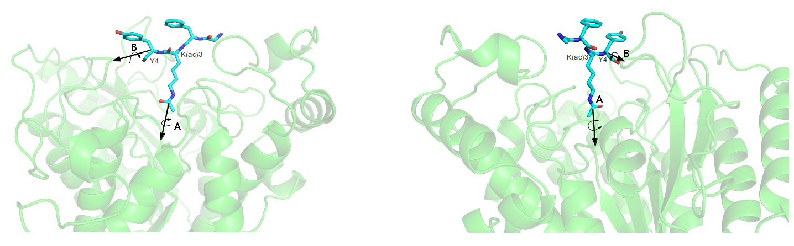
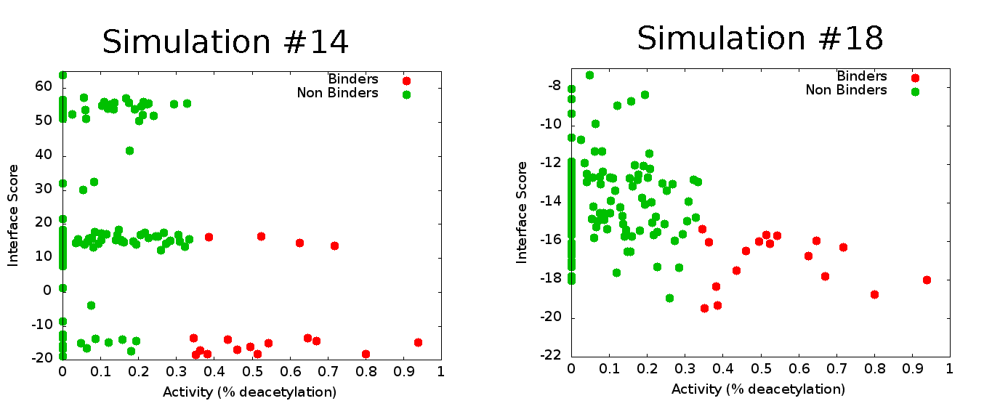
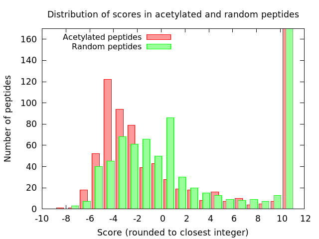

.. role:: ref

.. role:: label

.. raw::  latex

	\newcommand*{\docutilsroleref}{\ref}
	\newcommand*{\docutilsrolelabel}{\label}
	\newcommand*{\docutilsrolecaption}{\caption}
	\onehalfspacing
	
.. role:: raw-math(raw)
    :format: latex html

.. (DONE) ORA: general comment: references need to be fixed: why do they not start with number 1? Please add "," between them as the numbers come out as one long number.%

.. contents:: Table of Contents

.. raw:: LaTeX

     \newpage
..

Introduction
=============

	Our study combines several disciplines, joined together to create a classifier that predicts new substrates for Histone Deacetylase 8 (HDAC8). First, we'll provide a brief introduction to HDAC8 and its biological significance. Then, we'll describe the computational framework used in this project. Finally, we'll review solutions and different approaches taken in similar studies.
	
Histone Deacetylase 8
----------------------
	
	Metal dependent Histone Deacetylases (HDACs) catalyze the hydrolysis of acetyl-L-lysine to acetate and L-lysine, a process that is commonly called *deacetylation*. This reaction is a basis to a magnificent number of regulatory processes and has been shown to be a prominent factor in a number of diseases [1]_ :sup:`,` [2]_ . Histone deacetylases, as their name suggests are a class of enzymes that are responsible for the deacetylation of histone proteins, a process that typically alters the chromatin structure and leads to transcriptional repression; the hydrolysis of acetyl-lysine to lysine and acetate causes the histone tail to become positively charged, as the acetate ceases to mask the positive charge of lysine. This positively charged lysine contributes to the electrostatic interactions formed with the negatively charged DNA backbone, causing the DNA to wrap tighter around the histone and as a result become much less accessible to transcription factors and other proteins.
	
	HDAC8 is a key participant in a growing number of biological processes. As its name implies, HDAC8 is one of the regulatory components that enables the tight epigenetic control over the chromatin and was shown to regulate p53 levels [3]_ , participate in skull morphogenesis [4]_ and function as key factor in smooth muscle contractility [5]_ . HDAC8 was specifically found overexpressed above all other HDACs in neuroblastome [1]_  and various HDAC8 inhibitors were shown to induce apoptosis in Lymphoma cell lines [6]_ - findings that could imply that HDAC8 is involved in tumorigensis in some tissues.
	
	In recent years interesting evidence is accumulating, indicating that this is only the tip of the iceberg. Wilson *et al.* showed for the first time that HDAC8 together with Sirt-1 and p300 form an acetylation switch that modulates the transcriptional activity of Estrogen-Related receptor :raw-math:`$\alpha$` (ERR :raw-math:`$\alpha$`), but what's more intriguing is that HDAC8 was found to deacetylate ERR :raw-math:`$\alpha$` itself which is not a histone protein at all. Although it is known for quite some time that various HDACs have the ability to deacetylate non-histone substrates, particularly HDAC1 [7]_ :sup:`,` [8]_ - this was the first time that HDAC8 was captured in such a mechanism. A recent study showed that HDAC8 also deacetylates SMC3 - a subunit of the cohesin complex that mediates sister chromatid cohesion. Failure to deacetylate this particular protein might cause CdLS (Cornelia de Lange syndrome) - a genetic disease whose patients suffer from retardation and overall deformity [9]_.
	
	HDAC1 was the first HDAC to be identified back in 1996 [10]_ and since then, 18 others were confirmed by various groups [11]_ :sup:`,` [12]_ :sup:`,` [13]_. These enzymes can be divided to 4 subclasses, I-IV, based on their evolutionary descent (see Figure :ref:`hdacphylo`). HDAC8 is unique among all the other HDACs - it possesses several features that make it a great model for studying the biological role of deacetylation. It is the only HDAC that is found as a single polypeptide *in vivo* [14]_ , the rest are found as high molecular weight multiprotein complexes. Furthermore, it is much easier to work with experimentally since most purified recombinant HDACs are enzymatically inactive [15]_. Therefore, we conclude that from a structural biology perspective, HDAC8 is the best model among mammalian HDACs for studying the biologcal role played by deacetylation.

.. figure:: images/hdac_phylo.png
	:scale: 35%

	:label:`hdacphylo` A phylogenetic tree of currently known Histone deacetylases
	
	HDAC1,2,3 and 8 belong to class I, HDAC4,5,7 and 9 compose class IIa, HDAC6,10 belong to class IIb, an evolutionary distinct class that is made out of a family of enzymes called sirtuins compose class III, and HDAC11 is the only member of class IV.

..

	 HDACs have a well defined three-dimensional structure that is approximately similar. The central structural feature in all HDACs is the alpha-beta fold that is composed of 8 stranded parallel beta-sheets flanked by 11 alpha-helices, similar to the bacterial HDAC-like protein HDLP [16]_. Catalysis by HDACs and HDAC8 in particular requires a single transition metal ion. In HDAC8 this metal ion is located between the L4 and L7 loops, where conserved residues coordinate a single Zn\ :sup:`2+` ion that is a key participant in the catalytic mechanism. (see Figure :ref:`hdacfold`) [17]_ .
	 
.. figure:: images/hdac_fold.png
	:scale: 50%

	:label:`hdacfold` HDAC8 fold and metal binding
	
	**A:** HDAC8 exhibits a typical alpha/beta fold with a parallel beta sheet composed of 8 strands. **B:** Close up on the metal binding site (which is also a part of the active site) of HDAC8. **C:** A model of HDAC8 with K and Zn metal cofactor at their designated sites (Figure from [17]_). 

.. 

	  The basis of this catalytic mechanism, which is shared by all HDACs and other HDAC related enzymes such as some Arginases [18]_ , is a simple nucleophilic attack that is promoted by the active site transition metal and H143 that functions as a general base. The metal-bound water molecule attacks the metal coordinated C=O group of the acetylated lysine substrate (see Figure :ref:`catalyticmech`).

.. figure:: images/catalytic_mechanism.png
	:scale: 40%

	:label:`catalyticmech` The catalytic mechanism of deacetylation.

	The catalytic mechanism of the reaction involves a simple water mediated nucleophilic attack. 
..

	As drawn, the nucleophilic lone electron pair on the metal-bound water molecule becomes available only upon proton abstraction. Christianson *et al.* suggest that the electron pair of the breaking O-H bond could add to the :raw-math:`$\pi^*$` orbital of the substrate carbonyl. [17]_ The oxyanion of the tetrahedral intermediate and its flanking transition states are stabilized by metal coordination as well as hydrogen bond interactions with Y306, H143, and H142. H143 serves as a general acid catalyst to facilitate the collapse of the tetrahedral intermediate to form acetate and lysine after an intervening proton transfer (Figure from [17]_).
	


	Vannini *et al.* solved a variant of a catalytically inactive HDAC8-substrate complex in which Y306 was mutated to F, with a diacetylated peptide substrate that was derived from p53, containing a fluorogenic coumarin group at its carboxy terminus [19]_ . The solved structure reveals an unexpected feature: At the rim of the active site, the carboxylate of D101 establishes two directional hydrogen bonds with two adjacent nitrogen atoms of the substrate backbone (see Figure :ref:`labeledactivesite`), constraining the latter in an unusual cis-conformation. 


.. figure:: images/active_site_labeled.png
	:scale: 25%

	:label:`labeledactivesite` Close-up of the active site , with all the relevant residues . The cis conformation of the peptide backbone is clearly visible and colored in yellow. (PDB Code: 2v5w)
	
..
	
	This important structural feature is essential to catalysis - mutation of D101 to alanine results in a complete loss of enzyme activity on both histone and on the peptidic substrate that  *Vannini et al* used for their study. The authors suggest that the tight polar interactions that involves D101 keep the substrate in place during the deacetylation reaction. This particular residue shows remarkable conservation among class I and II HDACs despite the low overall sequence homology in this loop region. The alkyl chain of the acetylated lysine is  stabilized in the deep binding pocket by a stacking interaction with F152 and F208 and one hydrogen bond to G151.

	Although HDAC8 (and other HDAC-related deacetylases) are typically studied *in vitro* as Zn\ :sup:`2+` metal bound enzymes , the metal ion preference *in vitro* may differ. HDAC8 was shown to exhibit increased activity and even changed substrate specificity when substituted with Fe\ :sup:`2+` ions, suggesting that it could function with that metal also *in vivo* [20]_ and possibly have a cofactor based regulation. Crystal structures of HDAC8 coordinated with both Fe\ :sup:`2+` and Zn\ :sup:`2+` reveal similar metal coordination geometries [21]_. Additional monovalent cations such as K\ :sup:`+`  (was found to be the preferred metal *in vivo*) and Na\ :sup:`+` have also been identified in most crystal structures of HDAC8 in various peripheral sites and Gantt *et al* suggested that this interaction stabilizes the active conformation of the enzyme. [22]_ 

.. (DONE) ORA: FYI: the next paragraph did not appear in the pdf file.
.. (DONE) ORA: it still does not appear
..
	
	This study elaborates a high-throughput method for the discovery of novel non-histone substrates of zinc bound HDAC8 by applying various structural modeling techniques to the HDAC8-substrate complex. The structural approach we take in our study enables us not only to predict novel substrates but also to pinpoint the exact location of the interaction. We implemented our method within the Rosetta macromolecular modeling framework , that has a collection of generic modeling algorithms already built in. Using that pipeline we show that HDAC8 has a potential to deacetylate many other non-histone proteins and in particular, our results suggest that CdLS may be caused in various occasions by failure to deacetylate SMC1 - a component of the cohesin complex that in contrast to SMC3, has not been previously reported to be a target of HDAC8. Our analysis has also possibly identified a novel HDAC8 substrate- KAT6A which is a lysine acetylase. Both our protocol and preliminary experimental tests identified it as a top target for HDAC8.
	
	

.. (DONE) ORA: here you need also to add that you identified a new substrate, KAT6A. Including the part about screening phosphosite adds substantially to the thesis %
	
The Rosetta Framework
----------------------
	
	Rosetta is a well known framework that serves as a multi-purpose toolbox in a variety of scientific studies that involve the three dimensional modeling of a macro-molecule [23]_, ranging from design of new enzymes and symmetric proteins to predicting the structure of an RNA molecule [24]_ . In its early days, Rosetta started merely as a protocol for the prediction of the three-dimensional structure of a protein from sequence alone, *ab-initio* modeling, a heuristic to a difficult problem which has long been known to be NP-complete [25]_ . Critical to all molecular modeling problems - from design to *ab-initio* structure prediction - are a reasonably accurate free-energy function and a sampling method capable of locating the minima of this function for the biomolecular system under study. 
	
	All macro molecular structures and proteins in particular are governed by several hallmark features. One of these features is the nearly void-free packing of non-polar groups, in which they are buried away from water. This feature is a direct consequence of the hydrophobic effect discovered by Kauzmann and was shown to be the dominant driving force in the folding of proteins [26]_ .  Another important feature that is a strong determinant for the structure of many macro molecules is the change in the free energy caused by the formation of intramolecular hydrogen bonds among all buried polar atoms [27]_ . One more, reflects the Van-der Waals interactions between buried atoms - particularly the strong size dependence between the free energy cost of forming a cavity in the solvent to accommodate the macro molecule. Finally, the stability of macro molecules can be described in terms of the free energy cost of striping water molecules from polar residues, that has to be compensated by the formation of an intramolecular network of hydrogen bonds. 
	
.. (DONE) ORA: the whole paragraph above is confusing and needs to be rewritten more precisely. If I understand correctly, you want the paragraph above to be a description of what forces govern protein folding (and binding??), and the paragraph below then to be a description of how rosetta describes these forces, right? So first, remove Rosetta from the above paragraph.Then, be clearer about what is important for folding, and what is related to what: it seems that the different sentences describe related (or the same??) terms. As an example,  the sentence "This feature is a direct consequence of the hydrophobic effect discovered by Kauzmann and was shown to be the dominant driving force in the folding of proteins [26]_ " makes one think that the hbonds among buried polar atoms is == hydrophobic effect. This is definitely not what you want to say. In short, this paragraph needs to be much clearer. If you want we can talk about this and I can help.

.. LIOR: Fixed the above paragrah, hope its better...
..


	These features are captured in Rosetta to some extent. Atom - atom interactions are computed using a Lennard-Jones potential to describe packing, an implicit solvation model, to describe the hydrophobic effect and the electrostatic desolvation cost associated with burial of polar atoms, and an explicit hydrogen-bonding potential to describe hydrogen bonding. Even though the energy function used in Rosetta has been shown to be robust in a plethora of studies, it represents only a coarse approximation. For start, long range electrostatic interactions that were shown to be incredibly difficult to compute because of the induced polarization effect are not handled in the classic implementation of the energy function of Rosetta (Lately, a coarse approximation yielded good results in a number of cases, particularly in the modeling of Protein-DNA interactions [28]_ ). Rosetta's scoring function also does not compute the entropic change that is associated with the protein attaining an ordered structure, the underlying assumption behind this omission is that entropies of different well-packed proteins are similar.
	
	With all that said, we must note that an accurate scoring function that captures all the physical properties that are associated with protein folding and interactions is not a necessity for the success of most variants of structural modeling problems such as structure prediction and protein docking, rather, the success stems from the large free-energy gap between the native structure and all the other possible conformations. 
	
	**Rosetta employs several sampling strategies** that battle the rugged energy landscape that is generally associated with macro-molecular modeling. One such method is *Simulated Annealing* [29]_ - a heuristical method for overcoming local minima and smoothing the energy landscape. Its name implies the mechanism by which this algorithm works, on each step a solution is sampled from a predefined distribution and is accepted with a probability that is dependent both on the quality of the solution (is it better than the current best?) and on a global parameter - T which is decreased as the simulation progresses. At the beginning of the simulation - T is large and new solutions are accepted even if they are worse (in terms of the objective function) than the current best. At the end of the simulations - new solutions are accepted only if they maximize/minimize the objective function. 
	
	Another interesting approach that was initially developed in *ab-initio* structure prediction is smoothing the energy landscape by modeling a low-resolution version of the interaction with a corresponding low-resolution energy function: In this model, each residue is assigned with a *centroid sphere* that encompasses its chemical properties - such as hydrophobicity, polarity and more, leading to a smoother energy landscape in which local minima are easily identified. Another important tool that aids in the location of local minima is the incorporation of a library of fragments of amino acids with defined backbones in the simulations in its early stages. The library is constructed based on sequence similarity to the query sequence, usually a short peptide, and on the secondary structure predicted for the peptide by Psipred [30]_ . Fragment libraries allow the simulation to focus the search on global interactions, since local interactions are assumed to be optimal as they are influenced mainly by the immediate environment within the fragment. Fragment libraries were used extensively in our study of flexible peptide protein interactions [31]_. 
	
..

	Rosetta scoring functions and its sampling methods can be used for more than just structure prediction. Since Rosetta's scoring function is an estimation of the complex stability, we can use it to rank substrates according to their relative affinity to a target enzyme or proteins, possibly revealing its substrate preferences. 
	
Specificity prediction of peptide protein interactions
-------------------------------------------------------

	In their evolutionary journey, many proteins have gone through series of adaptations that enabled them to interact with various, different partners [32]_. The key to understand the biological role of enzymes, as well as other functional proteins, is to identify the repertoire of their natural substrate(s). The specificity and thereby role of enzymes varies, primarily depending on their active sites, which display selectivity ranging from preferences for a number of specific amino acids at defined positions (e.g. thrombin and the caspases) to more generic sites with limited discrimination at one position (e.g. chymotrypsin) [33]_ :sup:`,` [34]_.
	
	In addition to the primary amino acid sequence of the substrate, specificity is also influenced by the three-dimensional conformation of the substrate (secondary and tertiary structures). Proteases for example, preferentially cleave substrates within extended loop regions [35]_ while residues that are buried within the interior of the protein substrate are clearly inaccessible to the protease active site. Finally, the interaction between the two partners depends on the physical co-location of both the enzyme and substrate. Knowledge of the interaction specificity of functional proteins, and enzymes in particular, can dramatically improve our ability to predict target protein substrates. This information can at present be derived only from experimental approaches such as phage display [36]_ :sup:`,` [37]_ and peptide libraries [38]_ that yield high degree of confidence. However, these methods are expensive and demand an extensive period of preparation and application. Computational substrate prediction, although less robust and accurate, is much simpler and cheaper to run.

	Substrate specificity studies encompass a wide range of biological systems. One of the most studied is the interaction between MHC and peptides, as these proteins are involved heavily in various malignant and infectious diseases [39]_. *Dönnes et al.* developed SVMHC - an SVM based approach for the prediction of peptide binding to MHC class I proteins [40]_ . A similar method that involves support vector machine regression (SVR) models was developed by Wen Liu *et al* [41]_.  Schueler-Furman & Margalit *et al* developed a pipeline in which the peptide structure in the MHC groove was used as a template upon which peptide candidates were threaded, and their compatibility to bind was evaluated by statistical pairwise potentials [42]_ . 

	Except for the latter, these methods have the advantage of being fast and sometimes extremely accurate; however, they typically require large amounts of experimental training data, and thus may fail for systems that have not been well-characterized experimentally. Our method is not dependent on this large array of data, except for binding affinity or catalysis rates of a small number of substrates.

	The HIV protease was surveyed extensively for substrate specificity by a number of structure based computational methods. The vastly available experimental data related to this protein aided in the calibration of substrate detection approaches. Many such methods were demonstrated to be applicable in other systems. Kurt *et al.* used a coarse grained sequence threading approach with an empirical potential function to successfully discriminate binders from nonbinders in a small set of 16 peptides derived from suspected partners of HIV-1 protease. Chaudhury *et al.* developed a flexible peptide modeling protocol within RosettaDock [43]_ :sup:`,` [44]_  that predicted the structures for a large, diverse set of cleavable and noncleavable peptides by calculating an approximate free energy of the resulting complex, and showed that their protocol grants favorable energies to cleavable peptides over noncleavable peptides [45]_.
	
	King *et al.* developed an impressive flexible structure-based algorithm for characterization of a protein substrate preference, called *pepsec* within the Rosetta framework [46]_ . Their algorithm requires as input an approximate location for a key "anchor" residue of the peptide and the remainder of the peptide is assembled from fragments as in *de novo* structure prediction and refined with simultaneous sequence optimization. Backbone flexibility of the protein can be incorporated implicitly by docking into a structural ensemble for the protein partner. While this protocol was demonstrated to work very well on a variety of cases, it doesn't incorporate experimental data in a form of already-known activity of different substrates - as it is intended for *de-novo* specificity prediction.
	
	In our group, a general pipeline for the prediction of binding specificity of flexible peptides to protein receptors has previously been developed. In this pipeline, termed FlexPepBind, the structure of a collection of peptides  with variable sequences and experimental activity is modeled bound to a target receptor using a high resolution peptide docking protocol - FlexPepDock [47]_ . Subsequently, the energy estimation given by this protocol to each of the peptide - receptor complex structures is used to determine their relative binding affinities and subsequently train a classifier that is able to distinguish binders from non-binders. 
	
	This protocol has proven itself in 2 distinct biological systems - the interaction between Bcl2-like proteins and BH3 domains [48]_ which is a key feature in the regulation of apoptosis, and  the farnesyltransferase (FTase) enzyme [49]_ that catalyzes the attachment of a farnesyl group to a protein via a thioether bond to a cysteine located near the carboxy terminus of the protein [50]_ :sup:`,` [51]_ . In the Bcl-2 study, structural models of the interaction between a collection of helical BH3 domains and some proteins from the Bcl-2 family were created, and used to successfully recapitulate a significant part of their specificity profile, as well as to unravel novel interactions [48]_ .
	
	Unlike Bcl2-BH3, FTase is a catalytic protein that interacts primarily with *substrates*. Since FlexPepBind only models the interface between a peptide and a receptor, *London et al* assumed that binding equals catalysis and showed that this assumption is indeed valid for the vast majority of cases. 
	
	This study presents an adaptation of the FlexPepBind protocol to the intriguing enzyme HDAC8 to determine its binding specificity and potentially find novel substrates. In our study we assume that peptides that bind the enzyme in the active site, also go through catalysis. This assumption was validated in our earlier studies in Bcl and FTase. The pipeline can be summarized as follows; First, we calibrate and test our protocol for the binding of peptides that were tested by experiment for their ability to undergo deacetylation by our collaborators in the group of Carol Fierke at the University of Michigan. Then, we derive a classifier and show that it indeed is able to differentiate between experimentally validated low and high activity peptides substrates. Last, we try to find novel substrates among a large database of lysine acetylated peptides in proteins compiled from the Phosphosite database of post translational modifications (PTM) [52]_ .
	
Methods
========

Overview
---------
	
	We adapted FlexPepBind to predict the substrate specificity of Histone Deacetylase 8. First, we prepared a coarse starting complex of the enzyme and an array of peptides that were experimentally tested for catalytic activity. Then, we calibrated our protocol on a small subset of that experimentally verified dataset and obtained an initial coarse set of parameters - such as perturbation size of backbone movement and weight of different terms in the scoring function. This coarse set of parameters was refined by applying the pipeline on the whole training set. The performance of each set of parameters was evaluated by two statistical tests: The difference between active and non-active substrates was evaluated by a Kolmogorov-Smirnov two sample test, and in the case of the whole training set the correlation between predicted binding values and substrate activity was assessed also by Spearman non-parametric correlation, as well as ROC plots.

Flexible peptide - protein interactions with FlexPepDock
---------------------------------------------------------
	
	We use the previously described FlexPepBind protocol in our substrate specificity prediction of Histone Deacetylase 8. One of the most important building blocks of this protocol is a high resolution flexible peptide - protein docking protocol, FlexPepDock [47]_ . This protocol was shown to robustly refine coarse models of peptide–protein complexes into high resolution models and was later extended to model *ab-initio* peptide - protein complexes in which only the binding site and the sequence of the peptide is known [31]_. The general problem of modeling peptide - receptor interactions can roughly be divided to these subsections; 
	
	1) Model the receptor structure
	2) Predict potential binding sites on the receptor structure
	3) Model the peptide backbone on the binding site
	4) Refine the complex to higher resolution
	
	In most cases including the one we describe in this study, the last step is sufficient - several variants of receptor structures or even closely related homologs can be obtained from the PDB database, accompanied with proteins or peptides that are already located at the binding site and provide an approximate starting structure for the refinement process [53]_ :sup:`,` [54]_. The FlexPepDock protocol is outlined in Figure :ref:`fpdock` .

.. figure:: images/fpdock.png
	:scale: 35%

	:label:`fpdock` an outline of the FlexPepDock protocol 
	

	(Figure from [47]_).
	
..
	
.. ORA: the sentence "Figure taken from." belongs to the figure legend I moved it to there. %
.. LIOR: Unfortunatly, putting references in legends creates a stupid compilation error. I broke my head over it for quite some time.

..

	The first step of each FlexPepDock simulation is the prepacking of the input structure to provide better packing and remove internal clashes. Side chain conformations are optimized by determining the best rotamer combination for both the protein and the peptide separately [47]_ . This starting structure is then used as input to the FlexPepDock optimization protocol. The optimization is performed in 10 cycles. In the first cycle, the weight of the repulsive van der Waals term is reduced to 2% of its normal magnitude, and the attractive van der Waals term is increased by 225%. This allows significant perturbations within the binding pocket, while preventing the peptide and protein to separate during energy minimization. During refinement, the repulsive and attractive terms are gradually ramped back towards their original values (so that in the last cycle the energy function corresponds to the standard Rosetta score). Within each cycle, first the rigid body orientation between the protein and the peptide, then the peptide backbone is optimized in two sets of inner cycles. In 8 such inner cycles, low-energy conformations are searched using a Monte Carlo search with energy minimization [43]_ . In the first 8 cycles, a rigid body perturbation that is sampled from a gaussian distribution is applied and followed by sidechain repacking of interface residues and minimization (The default implementation of the minimization algorithm is DFP [55]_ ). The Metropolis criterion is then applied right after the energy minimization step to accept or reject the new conformation.


Preparation of starting structure
---------------------------------

	For each of the peptide sequences, a coarse model of the complex was generated, based on the selected template. This starting model served as input to the FlexPepDock protocol. We tested 2 approaches to create the starting complex: One involved threading the peptide sequence on the backbone configuration taken from solved structures. The second approach included superimposing only the acetylated Lysine onto a position taken from the crystal structure, and then extending the peptide to a complete linear polypeptide (all phi angles were set to -135.0 degrees, all psi angles to +135.0 degrees). 

.. (DONE) ORA: Just a comment - not for the thesis: the hbond distances between D101 and the N backbone atoms is pretty large. maybe the constraint should be in the form of "at least"? Also, you might mention that the distance constraint on H142 reflects a water-mediated interaction.
..


Calibration of the protocol
------------------------------
	
	*London et al* [49]_ developed a general framework for the prediction of binding specificity of flexible peptides to protein receptors. In general, the scheme of this framework follows a pipeline in which a collection of peptides with known activity or binding affinity are modeled in complex with the receptor using a high resolution peptide docking protocol [47]_, then the energy estimations (termed *score*) for the modeled complexes are used to determine the relative binding affinity of each peptide to the receptor. In case the receptor is actually an enzyme that catalyzes a chemical reaction, we assume that binding = catalysis. Although this assumption isn't true in a lot of cases. In our case, since we constrain the substrates in our pipeline to a very close conformation to that of the genuine substrates, we are able to discard a lot of peptides that are far from being able to attain these conformations. And so, our assumption in other words is that peptides that score high in complex with the receptor in a conformation that resembles the one of the actual substrate, are unlikely to go through catalysis.


	Our group has previously developed a general framework for the prediction of binding specificity of flexible peptides to protein receptors [49]_. In general, the scheme of this framework follows a pipeline in which a collection of peptides with known activity or binding affinity are modeled in complex with the receptor using the FlexPepDock protocol (see above and [47]_), then the energy estimations (termed *score*) for the modeled complexes are used to determine the relative binding affinity of each peptide to the receptor. In case the receptor is actually an enzyme that catalyzes a chemical reaction, we assume that binding = catalysis, an assumption that was demonstrated to be valid in a wide range of cases [48]_.

	Previous studies have shown that a calibration process of a FlexPepBind protocol results in a more accurate predictor than a predictor that uses a default set of parameters [48]_ . The calibration process usually involves the selection of a template, adapting the scoring function, and finding the right amount of sampling needed to achieve specificity - sensitivity balance.

Sampling
..........
	
	The term *Sampling* in the context of FlexPepDock takes 2 different meanings. Since the entire Rosetta framework is based on non-deterministic simulation pathways, the resulting output is different from one simulation to the next and in order to capture the conformation of a complex, several simulation runs should be made to increase the probability of locating the global minimal energy conformation. This number should be carefully calibrated, since the likelihood of finding false positive conformations rises with the number of simulations. The other meaning of *sampling* in the context of FlexPepDock is the perturbation size of small/shear moves of the peptide backbone applied during a single run. A large perturbation size increases the sampling space, causing the peptide to explore more conformations.
	
	Calibrating the amount of sampling of our FlexPepBind protocol in the context of number of simulations requires us to find the trade-off between computation time (each simulation run is computationally intensive), the number of near-native output structures and the number of structurally different yet low scoring decoys that are located in local minima (false positives). In the perturbation size, the trade-off is similar: here the increment is done to the space of possible conformations and not to the number of samples. If the peptide native structure is relatively different from the starting structure of the simulation (in terms of phi/psi angles) then larger perturbations are needed in order to find it. Increasing the perturbation size however, can pose a problem as it also decreases the probability we'll be able to find the native structure. 


	One approach that could narrow our search space and direct the algorithm towards the correct conformation, is threading a target sequence onto an existing backbone conformation.

.. figure:: images/2v5w_complex.png
	:scale: 25 %

	:label:`2v5wcomplex` The interface between the peptide substrate that was crystallized with *2v5w*. 
	
	Although the substrate peptides were located in the dimerization region of the two protein, its backbone was a good starting point that generated the most accurate predictor.


Template selection
...................

	As we have previously discussed, our protocol models the interaction between a peptide and its corresponding receptor. FlexPepDock takes as input a three dimensional structure of the receptor and a low resolution approximation of the peptide. In our case, the receptor is HDAC8. Its three dimensional structure was solved on numerous occasions and under different conditions in the last few years. In this study we tested multiple structures as templates for the FlexPepBind protocol. These are summarized in Table 1 below.

.. table:: Structures of HDAC8 that were tested as templates

	==========	=============================================================================================
	PDB ID		Description
	----------	---------------------------------------------------------------------------------------------
	2v5w [19]_	HDAC8 in complex with a p53-derived diacetylated peptide 
			with a Y306F catalysis abolishing mutation
	3f07 [56]_	HDAC8 complexed with APHA (aroyl pyrrolyl hydroxamate)
	1t67 [57]_	HDAC8 complexed with hydroxamate inhibitor (MS-344); 
			residues 62-68 were discarded from the model
	==========	=============================================================================================
..


	Choosing the right template is a formidable challenge. Most of the structures were solved with small molecule based inhibitors. These small molecules could induce a different *bound* structure than the actual real substrates. Others were solved with mutations that abolished catalysis and/or binding. In our simulations we focused either on variants that have catalysis abolishing mutations (but not binding) or variants that don't have mutations that affect binding or catalysis.

	Most importantly, most structures were solved as dimers that interacted with their highly flexible regions (even though the biological active form is a monomer [19]_), creating crystal contacts in the interface. These structures could potentially have slightly different backbone structures in the peptide binding region, a thing that could affect the identity of the residues that interact with these regions at the interface.

	In order to select a template, we applied a short FlexPepDock run on each of the above receptors, complexed with the top and bottom 5 binders and used Kolmogorov - Smirnov statistical fitness test to determine the correlation between our predicted binding values and the experimental activity values of different peptide substrates. 
	
	We note that *London et al.* merely used a short minimization to the template structure to select a proper template in the case of Bcl2 and FTase [49]_ :sup:`,` [48]_. In our case however, the highly flexible interface of HDAC8 indicated that a more extensive approach is needed. This short pipeline suggested that 2v5w is the best candidate for the structural template: this structure was solved together with an actual peptide, not along with a small molecule or in its free form - a fact which probably contributed to its better performance as a structural template (see `Summary of calibration runs`_ in the Results section).

	In comparison, the 3f07 structure contains 3 monomers, 2 of which interact with their flexible interfaces. The ligand that interacts with the receptor is a small molecule called APHA (aroyl pyrrolyl hydroxamate) that functions as an inhibitor. Even though 1t67 was solved as a monomer, the biologically active form, some of its residues were discarded from the model and it too, was solved with an hydroxamate inhibitor.
	
.. figure:: images/interface_allReceptors.png
	:scale: 50 %

	:label:`interreceptor` An alignment of the structures from Table 1 along with their substrates or inhibitors, demonstrating the conformational flexibility of the interface of HDAC8.


Scoring function
.................

	The FlexPepDock simulations were performed using both the standard Rosetta scoring schema (*score12*) and a slightly modified *score12* that includes several minor adjustments that were shown to improve [*]_ the resulting classifier in *London et al* study of the Bcl-2 - BH3 specificity [48]_ . In our calibration process we validated some of these parameters, verifying that they indeed introduce an improvement to the resulting predictor. These changes included:
	
	#) Incorporation of a weak, short, electrostatic energy term (*hack_elec*)
	#) Decreasing the weight of backbone-backbone hydrogen bonds close in primary sequence by half. (*hbond_sr_bb*)
	#) A score term that ranks the likelihood of particular amino acid at given phi-psi was decreased by half (*p_aa_pp*). 
	
..
	
	The most critical change was the introduction of a weak, short range Coulombic electrostatic energy term (hack_elec). In this term, a simple, linearly increasing distance-dependent dielectric was used to model solvent screening effects, with all interactions truncated at 5.5 Å, thereby preserving the short-ranged nature of the all-atom potential. *Bradley et al* demonstrated that the incorporation of the explicit electrostatics term in addition to Rosetta's orientation-dependent hydrogen bonding potential [58]_ helped to prevent unfavorable short-range electrostatic interactions, modulated the interaction strength of charged and polar hydrogen bonds and generally, improved the performance of their DNA-protein interaction specificity predictions [28]_.
	For term no. 2, it is hypothesized that relaxing it allows a greater degree of flexibility in backbone configurations. Since our system exhibits a large degree of flexibility in both the peptide and the receptor structure, we found it suitable for inclusion in the scoring function based on our previous experience.
	The third term reduces the penalty for some amino acids in more rare phi-psi conformations. Again, allowing more backbone flexibility. 

.. (DONE) ORA: how does the change of the other two parameters affect prediction, and why? 
.. (DONE) ORA: haven't looked at this comment yet.
.. LIOR: I haven't tested to change each one in turn. there were too many options for changes and I had to use some intuition regarding what feature is important for change and what is not. Perhaps I wasn't right for not testing it, but I think the effect of changing these is very minimal - they come into play only on design protocol from what I know.

.. (DONE) ORA: Also, you did not mention the change in the LK parameters.
.. LIOR: I remember we checked this issue thoroughly and got to a conclusion that I didn't modify the LK parameters eventually although I thought I did. I thought that this change above is the LK change an after you showed me the exact file in the database that I should have changed , we realized it ... 
.. (DONE) ORA: I think the sentence "The second term was used previously in our previous study of the Bcl system" is misleading. I would rather write that all three changes were found together to work well for Bcl. Then you can write in a note that you did not change the LK parameters as was done in BCl. This way you will be precise and allow people that read the thesis to understand what is similar and different from previous work. 
.. LIOR: Added remark, hope its fine now.

.. [*] The simulations in the Bcl-2 study included in addition a modification to the Lazaridis Karplus solvation term. This change wasn't incorporated to our scheme due to a technical mistake that was discovered in a very late phase of the research. Therefore, the improvement in performance was due to the above 3 changes and the modification of the Lazaridis - Karplus solvation term.

..

	We've seen in several studies conducted in our lab that a slight *post-simulation* change to the scoring function might be beneficial in determining the relative binding affinity of the peptide to the receptor. In other words, the scoring function that is used for the modeling process might be slightly different than the scoring function used to evaluate the modeled complexes after the simulation has been completed. These changes are:

	#) **Peptide score** - includes just the part of the internal energy of the peptide and the interface.
	#) **Interface score** - includes just the sum of interactions across the interface.
	#) **Reweighted score** - the sum of peptide score, interface score and total score. This upweights the contribution of the interface energy and the peptide energy.

Rigid body movements
.....................
	
	FlexPepDock applies rigid body movements to the peptide relative to the receptor. The transformations that define these movements are calculated using an axis and the point of center of mass of the peptide. By default, the axis that define the rigid body transformations, equals to the vector that connects the peptide CA atom closest to the center of mass of the peptide, to the closest CA atom in the receptor. Since the interaction between HDAC8 and its acetylated peptidic substrate involves a deep pocket in which the acetylated Lysine lies, we tested several alternative axes (some of them are illustrated Figure :ref:`constraintsfigure` ).

Constraints
............
.. (DONE) ORA: why not move this whole paragraph up to before prepacking? Then you won't run into the problems of duplicating and therefore confusing the reader? %
.. LIOR: I merged the two together, not after prepacking though, I think its more suitable to have it here. Hopefully, its ok
..
	
	The *no free lunch* theorem suggests that all search algorithms have the same average performance over all problems [59]_, and thus implies that to gain in performance on a certain application one must use a specialized algorithm that includes some prior knowledge about that problem. In previous studies we found that incorporating key interactions between the peptide and the receptor as constraints in FlexPepDock's search algorithm greatly improves the performance of the resulting predictor  [48]_ :sup:`,` [49]_. 
	
	HDAC8 has the ability to catalyze a deacetylation reaction with several different substrates [20]_ . We believe that its ability to maintain such a diverse specificity profile stems from the fact that its binding motif is encoded in the structure of its substrates. To this date (10/2012) there is only one solved complex containing a peptidic substrate bound to HDAC8 (PDB *2v5w*), so finding a structural motif from solved complexes in our case was somewhat a challenge. 
	Nevertheless, we were able to pinpoint the interaction between D101 in the receptor and the backbone N atoms in the acetylated Lysine and the adjacent position in the peptide as critically important: The mutation D101A resulted in a complete loss of enzyme activity on the peptidic substrate and also on purified histones [19]_. Additional constraints were derived from the interaction between the acetyl group of the Lysine and the Zn binding site in the catalytic site (including the Zn binding residues D178,H180, and D267, as well as the two additional Histidines connected through a water molecule, H142 & H143).
	
.. (DONE) ORA:  this is confusing: you had a paragraph on constraints above, now you mention it again. Please move to one place%
.. LIOR: The previous paragraph is more about a theoretical background about constraints... Here I show how we use it in practice. If you think it should all be squeezed to one section, let me know...
.. (DONE) ORA: I think it needs to be together, or better organized. Right now you have Table 1 & 4 that are exactly the same…. Also, I don't see how Table 3 is practice rather than theoretical background… %
..
.. (DONE) ORA: looks good to me now. What do you mean by "X,Y and Z" above, and how is this highlighted in the figure?
.. X,Y,Z were probably annotations in the old figure ... since I've written exactly which atoms/residues participate in the constraints, this comment is redundant..

..
	
	Once a structural motif is determined and constraints are introduced, the scoring function should be modified to favor conformations that include that particular structural motif. This step subsequently directs the search algorithm to sample structures that satisfy this collection of constraints. The most common types of constraints that are available in Rosetta are summarized below:

.. raw:: LaTeX

     \newpage
..


.. table:: Types of constraint functions in Rosetta

	=================	==========	=======================================
	Type of function	Parameters			Formula
	-----------------	----------	---------------------------------------
	Harmonic		x0, sd		.. image:: images/harmonic.png
							:scale: 50%
	Circular Harmonic	x0, sd		.. image:: images/circular_harmonic.png
							:scale: 50%
	Gaussian		mean,sd		.. image:: images/gaussian.png
							:scale: 50%
	=================	==========	=======================================

..

	Since we didn't want to allow much flexibility in those particular interactions we thought as important to binding, we used the harmonic function as our constraint, testing several standard deviations in our calibrations (a standard deviation of 0.2 was proven to work on previous studies of FlexPepBind mentioned earlier in this text). The first 4 constraints (see table below) are meant to hold the acetylated lysine in place and prevent it from moving too much in the active site. The last 2 constraints are meant to conserve the important interaction between Asp101 and the backbone of the peptide, as was described by Vannini et al in ref [19]_.
	

.. figure:: images/constraints_extended.png
	:scale: 20%

	:label:`keyint` The key interactions from which the constraints were derived (outlined as yellow lines), taken from a solved crystal complex (PDB: 2v5w).
	
	
.. raw:: LaTeX

     \newpage
..


.. table:: An elaboration of the constraints that were derived from the crystal structure

	===========	================	=========
	First atom	Second atom		distance
	-----------	----------------	---------
	Asp267 OD2	ac-Lys OH		2.8 A
	Asp178 OD2	ac-Lys OH		3.8 A
	His142 NE2	ac-Lys NZ [*]_		5.1 A
	His180 ND1	ac-Lys OH		3.8 A
	Asp101 OD1	ac-Lys N		3.0 A
	Asp101 OD2	Coumarin [*]_ N		3.2 A
	===========	================	=========

..

.. [*] The interaction between His142 and the NZ atom of the acetylated lysine is mediated by a water molecule. This fact is responsible for the long range constraint
.. [*] The Coumarin residue is located at the variable position and it is replaced with a different residue. However, its backbone orientation remains the same.


Results
========


Description of the dataset
--------------------------

	The Fierke group has tested the ability of HDAC8 to deacetylate 361 6-mer peptides with the sequence GXK(Ac)ZGC (where X,Z are all the amino acids except Cysteine), under two different conditions: for zinc and iron bound HDAC8 (unpublished results; see Table 5 in the supplementary material). For each of these peptides, a level of activity with respect to HDAC8 and the bound metal was determined by measuring the percentage of deacetylation after 1 hour.
	
	In this study , we focus only on Zn bound HDAC8, as a first step in deciphering the entire co-factor dependent specifity profile of the enzyme. We divided this dataset into a training and a test set, by sorting the peptides according to their experimental activity with Zn - bound HDAC8, and assigning all even-numbered rows to be the test set, and all odd-numbered rows to be the training set. This division assured an even distribution of peptides with respect to their activity levels (avoiding a situation where one set holds a large number of high/low activity decoys).


Calibration of the protocol
------------------------------

	Below we describe the results obtained in the calibration process. The first calibration round was made by taking the 5 peptide substrates with strongest HDAC8 activity and 5 peptides with no detectable HDAC8 activity at all (see Table 5). We used this set to identify a coarse set of parameters that could be refined later using the entire training set. This set of short simulations allowed us to identify critical simulation parameters and their respective values that could well distinguish between substrates and non-substrates.

	The performance of each simulation was evaluated by the Kolmogorov-Smirnov two-sample test, where each peptide was assigned a rank based on the average score of the three top-scoring models. We estimated the score using three measures: peptide score, interface score, and reweighted score (see Methods). 

	In general, each step of the calibration process involved changing one degree of freedom of a certain feature (such as - amount of sampling, constraints, etc) while maintaining the others fixed. This process resulted in a coarse set of parameters, to be refined on the whole training set as part of the classifier learning process. 

.. table:: A short version of the dataset used for coarse calibration of our protocol.

	+---------------+----------------------+------------------+
	|Sequence	|      % deacetylation |annotation	  |
	+===============+======================+==================+
	|GYK(ac)FGC	|93		       |		  |
	+---------------+----------------------+		  |
	|GYK(ac)WGC	|80		       |		  |
	+---------------+----------------------+ HDAC8 Substrates |
	|GLK(ac)FGC	|66		       |   	  	  |
	+---------------+----------------------+		  |
	|GFK(ac)FGC	|64		       |		  |
	+---------------+----------------------+		  |
	|GIK(ac)FGC	|62		       |		  |
	+---------------+----------------------+------------------+
	|GQK(ac)YGC	|0		       |		  |
	+---------------+----------------------+		  |
	|GIK(ac)VGC	|0		       |		  |
	+---------------+----------------------+HDAC8 Non- 	  |
	|GMK(ac)VGC	|0		       |Substrates	  |
	+---------------+----------------------+		  |
	|GDK(ac)YGC	|0		       |		  |
	+---------------+----------------------+		  |
	|GMK(ac)YGC	|0		       |		  |
	+---------------+----------------------+------------------+
..

	Below we detail all the different categories we calibrated. Each table elaborates the simulation serial number, and the relevant parameters that were perturbed in that specific category. Table 1 in the supplementary material describes the entire set of properties for each simulation and summarizes their performance.

Sampling
.........

	We inspected different amounts of sampling in which the number of decoys generated and the amount of perturbation size were modified together (we previously mentioned that the larger the perturbation size - the larger the space of possible peptide conformations).

Initial parameters
``````````````````
	We initialized the features with values that were found optimal in previous studies [48]_:
	
	#) Weight of *hackelec* (electrostatic term): 0.5
	#) Standard deviation of constraints: 0.2
	#) Number of decoys generated per simulation: 200
	#) Perturbation size: 6 degrees
	#) Structural template: 2v5w - HDAC8 bound to a peptide (see Methods).
	#) Anchor atom in peptide: CA of the acetylated lysine (residue 366 in the pdb). We assumed that the default anchor chosen in the FlexPepDock protocol will not be optimal in our case since it is farther from the active site, so we determined the anchor to be the acetylated lysine. 
	#) Anchor atom in receptor: CA of F194

	These features were, of course validated and perturbed in later phases.
	
	We also figured that the default anchor chosen in the FlexPepDock protocol will not be optimal in our case since it is farther from the active site, so we determined the anchor to be the acetylated lysine, and verified its optimality later on when other sets of parameters were calibrated. Furthermore, since it is unlikely that the amount of sampling will be different from one template to another, we selected 2v5w , due to the properties we mentioned earlier (primarily since it was solved with an actual peptide and not a small molecule)

.. table:: Calibration of the amount of sampling.

	+---------------+--------------------------------+----------------------------------------------------+
	|		|	 **Sampling**        	 |       **Scoring scheme** (KS p-value) 	      |
	+---------------+------------------+-------------+---------------+-----------------+------------------+
	|No.		|Perturbation size |  No. decoys | Peptide score | Interface score | Reweighted score |
	+---------------+------------------+-------------+---------------+-----------------+------------------+
	|1		|6 (default value) |  200	 | 0.2		 | 0.03		   | 0.2	      | 
	+---------------+------------------+-------------+---------------+-----------------+------------------+
	|2		|15		   |  200	 | 0.2		 | 0.03		   | 0.69	      |	
	+---------------+------------------+-------------+---------------+-----------------+------------------+
	|3		|15		   |		 |		 |		   |		      |
	|		|low resolution    |  		 |		 | 		   |		      |	
	|		|pre-optimization  |		 |		 |		   |		      |
	|		|(centroid mode)   |  200	 | 0.2		 | 0.2    	   | 0.697	      |
	+---------------+------------------+-------------+---------------+-----------------+------------------+
	|4		|20		   |  200	 | 0.2		 | 0.03		   | 0.2	      |
	+---------------+------------------+-------------+---------------+-----------------+------------------+
	|5		|30		   |  200	 | 0.2		 | 0.2		   | 0.2	      |
	+---------------+------------------+-------------+---------------+-----------------+------------------+
	|6		|30		   |  500	 | 0.2		 | 0.03		   | 0.69	      |
	+---------------+------------------+-------------+---------------+-----------------+------------------+
	|7		|60		   |  500	 | 0.2		 | 0.03		   | 0.69	      |
	+---------------+------------------+-------------+---------------+-----------------+------------------+
	|8		|90		   |  900	 | 0.69		 | 0.69		   | 0.03	      |
	+---------------+------------------+-------------+---------------+-----------------+------------------+
	|**18(threaded**|		   |		 |		 |		   |		      |
	| **peptide)**	|**8**		   |  **200**	 | **0.2**	 | **0.003**	   | **0.69**	      |
	+---------------+------------------+-------------+---------------+-----------------+------------------+

..


	Our findings above suggests that a modest amount of sampling (in the context of number of simulation runs) is sufficient to generate a reliable predictor. Our findings correlate with an earlier study conducted by *London et al* [49]_ , that found that 200 simulation rounds are indeed sufficient for this purpose, and that a larger number of simulation rounds doesn't necessarily yield significant improvements in the predictor's performance. This short set of calibration runs suggests that the interface scoring scheme functions better than the rest in the task of differentiating between binders and non binders in the case of HDAC8 substrates. Simulation #18 along with the interface scoring scheme shows the best ability to distinguish between binders and non binders. The sampling size of this simulation is lower than the one that was obtained using the extended conformations, since we hypothesize that the starting structure has approximately the correct conformation.
	
	We applied a short FlexPepDock run on each of the possible templates complexed with the top and bottom 5 binders, similarly to the previous section. These simulations used the parameters described above for simulation #2, except for the templates, and perturbation size=15 for all.

..	
..  (DONE) TODO: In the following sections I described additional evaluations that we performed , for each of those we used run #2 as a baseline. Selection of this run was made on early analysis (stat tests) that was changed in the later stages of the work.
	
..

	The following sections detail additional evaluations that were meant to calibrate additional features such as the amount of sampling and various elements of the scoring function. For each of those we used simulation #2 as a baseline. This simulation was selected based on an earlier statistical analysis - Pearson's correlation that was later changed to Kolmogorov-Smirnov. (KS Test is better suited for binary predictions)
	
Template selection
...................

.. (DONE) ORA: Here you used a perturbation of 15 degrees. maybe it would be good to add to each table the default values in the legend.
.. LIOR: mentioned that all simulations here used the initial values described above, except for the anchor.
.. (DONE) ORA: yes,but in table 6, you write that 6 is the default value... So this is confusing. %
.. LIOR: I see your point... Since it is the only thing that is not 'default' I mentioned it in the table of each legend. 
..

.. 8->1 , 9->2 , 16->3 , 5-> 4, 1->5, 4->6, 2-> 7, 3-> 8, 13->9, 15->10, 10->11, 7->12, 6->13, 12->14, 17->15, 18->16, 19->17, 11->18

.. table:: Selecting the right template.

	+----------------------------------+----------------------------------------------------+
	|			 	   |       **Scoring scheme** (KS p-value) 		|
	+---------------+------------------+---------------+-----------------+------------------+
	|No.		|Template	   | Peptide score | Interface score | Reweighted score |
	+---------------+------------------+---------------+-----------------+------------------+
	|2		|2v5w		   | 0.2	   | 0.03	     | 0.69 		|
	+---------------+------------------+---------------+-----------------+------------------+
	|9		|3f07		   | 0.997	   | 0.2	     | 0.69   		|
	+---------------+------------------+---------------+-----------------+------------------+
	|10		|1t67		   | 0.69	   | 0.69	     | 0.69   		|
	+---------------+------------------+---------------+-----------------+------------------+	

..
	These short simulations validate our initial assumption that *2v5w* is the best candidate for a template. 
	
.. (DONE) ORA: I would change the legend to what you write in the tables below: this is clearer: "These simulations used the same values as simulation #2, except for ...
	
Scoring function
.................

	In our calibration of the scoring function we were interested to see whether our initial parameters - primarily the use of the short electrostatic term (hack_elec) should be refined or modified. For that, we tried to use Rosetta's default scoring function *score12* (that does not contain any of the modifications described earlier) and another simulation in which we decreased only the weight of the electrostatic term (hackelec) in the scoring function.

.. raw:: LaTeX

     \newpage
..

.. table:: Calibrating the scoring function (these simulations used the initial values described above, except for the scoring function parameters indicated)
	
	+----------------------------------------------+----------------------------------------------------+
	|		                	       | **Scoring scheme** (KS p-value)		    |
	+---------------+------------------------------+---------------+-----------------+------------------+
	|No.		|Scoring function  	       | Peptide score | Interface score | Reweighted score |
	+---------------+------------------------------+---------------+-----------------+------------------+
	|2		|weight of hackelec = 0.5      | 0.2           | 0.03	         | 0.69   	    |
	+---------------+------------------------------+---------------+-----------------+------------------+	
	|11		|weight of hackelec = 0.25     | 0.2	       | 0.2	         | 0.69   	    |
	+---------------+------------------------------+---------------+-----------------+------------------+
	|12		|*score12*		       | 0.2	       | 0.03	         | 0.2   	    |
	+---------------+------------------------------+---------------+-----------------+------------------+
..


	Looking at the results, simulations that involved the generic Rosetta scoring function and the modified scoring function achieved similar ability to distinguish between binders and non binders, in contrast to what we previously anticipated. 
	The fact that 0,0.5 values for hack_elec work better than 0.25 probably indicates a certain degree of instability: the energy landscape is affected significantly by this small change.
 
.. (DONE) ORA: this also indicates instability - how else would you explain that hackelec 0.5 and 0 work well but 0.25 does not? Maybe mention this instability
	
Rigid body movements
.....................
	
	
.. (DONE) TODO: What is acetyl-K4??? change to anchor-receptor - anchor-peptide. about the figure: improve it , take just the peptide and show just the vector , maybe from 2 different orientations with the receptor in very low opacity.

	We tested several approaches to perform rigid body movements. By default, the axis that determines the transformations of the peptide relative to the receptor equals to the vector that connects the closest peptide CA atom to the center of mass the peptide, to the closest receptor atom. We manually selected different atoms to create different axes for the rigid body transformations.
	
.. table:: Choosing an axis for rigid body movements (these simulations used the same values of simulation #2, except for the anchors)

	+------------------------------------+----------------------------------+
	|		                     | **Scoring scheme** (KS p-value)  |
	+-----+------------------------------+----------+-----------+-----------+
	|No.  |Anchor (residue)              | Peptide  | Interface | Reweighted|
	|     |		     	             | score    | score     | score     |
	+-----+------------------------------+----------+-----------+-----------+
	|2    | **Peptide**: acetyl-K3       |          |	    |    	|  
	|     |	(CA atom)   		     | 0.2      | 0.03      | 0.69	|
	|     |				     |          |	    |	        |
	|     | **Receptor**: F194   	     |          |	    |	        |
	+-----+------------------------------+----------+-----------+-----------+	
	|13   |**Peptide**:X4                | 0.2	| 0.2	    | 0.2 	|
	|     |(variable position - 	     |          |	    |	        |
	|     |CA atom, chosen by default by |          |	    |	        |
	|     |the protocol)		     |          |	    |	        |
	|     |				     |          |	    |	        |
	|     |**Receptor**: M260	     |          |	    |	        |
	+-----+------------------------------+----------+-----------+-----------+
	|14   |**Peptide**: acetyl-K3	     | 0.2	| 0.003	    | 0.69      |
	|     |				     |          |	    |	        |
	|     |(anchor atom was the carbonyl |          |	    |	        |
	|     |of the acetyl in the	     |          |	    |	        |
	|     |acetylated lysine instead     |          |	    |	        |
	|     |of CA)			     |          |	    |	        |
	|     |				     |          |	    |	        |
	|     |**Receptor**: G289   	     |          |	    |	        |
	+-----+------------------------------+----------+-----------+-----------+
	|15   |**Peptide**: acetyl-K3 	     |  0.2     | 0.2	    |	        |
	|     |(CA atom)		     |          |	    |	  0.009 |
	|     |				     |          |	    |	        |
	|     |**Receptor**: G289 (CA atom)c |          |	    |	        |
	+-----+------------------------------+----------+-----------+-----------+


..

	Looking at the results we see that selecting an anchor that favors an axis that aligns with the vector formed by the acetylated lysine sidechain, that goes into the pocket (see Figure :ref:`constraintsfigure` ), works best. Figure :ref:`constraintsfigure` shows an example of 2 of the axes (from simulation 13 and 14) we used in our calibration.
	
.. (DONE) ORA: the connection between the figure and the table is not clear at all: you need to label the atoms and explain the arrows, and explain to what "366" for example corresponds.
.. LIOR: I changed the figure to show the vector formed by our best result - #14. Basically, I look at this figure as more as a demonstration, you can't really show the exact 3d vector in these kind of pictures. It should give the reader an idea about what we are talking about... 



	:label:`constraintsfigure` An illustration of 2 axes we used to sample rigid body movements. **A** (simulation 14) - rotating the peptide around the acetylated lysine residue, and **B** (simulation 13) rotating the peptide around a vector that was chosen by the protocol by default (the vector that connects the c-alpha closest to the center of mass of the peptide to the c-alpha atom in the receptor that is closest to this c-alpha. **PDB**: 2v5w with one of the peptides from the data set (GFK(ac)YGC).

.. ORA: note that I changed the legend a little.

Constraints
............

	Simulations with no constraints at all generated model structures in which the peptide didn't bind the active site at all (results not shown). We therefore tested different types of constraints, and different values for the standard deviations of the constraints. (see Figure :ref:`keyint`) 	

.. table:: Calibration of standard deviation of constrains (these simulations used the same values as simulation #2, except for the standard deviation of the constraints)

	+------------------------------------------------+----------------------------------------------------+
	|		                		 |      **Scoring scheme** (KS p-value)		      |
	+---------------+--------------------------------+---------------+-----------------+------------------+
	|No.		|Constraints (standard deviation)| Peptide score | Interface score | Reweighted score |
	+---------------+--------------------------------+---------------+-----------------+------------------+
	|2		| 0.2 Å 	                 | 0.2           | 0.03	           | 0.69             |
	+---------------+--------------------------------+---------------+-----------------+------------------+
	|16		| 0.15 Å 	                 | 0.2           | 0.2   	   | 0.005            |
	+---------------+--------------------------------+---------------+-----------------+------------------+
	|17		| 0.25 Å 	                 | 0.2           | 0.03   	   | 0.2	      |
	+---------------+--------------------------------+---------------+-----------------+------------------+

..

	
Threading the peptide
......................
	
.. (DONE) ORA: I changed below: you cannot talk about verification of "this hypothesis" if you don't give reasons and assumptions. Therefore I suggest to move the reasons to here, and in the methods indeed describe only the methods part, not the implications.
.. (LIOR) After modifying the sets of constraints we actually found out that threading the peptide yeilds better results , remember? so I updated this section accordingly.
..

	Most of initial simulations were carried out with extended peptides as starting structures. We initially suspected that the peptide secondary structure is biased since it was located right in the dimerization region in the crystal structure. However, we found out that using the original structure and orientation of the original structure of the peptide yielded better correlation with experimental data.

.. table:: Choosing a starting structure (these simulations used the same values as simulation #2, except for the starting structure and perturbation size).

	+----------------------------------------------+-------------------------------------------------------+
	|		                	       |**Scoring scheme** (KS p-value) 		       |
	+----+----------------------+------------------+------------------+------------------+-----------------+
	|No. |Starting structure    |Perturbation size | Peptide score    | Interface score  |Reweighted score |
	+----+----------------------+------------------+------------------+------------------+-----------------+
	|2   | Extended conformation|   15	       |  0.2             | 0.03	     | 0.69            |
	+----+----------------------+------------------+------------------+------------------+-----------------+
	|18  | Threaded peptide     | 	8	       |0.2               | 0.003	     | 0.69            |
	+----+----------------------+------------------+------------------+------------------+-----------------+
..
	
	The simulation starting from a threaded structure achieved the best correlation with experimental data. The backbone starting structure was probably a close approximation to many of the final complexes.
	
Summary of calibration runs
............................
	
	This phase of calibration allowed us to select several promising sets of parameters to be refined in a later stage on the whole training set. With that approach we could easily discard sets of parameters that failed to identify highly reactive substrates, and falsely identified zero activity substrates. We note simulations #18 and #2 and their set of parameters, using the interface scoring scheme yielded the best performance in terms of Kolmogorov Smirnov p-values. We also noticed that the interface scoring scheme achieved superior performance over the rest of the schemes in most cases. Moreover, the reweighted scoring scheme that demonstrated good ability to distinguish binders from non binders in previous studies, failed in the vast majority of simulations.
	In the next phase, in which we run our peptide modeling protocol on the whole training set, we mainly use the set of parameters that exhibited superior performance in the short calibration phase.

Whole data set analysis
--------------------------
	
Training a classifier
.....................

	After an initial phase of calibration on 10 peptides, we were set to examine and refine the parameters learned on the whole training set. This step allowed us to refine our initial, coarse set of parameters. Table 11 summarizes the parameters of the different simulations on the whole training set.

	Recall that our dataset contains sequences of lysine acetylated peptides that are ranked by their activity level as substrates. The peptide's level of activity is not represented in a binary fashion (binder / non-binder) , but rather as a continuous value in [0,1]. In order to train a binary classifier, we needed to define a threshold to create a binary representation. To accomplish that, we selected an experimental level of activity to serve as a cutoff so that each sequence with activity that is lower than the cutoff is labeled as a non-binder and *vice versa*. We derived that cutoff by applying 2 samples Kolmogorov-Smirnov (KS) test on all possible activity levels ([0,1], in resolution of 0.01). The activity level that was chosen as cutoff is the one that obtained the lowest p-value in the KS test, thus, the one that could best differentiate between the 2 distributions of *scores* - that of the substrates and the score distribution of non substrates.  (see Figure :ref:`cutoff` )

	
.. figure:: plots/cutoff.png
	:scale: 50 %

	:label:`cutoff` An **example** for a log(p-value) of KS test vs. Activity level plot created from simulation #2a (see table below). when using the cutoff from the X axis. Clearly, the best cutoff we can choose in this case is 0.34.

..

	This table summarizes the simulations we performed on the whole training set, each of the columns describe a different aspect of the parameter set used.
	
	
.. (DONE) ORA: Also, the tables should have the same format as before, and include also results (the correct measure of course ...)	
.. (DONE) ORA: the columns that you need: No.; Anchor (residue); Sampling - Perturbation size; Sampling - No. Decoys; Template; threshold value; Scoring function; Scoring Scheme (KS & Spearman p-values). In short, exactly as in the tables above, in particular include the p values.

.. LIOR:This is too much information for one table, I added a table with all the scoring per each scoring scheme and and threshold in another table below. (also for the scores after clustering)

.. (DONE) ORA: ok, but still, table 12 looks horrible and you need to redo it anyway…. It also contains too much redundant info: you can state at the top/bottom of the table that all simulations included 200 decoys, and that all included hack_elec=0.5. This makes it easier to read the table. If you also mention that all contain Anchor K3, perturbation size 15 and template 2v5w, you can add a column in which you add modifications (e.g. 8 degree perturb; threaded -  for run 18a). But that's up to you. This way you could make one table only, which will make it easier on the reader to understand. %

.. raw:: LaTeX

     \newpage
..

.. table:: Summary of training set simulations. The Numbering is based on the calibration runs (see Table 6 above).

	+---+----------------------------------------+
	|No.| Modifications			     | 
	+---+----------------------------------------+
	|2a |	None				     |
	+---+----------------------------------------+
	|3a |	* Anchor: K3 ch atom	 	     |
	|   |	* low-res. preoptimization step	     |
	+---+----------------------------------------+
	|9a |	Template: 3f07		             |
	+---+----------------------------------------+
	|14a|	Anchor: K3 ch atom	             |
	+---+----------------------------------------+
	|16a|	SD of constraints = 0.15	     |
	+---+----------------------------------------+
	|17a|	SD of constraints = 0.25	     |
	+---+----------------------------------------+
	|18a| 	* Perturbation size: 8		     |
	|   |   * Template: 2v5w , threaded peptide  |
	+---+----------------------------------------+
	| Unless stated otherwise, all simulations   |
	| included:		     		     |
	|					     |
	| * Perturbation size = 15      	     |
	| * #Decoys = 200			     |
	| * Template: 2v5w			     |
	| * Anchor: CA atom of K3		     |
	| * hack_elec=0.5	        	     |
	+--------------------------------------------+

Scoring of peptides
````````````````````

	We used 2 statistical tests - Kolmogorov Smirnov and Spearman's non parametric correlation, to evaluate the ability of parameter set of a simulation to differentiate between binders and non-binders. 
	Simulation 18(a) that threaded each sequence on the original peptide found in 2v5w has a p-value of :raw-math:`$ 2.78 \times 10^{-8} $` for KS with a cutoff of 0.35, using the interface scoring scheme - much more significant than the other scoring schemes. However, in terms of correlation, Simulations 14(a) and 16(a) achieved the best correlation (p-values) with experimental activity on the training set, 0.0005, 0.0002 respectively, using the interface scoring scheme. 
	
	Since we're evaluating our hypothesis with more than one method, a Bonferroni correction must be applied. The Bonferroni correction is an adjustment made to P values when several dependent or independent statistical tests are being performed simultaneously on a single data set. Put simply, the probability of identifying at least one significant result due to chance increases as more hypotheses are tested. The idea that stands behind it is that if an experimenter is testing :raw-math:`$n$`  dependent or independent hypotheses on a set of data, the probability of type I error is offset by testing each hypothesis at a statistical significance level :raw-math:`$ 1/n $` times what it would be if only one hypothesis were tested. And so, to get the corrected p-value, we must multiply it by the number of tests - :raw-math:`$n$`.
	Since we used 2 different tests, we multiply the p-value by 2. So, for simulation #18 - we'll get :raw-math:`$ 5.56 \times 10^{-8} $` for KS with a cutoff of 0.35, which is still a significant result.


.. table:: Scoring of training set simulations. The numbering is based on the calibration runs (see Table 11 above).
	:class: borderless

	+-------------------------------------------------------------------------------------------------------------------------------------+
	|	.. figure:: images/table_trainingset_p_val.png									   	      |
	|		:scale: 100 %												   	      |
	+-------------------------------------------------------------------------------------------------------------------------------------+

	

.. (DONE) ORA: why clustering? This comes "out of the blue" - why didn't you report on this in the previous part on the 10 initial sequences?
.. LIOR: Its another step in the analysis, I elaborated some more. Clustering of 10 samples in not enough to draw conclusions (Although i did it ...) The whole point of the calibration phase is for it to be quick. The training set analysis involves more 'complex' tools such as clustering.
.. (DONE) ORA: ok, but you should describe what this is, i.e. you should write that with clustering, similar results are pulled together and one representative is chosen. This way, distinct solutions all receive similar representation, and oversampling of one solution will not affect the results. Or something similar. %
.. LIOR: I explained it below :) It's similar to what you described, hope its ok.

..

Clustering is a statistical data analysis technique that is used (among others) to reduce noise in data samples. We were interested to see whether this technique could eliminate some of the false positive samples (low scoring decoys that were actually noise) so we clustered [60]_ the decoy structures from each simulation based on their RMSD, and averaged the top 3 ranking decoys in the largest cluster according to the different scoring schemes. The p-values and correlation coefficients can be see in the table below.

.. raw:: LaTeX

     \newpage
..

.. table:: Scoring of training set simulations after clustering. The Numbering is based on the calibration runs (see Table 6 above).
	:class: borderless

	+-------------------------------------------------------------------------------------------------------------------------------------+
	|	.. figure:: images/table_trainingset_p_val_clustering.png								      |
	|		:scale: 60 %												   	      |
	+-------------------------------------------------------------------------------------------------------------------------------------+
..

	In contrast to previous findings in earlier studies [48]_ :sup:`,` [49]_, we found that clustering improves the ability to differentiate between binders and non binders by several orders of magnitude. For example, Simulation #18(a) (in which we threaded the peptide onto the existing backbone conformation, using the interface scoring scheme) demonstrated the best performance with the interface scoring scheme and a KS p-value of 1.4×10\ :sup:`-9` and a cutoff of 0.35 which is two orders of magnitudes increment from the lowest p-values that we obtained without clustering. Another notable candidate was Simulation #14(a) (in which the CH atom of the lysine sidechain was used as anchor), it showed a p-value of 4.48×10\ :sup:`-7` using activity level of 0.34 as a cutoff.


	Interestingly, we saw that the level of activity of around ~ 0.34  recurs as a cutoff for a number of well performing parameter sets that achieved low p-values after clustering under different scoring schemes. This finding could suggest that our method has an experimental level of sensitivity, i.e our method can distinguish binders from non binders down to a 34 % deacetylation. Thus, substrates that have activity levels that are lower than 0.34 will not be recognized as binders although they exhibit some catalytic activity.

	To visualize the comparison of our ability to distinguish binders from non binders with and without clustering, we plotted *score vs. activity* plots for all simulations and for all scoring schemes. The following example shows a *score vs. activity* plot for simulations #18a and #14a with interface scoring scheme after the clustering step - the one that achieved the greatest ability to distinguish between binders and non binders according to the KS test:



	
	:label:`scoreactivity` Score vs. activity plots for simulations #14a and #18a with the interface scoring scheme after clustering.
..

	The rest of the plots are available in Table 4 in the supplementary material.
	
..

	From the results above we were able to derive a modeling scheme that could serve us in our future predictions for additional substrates - the scheme we used in simulation #18(a) together with a clustering step achieved best AUC together with the 0.34 cutoff we obtained. (see Figure :ref:`roc`). This modeling scheme used the existing peptide found in the crystal structure of *2v5w* as a starting structure for the simulation. 
	
.. table:: The set of parameters used in simulation #18 - the modeling scheme with the best ability to distinguish between binders and non binders


	====================================	===========================
		**Parameter**			**Value**
	------------------------------------	---------------------------
	Sampling (number of decoys)		200
	Sampling (Perturbation size)		8
	Starting structure			2v5w (threaded peptid)
	Anchor					K3 (The acetylated Lysine)
	Scoring function			hack_elec = 0.5
	Standard dev of constraints:		0.2
	====================================	===========================

..	

Comparison to a minimization only based classifier
...................................................

	Previous studies have indicated that a minimization only scheme could yield surprisingly good predictors and as a result, posses a ability to distinguish binders and non binders in several biological systems [48]_ :sup:`,` [49]_. The FlexPepDock protocol applies a minimization scheme in which only the corresponding peptide and the receptor interface residues are minimized while the whole receptor structure stays fixed. We've applied several different minimization schemes to our training set. Each peptide was ranked according to the respective rosetta score achieved in the minimization scheme. Since minimization is deterministic, it was applied only once for each peptide.

.. (DONE) ORA: in the below, you need to give the details of the parameters in the run 
.. LIOR: I don't want to burden the reader with too much technical details in the menuscript. If the reader is interested in the actual parameters, he can look them up in the table (I wrote that the parameters are similar to Simulation #X.. isn't it sufficient?

.. (DONE) ORA: I don't get it: minimization only does not involve perturbation, and creates only one decoy - so what is the message in Table 17??? Maybe call the runs that are min only with the same numbering but add an asterix (e.g. 2a*)?Table 17 is also confusing, because it contains values for run 18a that are different from the values describe in other places for 18a…. Is it 8 pert and 2v5w threaded, or 15 pert and 3f07 template??? Also, from a short look, I don't get Table 19 - the KS values are all very high and non-significant. Why do you need both 18 and 19???
.. LIOR: 1) Oops.. one moment of lack of concentration ... :-P Recreated the table and changed the description of the simulation.
..	 2) Sorry about the 3f07 ... I guessed I got confused from all the changes in the numberings..
	 3) Table 19 is redundant in my opinion too.. I added it just because you asked to see a comparison of the minimization phase with the calibration set. If you changed your mind, I'll delete it.

.. table:: The parameters of each minimization scheme applied to the training set. (Numbering same as calibration runs in Table #5)

	+-------+------------+-------------------+
	|No.    | Template   |Score function	 |
	+-------+------------+-------------------+
	|2a* 	|   2v5w     |hack_elec=0.5      |
	+-------+------------+-------------------+
	|2b*    | 2v5w       |score12            |
	+-------+------------+-------------------+
	|18a* 	|2v5w        |			 |
	|	|(threaded)  |hack_elec=0.5      |
	+-------+------------+-------------------+


.. (DONE) ORA: Why do you need this note? It is clear from the table - it is the only thing that changes. 

..

	The following table summarizes the performance of each parameter set, using only a short minimization:

.. table:: Scoring of minimization runs. The numbering is based on the calibration runs (see Table 6 above).
	:class: borderless


	+-------------------------------------------------------------------------------------------------------------------------------------+
	|	.. figure:: images/table_trainingset_p_val_minimization.png								      |
	|		:scale: 100 %												   	      |
	+-------------------------------------------------------------------------------------------------------------------------------------+


..

	Surprisingly , simulation #2b* - the one that didn't require any changes to the scoring function was the one that best correlated with experimental data and showed the best ability so far to distinguish binders from non binders with a KS p-value of 5.95×10\ :sup:`-10` and a cutoff of 0.34 using the peptide scoring scheme and the interface scoring scheme. Simulation #18a* also performed well with a KS p-value of 4.6×10\ :sup:`-8` and a cutoff of 0.34, using the peptide scoring scheme. Figure :ref:`roc` shows an ROC plot comparing the performance of possible predictors derived from both types of best performing simulations - minimization only and full optimization. 


.. (DONE) ORA: as I said above - I don't get the KS p-values of that table….%
.. LIOR: See my remark from above... This table is redundant in my opinion.
.. (DONE) ORA: Agreed, yes, you should remove it. I still am perplex how bad the KS value is here compared to the whole set….
.. LIOR: Table removed... The KS values here should be compared to the calibration set.

Test set analysis
..................

	With the insights gained from training a classifier on the training set, we applied it on the other part of the sequences - the test set. The simulation scheme used the set of parameters and constraints identical to that of simulation #18(a) in the training set runs, as its resulting predictor has the best ability to distinguish between binders and non binders (ROC plot AUC of 0.95 , see Figure :ref:`roc`).

	The below ROC plot summarizes the performance of our classifier on the test set, comparing to its performance on the training set and to a minimization only scheme.


.. figure:: plots/ROCPlots/roc.png
		:scale: 50 %

		:label:`roc` Comparison of the minimization and full optimization (18a) schemes that included clustering on both training and test sets.
..

	The minimization pipeline uses the *peptide scoring scheme* with the parameter set of #2b* that has the best performance (see table above), while in the full optimization scheme the parameter set used is the one of simulation **#18a** with the *interface scoring scheme*, as it performed better on the training set and thus - served as the basis for the predictor on the test set. 
	
	Looking at the plots we can see that test set AUC values are lower than the respective training set values. This observation could imply a certain degree of overfitting. Nevertheless, these values shows that our classifier has an ability to distinguish binders from non binders much better than a random predictor.

Searching for novel, non-histone substrates
--------------------------------------------

	We used the minimization only version of our predictor to search for potential novel substrates of HDAC8. This version of the predictor has similar performance to the full optimization scheme and is the least computationally intensive. 
	The Phosphosite database from the site PhosphoSitePlus (PSP) - an online systems biology resource providing comprehensive information and tools for the study of protein post-translational modifications, contains a compilation of all experimentally examined acetylation sites in proteins [52]_ . We downloaded this database and queried it for lysine acetylated proteins. These present a pool of potential targets of HDAC8. In order to evaluate their ability to be deacetylated by HDAC8, we trimmed the sequences around the acetylated lysine to the same size of the sequences in our experimental dataset - **XXK(ac)XXX**, and used these as input. 

	To demonstrate the ability of our classifier to recognize potential substrates among the large database of acetylated sequences, we plotted the distribution of scores of all the acetylated sequences from the database against a background distribution of random peptides that were sampled from the distribution of amino acids in the acetylated sequences in phosphosite (Figure :ref:`phosphodist`), under the null hypothesis that both sequences originate from the same distribution. The plot shows that overall, acetylated peptides obtained lower scores than random peptides (Kolmogorov-Smirnov test p-value =5.07×10\ :sup:`-5`. The median score for acetylated peptides was 540.6 and for the random peptides 587.98). Looking only at peptides with negative scores, the median score for the acetylated peptides is -4.56 and for the random peptide data set, the median score is -2.19.

.. (DONE) ORA: add median values for improved "intuition".
.. LIOR: Medians are about the same ... not sure whether to put them. 
.. (DONE) ORA: I was thinking of the median value of the score. What median value did you indicate here?
.. LIOR: This the median value of the score... Notice the right bar, it concentrates a lot of positives and probably shifts the median towards these high values...
..

	It is important to note that most sequences in the Phosphosite database are probably not substrates of HDAC8, but nevertheless, we differentiate between a collection of random sequences and a collection of acetylated sequences, some of them potential substrates of HDAC8. This finding could suggest that there are quite a number of potential substrates of HDAC8 or other deacetylases that are yet to be discovered.



		:label:`phosphodist` Distribution of scores in both acetylated and random sequences
	
		The rightmost bar concentrates all the peptides that have a minimization score above 10 (a high score that suggests that our approach was not able to model successfully these peptides into the binding site).
		
..

	Although in the above plot we compared the distribution of scores between acetylated peptides and random sequences, it is worth noting that a similar comparison could have been made by using the exact sequences of the proteins that contained the acetylated peptides, by trimming the protein to peptides wherever there is an acetylated lysine. These sequences represent a distribution that is closer to the one that the enzyme encounters *in vivo*.
	
.. (DONE) ORA: I think you should add the plots for each protein: this is what the HDAC8 enzyme sees when it comes to work ...
.. LIOR: What do you mean? which plots?
.. (DONE) ORA: I think that it is more meaningful to show values that you would get for all lysines (peptides around) in a certain protein. THis would show that the particular site is indeed very significantly better than the rest. You can then overlap the info about acetylation and the scores to see if both hint at the same place. As I told you, random is not the way to go as you include factors that are irrelevant. In any case, you should at least mention that there are other ways to create background distributions).
.. LIOR: Done, see above...

Experimental validation of de-novo predictions (preliminary results)
.....................................................................

	In collaboration with *Fierke et al* we tested the catalytic activity of HDAC8 on 25 different sequences. These peptides were divided to 3 classes: 
	
	* Class A: 10 sequences that were the highest ranking peptides in our *de-novo* data set from phosphosite. 
	* Class B: 10 sequences that were low ranking peptides from the same proteins that had a top 10 high ranking representative - this class served as a negative set. 
	* Class C: 5 sequences that were taken from proteins that had multiple high ranking peptides. 
	
	Each of these peptides was measured for its catalytic activity in a concentration of 150 :raw-math:`$\mu$` Molar. Note that the values obtained are **preliminary**, they represent a single time point and therefore we cannot tell yet whether they are kcat/Km values (which represent binding) or another value which includes binding and chemistry (peptides with an empty cell in the activity level are yet to be determined).

.. raw:: LaTeX

     \newpage
..

.. table:: Experimental measurement of potential substrates and a corresponding predicted negative set.
	:class: borderless

	+-------------------------------------------------------------------------------------------------------------------------------------+
	|	.. figure:: images/table_exp_results.png								      		      |
	|		:scale: 85 %												   	      |
	+-------------------------------------------------------------------------------------------------------------------------------------+
..

	Notice the sequence **VSK(ac)GPF**. It obtained the highest catalytic velocity and also has the best score among all the candidates that were evaluated by our protocol. These results could suggest that KAT6A which is a histone acetyl transferase is deacetylated by HDAC8. We allow ourselves to further hypothesize that if KAT6A is indeed being deacetylated by HDAC8, there is a possibility that these proteins participate in a feedback loop that is potentially responsible for regulating the acetylation level of proteins inside the cell and the nucleus.

HDAC8 and CdLS syndrome
........................
	
	CdLS (Cornelia de Lange syndrome) is a genetic disorder that causes a range of mental and cognitive disabilities. It is long known that this syndrome results from a malfunction in the cohesin acetylation cycle [2]_. In humans, cohesin is a multisubunit complex that is made up of SMC1A, SMC3, RAD21 and a STAG protein. These form a ring structure that is proposed to encircle sister chromatids to mediate sister chromatids cohesion [61]_ and also play key roles in gene regulation [62]_ . 50-60% of all known cases of CdLS are caused by mutations in the cohesin loading protein - NIPBL [63]_. In addition, it is known for quite a while that CdLS is also caused by mutations in both SMC1A and SMC3 [64]_ . Mutations in RAD21 also cause a milder version of the syndrome [65]_. A recent study claims the loss of function of HDAC8 as one of the causes to the Cornelia de Lange syndrome [2]_ , and suggests that a failure to deacetylate SMC3 might be the cause. These observations have led us to hypothesize - First, could some of the SMC3 mutations inhibit the deacetylation of SMC3 , thus, causing CdLS? Second, could HDAC8 deacetylate SMC1A too and as a result - mutations that affect SMC1A ability to go through deacetylation cause CdLS?
	
	We analyzed these 2 proteins for such sites in which acetylation, deacetylation by HDAC8 (as predicted by our protocol) and known CdLS causing mutations co-localize. Our assumption states that mutations that are located next to known acetylation sites and have much higher scores than their unmutated counterparts are prime suspects for being deacetylated by HDAC8, and a failure to go through deacetylation causes the disease.

SMC3
`````

	Deardorff et al. [2]_ showed that HDAC8 indeed deactylate SMC3 By using a monoclonal antibody specific for acetylated SMC3, the researchers found that the total levels of SMC3 is constant throughout the cell cycle while SMC3-ac levels rapidly decline during mitosis, a finding that suggested a coordinated deacetylation. The researchers therefore used RNAi for each of the known histone deacetylases and sirtuins and identified HDAC8 as the primary SMC3 deacetylase. 
	Indeed, SMC3 has 6 known acetylation sites [66]_. Among these, our protocol predicts that 3 are HDAC8 deacetylation substrates:
	
.. table:: SMC3 known acetylation sites with FlexPepBind scores
	
	=================	===============	============
	Position
	of Deacetylation	Sequence	FPBind score
	-----------------	---------------	------------
	140			**IVK(ac)QGK** 	-6.222
	105			**GAK(ac)KDQ** 	-4.027	
	215			**YQK(ac)WDK** 	-2.082
	336			LEK(ac)IEE 	25.855
	1190			GVK(ac)FRN 	125.366
	106			AKK(ac)DQY 	672.779
	=================	===============	============

..

..

	**Are there any more deacetylation sites?** We were interested to see whether our protocol can capture additional deacetylation sites that are not known yet. For that, we trimmed the SMC3 sequence to short peptides 6 residues long, wherever there was a lysine (in format identical to the YYK(ac)YYY format, see Figure :ref:`smc3seq`).
	
.. figure:: images/peptide_collection_arrows.png
	:scale: 55%

	:label:`smc3seq` Approach for the identification of additional HDAC8 sites in SMC3 using FlexPepBind: For each possible acetylation site (e.g. each lysine in the SMC3 sequence) we created a peptide as input to our protocol and calculated the binding ability of that peptide sequence to HDAC8. Low-scoring peptides were predicted to be putative deacetylation sites.

..

	Results from the minimization version of our protocol indicate that there are 13 additional possible deacetylation sites, assuming these sites undergo acetylation in the first place:

.. raw:: LaTeX

     \newpage
..

.. table:: Additional putative deacetylation sites for SMC3 suggested by our protocol (sorted by score).

	========================	===========	=============	
	Position of K(ac)		Sequence	FPBind score		
	------------------------	-----------	-------------
		1052			GGK(ac)ATL	-7.044
		1105			TGK(ac)QGE	-6.986
		695			EAK(ac)LNE	-6.646
		138			IVK(ac)QGK	-6.222
		745			KEK(ac)RQQ	-6.122
		984			VNK(ac)KAL	-5.243
		493			EKK(ac)QQL	-4.976
		388			TSK(ac)EER	-4.747
		1012			GYK(ac)SIM	-4.619
		400			ELK(ac)SLD	-4.140
		621			FDK(ac)AFK	-4.050
		105			GAK(ac)KDQ	-4.027
		1046			FQK(ac)LVP	-3.957
		304			RTK(ac)LEL	-3.588
		215			YQK(ac)WDK	-2.082
		157			RLK(ac)LLR	-1.664
	========================	===========	=============

..

.. (DONE) ORA: include them here, not in supmat - and combine with data on mutation etc
.. (DONE) ORA: why again in the wrong direction? put the best scoring at the beginning…. Also, highlight the one next to the known mutation.

SMC1A
``````
	
	Mutations in the SMC1A protein account for ~ 5% of the cases of CdLS, and several mutations in a number of patients have been reported [64]_. We tested whether any of these mutations are known acetylation sites, and whether these acetylation sites might be deacetylated by HDAC8.

.. raw:: LaTeX

     \newpage
..

.. figure:: images/SMC1A_mutations.png
	:scale: 40%

	:label:`smc1amut` Known acetylation sites and observed mutations in SMC1A, see summary on the table below
	
	**A** - SMC1A sequence annotated with known acetylation sites and mutations, as well as peptides trimmed from the protein that we predicted to bind when tested as potential acetylated peptides (peptides > 6 residues indicate overlapping regions). **B** Scheme of SMC1A structure annotated with mutations that were discovered in different patients (Reproduced from [64]_).
	
..

.. figure:: images/venn_diagram.png
	:scale: 60%

	:label:`venndiagram` Venn diagram illustrating the relationships between the different positions.
	
	Venn diagram that indicates that the CdLS mutation R711W in SMC1 will abolish deacetylation of K713 by HDAC8.

	The positions in the SMC1A protein could be either acetylated (blue circle; color legend as in Figure :ref:`venndiagram`), mutated in CdLS patient(s) (green circle), or/and be a part of a low-scoring peptide according to FlexPepBind (for the wild type sequence, but not for the mutant sequence; red circles). This Venn diagram shows that these sets intersect each other and most notably, have one position in common, R711. 

..

	Worth noting is the mutation **R711W** that is located close to a known acetylation site in the putative coiled coil (a high resolution complex is yet to be determined) region and was predicted by our classifier as a binder. A mutated version of the peptide - **WLKYSQ** was predicted as a  strong non-binder. The authors of the study in ref [64]_ used the Coils program [67]_ , that predicts the probability of protein to form a coiled coil and concluded that the R711W mutation has a low likelihood of disrupting the coiled coil. The authors speculate that the alterations caused by this mutation may affect the angulation of the coiled-coil resulting in impaired intra or intermolecular approximation of the SMC head domains, or disrupt binding of accessory proteins to the cohesin ring. Our findings however suggest yet another possibility - the R711W mutation might disrupt the (acetylation or) deacetylation of SMC1A at position 713, and that might contribute to the protein inability to bind accessory proteins or failure to attain a non-functioning structure.
	In addition, position 831-832 contains a deletion/insertion mutation and is also a low scoring decoy. However , it isn't listed as a known acetylation site.
	
Discussion
===========

	*London et al* have previously developed a method for structure-based prediction of binding specificity that successfully identifies both known and novel protein farnesyltransferase (FTase) substrate peptides and BH3 peptides to Bcl-2-like proteins [48]_.
	In this study, we applied the FlexPepBind pipeline to train a classifier that distinguishes between peptides that bind to HDAC8 and peptides that do not. Since FlexPepDock only models the interface between the two and not the catalytic process, we assume that peptides that bind to HDAC8 are subsequently deacetylated. Our studies conclude that the peptide's ability to bind to the receptor is somewhat correlated with the ability of that same sequence to bind when positioned in an exposed region of a protein. This conclusion was shown to be valid on several occasions [68]_.

	The HDAC8 system presents additional challenges to previous studies that applied FlexPepBind - the extremely flexible loops in the interface have the ability to move and accommodate different substrates for each conformation, the lack of solved crystals that incorporated a genuine substrate and the acetylated lysine - a post translational modification that was barely addressed in previous computational studies.
	We calibrated a set of parameters that included the amount of sampling and movement, degree of constraints and some other energy terms in the scoring function and compared the resulting predictor to a predictor that was obtained by applying a much simpler and less computationally intensive approach - the FlexPepDock minimization scheme. Although the full optimization scheme achieved better AUC than the short minimization pipeline, it was too computationally intensive for high-throughput mode as it included (in addition to the FPDock full optimization runs) an additional clustering step. Therefore, we used the minimization only scheme which has a similar accuracy but is also much faster.
	
	We note that on both pipelines (minimization and full-optimization+clustering) suggested in this essay the performance of the resulting classifiers on the test set wasn't as good as the training set. One probable reason is overfitting. A method that we could have applied in our analysis to avoid overfitting and build a more robust classifier is **cross validation**, in which the data set is partitioned into complementary subsets, then, the analysis is performed on one subset (the training set), and validating the analysis on the other subset (validation/test set). To reduce variability, multiple rounds of cross-validation are performed using different partitions, and the validation results are averaged over the rounds.

	We have used the minimization only protocol to predict deacetylation sites on SMC3 - a protein that was confirmed to undergo deacetylation by HDAC8 - a failure to deacetylate this protein causes CdLS. In addition, For SMC1A - another protein that was shown to be involved in CdLS, we mapped all known mutations that lead to the disease, all known acetylation sites, and all predicted strong substrate sequences for HDAC8. Interestingly, we identified one site where all agree, suggesting a possible site of interaction with HDAC8, and thus a functional explanation for the involvement of SMC3 in CdLS.
	
	Important emphasis should be put on the fact that the current implementation of our protocol cannot distinguish whether the derived peptide is located in an exposed region of the protein. In the case of the SMC proteins, our protocol predicted multiple binders that were originated from regions in the protein that are probably inaccessible to the solvent, or fold into a helix rather than adopting an extended conformation. A possible improvement to our pipeline could include a secondary structure prediction program that will be able to filter out these kinds of false positives and focus the search only on regions which are able to go through acetylation and deacetylation.
	

	We conclude that this project elaborates a method for the elucidation of the substrate profile of HDAC8 with Zn cofactor. As was mentioned earlier in the text, HDAC8 has the ability to catalyze substrates by using iron (Fe) as a co-factor instead of Zinc. Our method, although aimed at predicting substrates for the Zn bound version of the HDAC8 enzyme, hopefully could be adapted in the coming future to elucidate the substrate profile of the iron bound HDAC8. 
	
.. (DONE) ORA: What do you conclude? I would rather say that it should be noted that this all is aimed at a Zn bound HDAC8 and the Fe bound version needs still to be studied, by the same scheme, by someone else.

.. (DONE) ORA: I stopped here - I still think that the tables should be organized in a format that is easier to read and does not make you jump from table to table. You could do this in landscape format and include all info about a certain run in one line for example]. Try to finish to look at all remarks, and then we can shortly discuss the supmat.

.. raw:: LaTeX

     \newpage
..

References
===========

.. footer::
	Page ###Page### of ###Total###
	
.. [1] Oehme I, Deubzer HE, Wegener D, et al. Histone deacetylase 8 in neuroblastoma tumorigenesis. Clin Cancer Res. 2009;15(1):91-9.
.. [2] Deardorff MA, Bando M, Nakato R, et al. HDAC8 mutations in Cornelia de Lange syndrome affect the cohesin acetylation cycle. Nature. 2012;489(7415):313-7.
.. [3] Yan W, Liu S, Xu E, et al. Histone deacetylase inhibitors suppress mutant p53 transcription via histone deacetylase 8. Oncogene. 2012;
.. [4] Haberland M, Mokalled MH, Montgomery RL, Olson EN. Epigenetic control of skull morphogenesis by histone deacetylase 8. Genes Dev. 2009;23(14):1625-30.
.. [5] Waltregny D, Glénisson W, Tran SL, et al. Histone deacetylase HDAC8 associates with smooth muscle alpha-actin and is essential for smooth muscle cell contractility. FASEB J. 2005;19(8):966-8.
.. [6] Balasubramanian S, Ramos J, Luo W, Sirisawad M, Verner E, Buggy JJ. A novel histone deacetylase 8 (HDAC8)-specific inhibitor PCI-34051 induces apoptosis in T-cell lymphomas. Leukemia. 2008;22(5):1026-34.
.. [7] Juan LJ, Shia WJ, Chen MH, et al. Histone deacetylases specifically down-regulate p53-dependent gene activation. J Biol Chem. 2000;275(27):20436-43.
.. [8] Luo J, Su F, Chen D, Shiloh A, Gu W. Deacetylation of p53 modulates its effect on cell growth and apoptosis. Nature. 2000;408(6810):377-81.
.. [9] Liu J, Krantz ID. Cornelia de Lange syndrome, cohesin, and beyond. Clin Genet. 2009;76(4):303-14.
.. [10] Taunton J, Hassig CA, Schreiber SL. A mammalian histone deacetylase related to the yeast transcriptional regulator Rpd3p. Science. 1996;272(5260):408-11.
.. [11] Betz R, Gray SG, Ekström C, Larsson C, Ekström TJ. Human histone deacetylase 2, HDAC2 (Human RPD3), is localized to 6q21 by radiation hybrid mapping. Genomics. 1998;52(2):245-6.
.. [12] Emiliani S, Fischle W, Van lint C, Al-abed Y, Verdin E. Characterization of a human RPD3 ortholog, HDAC3. Proc Natl Acad Sci USA. 1998;95(6):2795-800.
.. [13] Grozinger CM, Hassig CA, Schreiber SL. Three proteins define a class of human histone deacetylases related to yeast Hda1p. Proc Natl Acad Sci USA. 1999;96(9):4868-73.
.. [14] Schueler-furman O, Wang C, Bradley P, Misura K, Baker D. Progress in modeling of protein structures and interactions. Science. 2005;310(5748):638-42.
.. [15] Luo Y, Jian W, Stavreva D, et al. Trans-regulation of histone deacetylase activities through acetylation. J Biol Chem. 2009;284(50):34901-10.
.. [16] Finnin MS, Donigian JR, Cohen A, et al. Structures of a histone deacetylase homologue bound to the TSA and SAHA inhibitors. Nature. 1999;401(6749):188-93.
.. [17] Lombardi PM, Cole KE, Dowling DP, Christianson DW. Structure, mechanism, and inhibition of histone deacetylases and related metalloenzymes. Curr Opin Struct Biol. 2011;21(6):735-43.
.. [18] Dowling DP, Di costanzo L, Gennadios HA, Christianson DW. Evolution of the arginase fold and functional diversity. Cell Mol Life Sci. 2008;65(13):2039-55.
.. [19] Vannini A, Volpari C, Gallinari P, et al. Substrate binding to histone deacetylases as shown by the crystal structure of the HDAC8-substrate complex. EMBO Rep. 2007;8(9):879-84.
.. [20] Gantt SL, Gattis SG, Fierke CA. Catalytic activity and inhibition of human histone deacetylase 8 is dependent on the identity of the active site metal ion. Biochemistry. 2006;45(19):6170-8.
.. [21] Dowling DP, Gattis SG, Fierke CA, Christianson DW. Structures of metal-substituted human histone deacetylase 8 provide mechanistic inferences on biological function . Biochemistry. 2010;49(24):5048-56.
.. [22] Gantt SL, Joseph CG, Fierke CA. Activation and inhibition of histone deacetylase 8 by monovalent cations. J Biol Chem. 2010;285(9):6036-43.
.. [23] Das R, Baker D. Macromolecular modeling with rosetta. Annu Rev Biochem. 2008;77(1):363-82.
.. [24] Kaufmann KW, Lemmon GH, Deluca SL, Sheehan JH, Meiler J. Practically useful: what the Rosetta protein modeling suite can do for you. Biochemistry. 2010;49(14):2987-98.
.. [25] Berger B, Leighton T. Protein folding in the hydrophobic-hydrophilic (HP) model is NP-complete. J Comput Biol. 1998;5(1):27-40.
.. [26] Kauzmann W. Some factors in the interpretation of protein denaturation. Adv Protein Chem. 1959;14:1-63.
.. [27] Baldwin RL. Energetics of protein folding. J Mol Biol. 2007;371(2):283-301.
.. [28] Yanover C, Bradley P. Extensive protein and DNA backbone sampling improves structure-based specificity prediction for C2H2 zinc fingers. Nucleic Acids Res. 2011;39(11):4564-76.
.. [29] Kirkpatrick S, Gelatt CD, Vecchi MP. Optimization by simulated annealing. Science. 1983;220(4598):671-80.
.. [30] Gront D, Kulp DW, Vernon RM, Strauss CE, Baker D. Generalized fragment picking in Rosetta: design, protocols and applications. PLoS ONE. 2011;6(8):e23294.
.. [31] Raveh B, London N, Zimmerman L, Schueler-furman O. Rosetta FlexPepDock ab-initio: simultaneous folding, docking and refinement of peptides onto their receptors. PLoS ONE. 2011;6(4):e18934.
.. [32] Han JD, Bertin N, Hao T, et al. Evidence for dynamically organized modularity in the yeast protein-protein interaction network. Nature. 2004;430(6995):88-93.
.. [33] Ng NM, Pike RN, Boyd SE. Subsite cooperativity in protease specificity. Biol Chem. 390(5-6):401-7.
.. [34] Boyd SE, Kerr FK, Albrecht DW, De la banda MG, Ng N, Pike RN. Cooperative effects in the substrate specificity of the complement protease C1s. Biol Chem. 390(5-6):503-7.
.. [35] Hubbard SJ, Campbell SF, Thornton JM. Molecular recognition. Conformational analysis of limited proteolytic sites and serine proteinase protein inhibitors. J Mol Biol. 1991;220(2):507-30.
.. [36] Matthews DJ, Wells JA. Substrate phage: selection of protease substrates by monovalent phage display. Science. 1993;260(5111):1113-7.
.. [37] Atwell S, Wells JA. Selection for improved subtiligases by phage display. Proc Natl Acad Sci USA. 1999;96(17):9497-502.
.. [38] Ju W, Valencia CA, Pang H, et al. Proteome-wide identification of family member-specific natural substrate repertoire of caspases. Proc Natl Acad Sci USA. 2007;104(36):14294-9.
.. [39] Sette A, Chesnut R, Fikes J. HLA expression in cancer: implications for T cell-based immunotherapy. Immunogenetics. 53(4):255-63.
.. [40] Dönnes P, Elofsson A. Prediction of MHC class I binding peptides, using SVMHC. BMC Bioinformatics. 2002;3:25.
.. [41] Liu W, Meng X, Xu Q, Flower DR, Li T. Quantitative prediction of mouse class I MHC peptide binding affinity using support vector machine regression (SVR) models. BMC Bioinformatics. 2006;7:182.
.. [42] Schueler-furman O, Altuvia Y, Sette A, Margalit H. Structure-based prediction of binding peptides to MHC class I molecules: application to a broad range of MHC alleles. Protein Sci. 2000;9(9):1838-46.
.. [43] Gray JJ, Moughon S, Wang C, et al. Protein-protein docking with simultaneous optimization of rigid-body displacement and side-chain conformations. J Mol Biol. 2003;331(1):281-99.
.. [44] Chaudhury S, Gray JJ. Conformer selection and induced fit in flexible backbone protein-protein docking using computational and NMR ensembles. J Mol Biol. 2008;381(4):1068-87.
.. [45] Chaudhury S, Gray JJ. Identification of structural mechanisms of HIV-1 protease specificity using computational peptide docking: implications for drug resistance. Structure. 2009;17(12):1636-48.
.. [46] King CA, Bradley P. Structure-based prediction of protein-peptide specificity in Rosetta. Proteins. 2010;78(16):3437-49.
.. [47] Raveh B, London N, Schueler-furman O. Sub-angstrom modeling of complexes between flexible peptides and globular proteins. Proteins. 2010;78(9):2029-40.
.. [48] London N, Gullá S, Keating AE, Schueler-furman O. In silico and in vitro elucidation of BH3 binding specificity toward Bcl-2. Biochemistry. 2012;51(29):5841-50.
.. [49] London N, Lamphear CL, Hougland JL, Fierke CA, Schueler-furman O. Identification of a novel class of farnesylation targets by structure-based modeling of binding specificity. PLoS Comput Biol. 2011;7(10):e1002170.
.. [50] Maurer-stroh S, Washietl S, Eisenhaber F. Protein prenyltransferases. Genome Biol. 2003;4(4):212.
.. [51] Zhang FL, Casey PJ. Protein prenylation: molecular mechanisms and functional consequences. Annu Rev Biochem. 1996;65:241-69.
.. [52] Hornbeck PV, Chabra I, Kornhauser JM, Skrzypek E, Zhang B. PhosphoSite: A bioinformatics resource dedicated to physiological protein phosphorylation. Proteomics. 2004;4(6):1551-61.
.. [53] Cesareni G, Panni S, Nardelli G, Castagnoli L. Can we infer peptide recognition specificity mediated by SH3 domains?. FEBS Lett. 2002;513(1):38-44.
.. [54] Niv MY, Weinstein H. A flexible docking procedure for the exploration of peptide binding selectivity to known structures and homology models of PDZ domains. J Am Chem Soc 2005;127:14072– 14079.
.. [55] Davidon WC. Variable metric method for minimization. SIAM Journal on Optim 1991;1:1–17.
.. [56] Dowling DP, Gantt SL, Gattis SG, Fierke CA, Christianson DW. Structural studies of human histone deacetylase 8 and its site-specific variants complexed with substrate and inhibitors. Biochemistry. 2008;47(51):13554-63.
.. [57] Somoza JR, Skene RJ, Katz BA, et al. Structural snapshots of human HDAC8 provide insights into the class I histone deacetylases. Structure. 2004;12(7):1325-34.
.. [58] Kortemme T, Morozov AV, Baker D. An orientation-dependent hydrogen bonding potential improves prediction of specificity and structure for proteins and protein-protein complexes. J. Mol. Biol. 2003;326:1239-1259.
.. [59] English, T. (2004) No More Lunch: Analysis of Sequential Search, Proceedings of the 2004 IEEE Congress on Evolutionary Computation, pp. 227–234.
.. [60] Li SC, Ng YK. Calibur: a tool for clustering large numbers of protein decoys. BMC Bioinformatics. 2010;11(1):25.
.. [61] Nasmyth K, Haering CH. Cohesin: its roles and mechanisms. Annu Rev Genet. 2009;43:525-58.
.. [62] Dorsett D. Cohesin: genomic insights into controlling gene transcription and development. Curr Opin Genet Dev. 2011;21(2):199-206.
.. [63] Krantz ID, Mccallum J, Descipio C, et al. Cornelia de Lange syndrome is caused by mutations in NIPBL, the human homolog of Drosophila melanogaster Nipped-B. Nat Genet. 2004;36(6):631-5.
.. [64] Deardorff MA, Kaur M, Yaeger D, et al. Mutations in cohesin complex members SMC3 and SMC1A cause a mild variant of cornelia de Lange syndrome with predominant mental retardation. Am J Hum Genet. 2007;80(3):485-94.
.. [65] Deardorff MA, Wilde JJ, Albrecht M, et al. RAD21 mutations cause a human cohesinopathy. Am J Hum Genet. 2012;90(6):1014-27.
.. [66] Choudhary C, Kumar C, Gnad F, et al. Lysine acetylation targets protein complexes and co-regulates major cellular functions. Science. 2009;325(5942):834-40.
.. [67] Lupas A, Van dyke M, Stock J. Predicting coiled coils from protein sequences. Science. 1991;252(5009):1162-4.
.. [68] London N, Raveh B, Movshovitz-attias D, Schueler-furman O. Can self-inhibitory peptides be derived from the interfaces of globular protein-protein interactions?. Proteins. 2010;78(15):3140-9.

..

.. raw:: LaTeX

     \newpage
..

-

.. raw:: LaTeX

     \newpage
..

Supplementary Material
=======================
