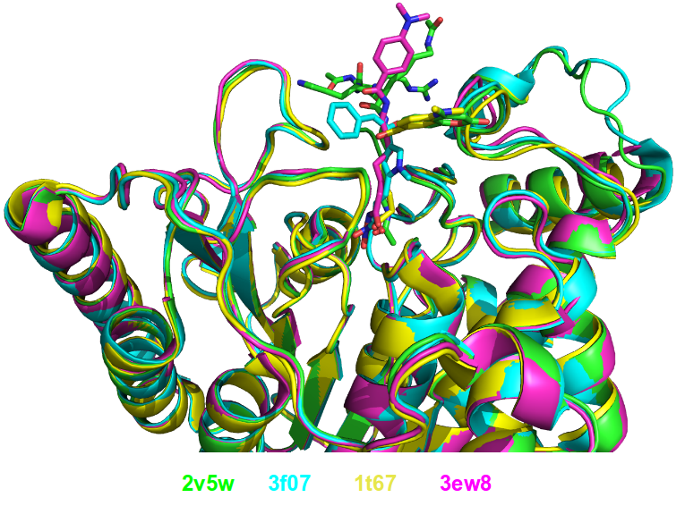
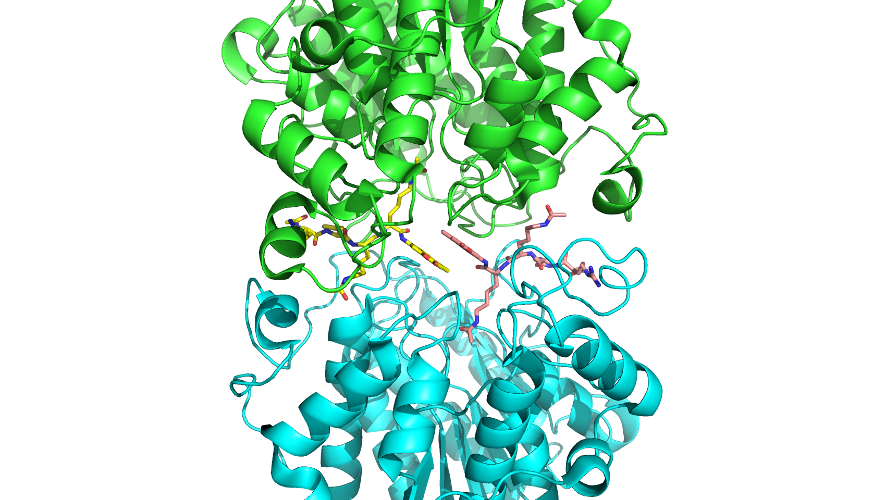
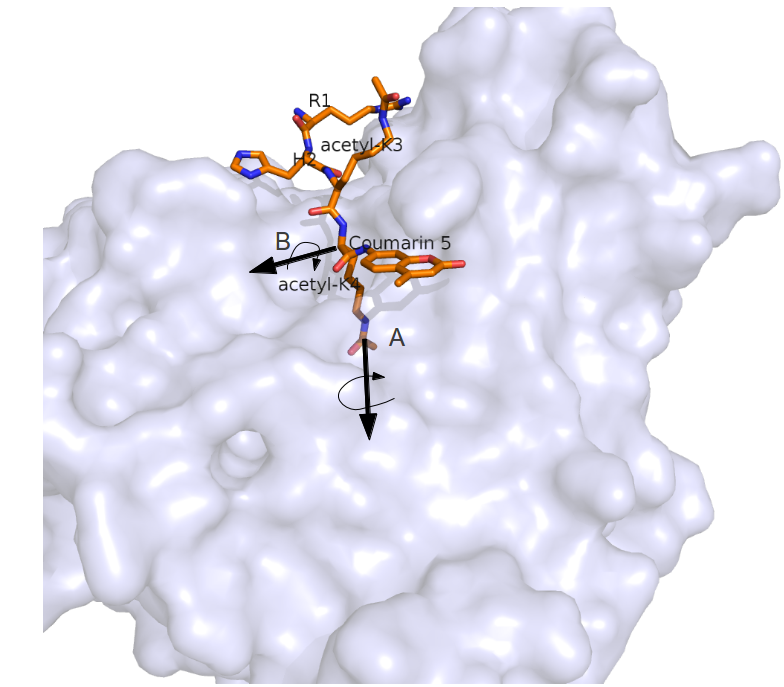
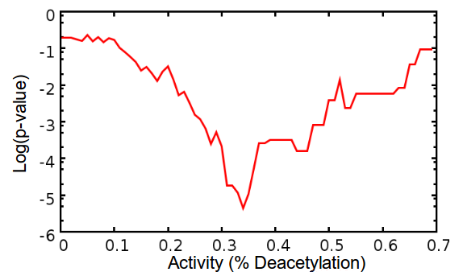

.. role:: ref

.. role:: label

.. raw::  latex

  \newcommand*{\docutilsroleref}{\ref}
  \newcommand*{\docutilsrolelabel}{\label}
  \newcommand*{\docutilsrolecaption}{\caption}
  
.. role:: raw-math(raw)
    :format: latex html

==============
Lior's Thesis
==============

Introduction
=============

	1) Acetylation - what it is (a reversible ptm), why is it important?
	2) Histone Deacetylases (and HAT) - description of the HDAC family, its function
	3) HDAC8 - why is it *interesting* (the specificity switch , monomer, the syndrome that was published on nature, its role in different cancers, etc)


Methods
========

	*London et al* have previously developed a general pipeline for the prediction of binding specificity of flexible peptides to protein receptors. In this pipeline, termed FlexPepBind, we model the structure of a collection of peptides with variable sequences to a target receptor using a high resolution peptide docking protocol - FlexPepDock[citation] and use the energy estimation given by this protocol to each of the peptide - receptor complexes to determine their relative binding affinities and subsequently train a classifier that will be able to distinguish binders from non-binders. This protocol has proven itself in 2 distinct biological systems - the interaction between Bcl2-like proteins and BH3 domains [7]_ which is a key feature in the regulation of apoptosis and  the farnesyltransferase (FTase) enzyme [citation] that catalyzes the attachment of farnesyl group to a protein via a thioether bond to a cysteine at or near the carboxy terminus of the protein [1,2 citation from nir's article]. *London et al* modeled the interaction between a collection of helical BH3 domains and some proteins from the Bcl-2 family and was successful in recapitulating a significant part of their specificity profile, as well as unraveling novel interactions.
	
	Unlike Bcl2-BH3, FTase is a catalytic protein that interacts primarily with *substrates*. Since FlexPepBind only models the interface between a peptide and a receptor, *London et al* assumed that binding equals catalysis and showed that this assumption is valid for the vast majority of cases. 
	
	This study is yet another adaptation of this protocol to the intriguing enzyme HDAC8 to determine its binding specificity and potentially find novel substrates. In our study we also assume that binding equals catalysis, demonstrating that this assumption is valid across a wide range of peptides. The pipeline can be summarized as follows; First, we calibrate and test our protocol for the binding of peptides that were validated experimentally by *Fierke et al*. Then, we derive a classifier and show that it indeed possesses an ability to differentiate between experimentally validated low and high affinity peptides substrates. Last, we try to find novel substrates from a large database of lysine-acetylated proteins.
	
Preparation of starting structure
---------------------------------

	For each of the peptide sequences a coarse model of the complex was generated based on the selected template, that coarse model is the starting structure that serves as input to the FlexPepDock protocol. We tested 2 approaches to create the starting complex, one involved threading the peptide sequence onto the backbone configuration taken from solved structures, the other approach included the extension of the peptide to a complete linear polypeptide (all phi angles were set to -135.0 degrees, all psi angles to +135.0 degrees) and superimposing only the acetylated Lysine onto a position taken from the crystal structure. 

	The *no free lunch* theorem suggests that all search algorithms have the same average performance over all problems [4]_, and thus implies that to gain in performance on a certain application one must use a specialized algorithm that includes some prior knowledge about that problem. In previous studies we found that incorporating key interactions between the peptide and the receptor as constraints in FlexPepDock's search algorithm greatly improves the performance of the resulting predictor. 

	Unlike previous studies, where the key interactions from which the constraints were derived relied heavily on backbone atoms, we found that the dominant interactions in our case are mostly mediated through the acetylated lysine sidechain. Furthermore, Our computational results suggests that the sidechains adjacent to the acetylated lysine form stablilizing stacking interactions with the receptor. Indeed, experimental data shows that aromatic amino acids at these positions are over represented in highly active peptides. However, we still lack a crystal structure that validates our structural hypothesis.

.. figure:: images/figure_1.png
	:scale: 20%

	:label:`keyint` The key interactions from which the constraints were derived, taken from a solved crystal complex (PDB: 2v5w).

	The interaction between D101 in the receptor and the N atom in the acetylared Lysine is critically important, a mutation D101A resulted in a complete loss of enzyme activity on the peptidic substrate and also on purified histones. [1]_ Additional constraints were derived from the interaction between the acetyl group and the two His, Asp in the active site - mostly in the purpose of fixating the acetylated Lysine in the active site.
	
Calibration of the protocol
------------------------------
	
	*London et al* [citation] developed a general framework for the prediction of binding specificity of flexible peptides to protein receptors. In general, the scheme of this framework follows a pipeline in which a collection of peptides are modeled in complex with the receptor using a high resolution peptide docking protocol [citation], then the energy estimations (termed *score*) for the modeled complexes are used to determine the relative binding affinity of each peptide to the receptor. In case the receptor is actually an enzyme that catalyzes a chemical reaction, we assume that binding = catalysis, although there are examples in which this assumption fails.[citation] 
	Previous studies have shown that a calibration process of a FlexPepBind protocol results in a more accurate predictor than a predictor that's created using a default set of parameters [citation]. The calibration process usually involves the selection of a template, adapting the scoring function and finding the right amount of sampling needed to achieve time - performance balance. [citation to bcl]

Template selection
...................

	As we've previously discussed, our protocol models the interaction between a peptide and its corresponding receptor. FlexPepDock takes as input a three dimensional structure of the receptor and a low resolution approximation of the peptide. In our case, the receptor is HDAC8, its three dimensional structure was solved on numerous occasions and under different conditions in the last few years. In this study we tested multiple structures as templates for the FlexPepBind protocol, summarized in the table below.

.. table:: Structures of HDAC8 that were tested as templates

	======	=========	============================================================
	PDB ID	Reference	Description
	------	---------	------------------------------------------------------------
	2v5w	[1]_		HDAC8 in complex with a p53-derived diacetylated peptide 
				with a Y306F catalysis abolishing mutation
	3f07	[2]_		HDAC8 complexed with APHA
	1t67	[3]_		HDAC8 complexed with hydroxamate inhibitor (MS-344), 
				residues 62-68 were discarded from the model
	======	=========	============================================================

..

	Choosing the right template is a formidable challenge - some structures were solved with inhibitors - a thing that could induce a different *bound* structure than the actual real substrates. Others were solved with mutations that abolished catalysis and/or binding. And most of all, most structures were solved as dimers that interacted with their highly flexible regions (even though the biological active form is a monomer [1]_ ) creating crystal contacts and potential interactions that might have altered the specificity profile of the enzyme.

	In order to select a template we applied a short FlexPepDock run on each of the above recetors, complexed with the top and bottom 5 binders and used Pearson's correlation to determine how well we could distinguish between the two classes. We note that *London et al* merely used a short minimization to the template structure to select a proper template in the case of Bcl2 [7]_ , In our case, the highly flexible interface of HDAC8 indicated that a more extensive approach is needed. This short pipeline suggested that 2v5w is the best candidate for the structural template, this structure was solved as together with an actual peptide, not along with a small molecule or in its free form - a fact which probably contributed to its performance as a structural template.
	


	:label:`interreceptor` **A** - The interface of 2v5w with the lysine acetylated peptide and the coumarin residue up close. **B** - An alignment of the structures from Table 1, demonstrating the conformational flexibility of the interface of HDAC8.

Sampling
..........
	
	The term *Sampling* in the context of FlexPepDock takes 2 different meanings. Since the entire Rosetta framework is based on non-deterministic simulation pathways, the resulting output is different from one simulation to the next and in order to capture the conformation of a complex, several simulation runs should be made in the hope that at least one will find the global minimal energy conformation. The other meaning of *sampling* in the context of FlexPepDock is the perturbation size of small/shear moves of the peptide backbone. A large perturbation size increases the sampling space , causing the peptide to explore more conformations.
	
	Calibrating the amount of sampling in our FlexPepBind protocol in the context of number of simulations, requires us to find the trade-off between computation time (each simulation run is computationally intensive) and number of near-native output structures (in optimal cases, the more we sample, the larger our signal/noise ratio). In the sampling space context, we aim at finding the trade-off between sampling different peptide conformations and the size of the sample space. If the peptide native structure is relatively different than the starting structure of the simulation (in term of phi/psi angles) then larger perturbations are a necessity in order to find it. Increasing the perturbation size however, can pose a probelm as it also increases the space of possible conformations, potentially decreasing the signal/noise ratio.
	
	We found that a modest amount of sampling (in the context of number of simulation runs) is sufficient to generate a reliable predictor. Our findings correlate with an earlier study conducted by *London et al* [8]_ , that found that 200 simulation rounds are indeed sufficient for this purpose, and that a larger number of simulation rounds doesn't necessarily yield significant improvements in the perdictor's performance. However, in terms of the perturbation size, we found that the default amount of sampling that was sufficient for all previous studies, wasn't optimal in our case, perhaps since our simulation started from an extended peptide conformation, while all other studies reused an existing backbone conformation as a template that all the sequences were threaded on. 
	
	
	Threading a peptide onto an existing backbone conformation in our case proved to be problematic. As we've previously mentioned, the lack of proper substrate - receptor crystal structure didn't allow us to obtain a genuine peptide - receptor complex and as a result, we couldn't reuse a reliable backbone conformation. We tried to reuse the existing peptide backbone that was present in *2v5w*, this complex was far from optimal - the peptide was located right in the interface between the two HDAC8 dimers that formed in the crystalization process, and interacted heavily with both of them. Furthermore, it contains a fluorescent coumarin residue and two acetylated lysine residues - these facts prevented the backbone conformation of this peptide from being an optimal solution, and indeed - this approach didn't yield a better predictor than the one we got when we used an extended peptide as a starting structure for our simulations.
	



	The interface between the peptide substrate that was crystallized with *2v5w*. 
	
	This backbone of this peptide was found to be a poor starting structure since it interacts with both monomers in the dimer, contains a coumarin residue (which potentially has different backbone preferences than conventional amino acids ) and two acetylated lysines.


Scoring function
.................

	The FlexPepDock simulations were performed using both the standard Rosetta scoring schema (*score12*) and a slightly modified *score12* that includes several minor adjustments that were shown to improve the resulting classifier. The most critical change was the introduction of a weak short range Coulombic electrostatic energy term (hack_elec) In this term, a simple, linearly increasing distance-dependent dielectric was used to model solvent screening effects, with all interactions truncated at 5.5 Å, thereby preserving the short-ranged nature of the all-atom potential. *Bradly et al* [5]_ demonstrated that the incorporation of the explicit electrostatics term in addition to Rosetta's orientation-dependent hydrogen bonding potential [6]_ helped to prevent unfavorable short-range electrostatic interactions, modulated the interaction strength of charged and polar hydrogen bonds and generally, improved the performance of their DNA-protein interaction specificity predictions. This slight modification was also used by *London et al* in their Bcl-2 - BH3 specificity predictions [7]_ and in our calibration process we validated some of these parameters, verifying that they indeed introduce an improvement to the resulting predictor.
	
	We've seen in several studies conducted in our lab that a slight *post-simulation* change to the scoring function might be beneficial in determining the relative binding affinity of the peptide to the receptor. In other words, the scoring function that is used for the modeling process might be slightly different than the scoring function used to evaluate the modeled complexes after the simulation has been completed. These changes are:

	#) **Peptide score** - includes an estimation of the internal energy of the peptide
	#) **Interface score** - includes an estimation of the interactions across the interface
	#) **Reweighted score** - the sum of peptide score, interface score and total score.


	It is yet to be determined if the modification of the scoring function in the following fashion in the simulation phase itself also results in better estimation of the relative binding affinity.

Rigid body movements
.....................
	
	FlexPepDock applies rigid body movements to the peptide relative to the receptor. The transformations that define these movements are calculated using an axis and the point of center of mass of the peptide. By default , the axis equals to the vector that connects the closest peptide CA atom to the center of mass the peptide , to the closest receptor atom. Since the interaction between HDAC8 and its acetylated peptidic substrate involves a deep pocket in which the acetylated Lysine lies, we tested several alternative axes (described in figure :ref:`mc` )


	
	:label:`mc` The main axes we tested in the calibration process. One, rotating the peptide around the Lysine residue, the other approx. around the vector that is formed by the linear conformation of the peptide, X4-Ca (X - a variable position), is the default choice of the protocol.

Constraints
............
	
	HDAC8 has the ability to catalyze a deacetylation reaction with several different substrate [citation]. We believe that its ability to maintain such a diverse specificity profile stems from the fact that its binding motif is encoded in the structure of its substrates. One of our most basic assumptions when applying the FlexPepBind protocol is that the ability to characterize the structural interaction motif properly correlates the capacity to reconstruct the entire specificity profile. To this date (10/2012) there is only one solved complex containing a peptidic substrate bound to HDAC8 (PDB *2v5w*) , so finding a motif in our case was somewhat a challenge. Figure :ref:`keyint` illustrates the conserved interactions we derived from the solved complexes.
	
	Once a structural motif is determined, the scoring function must be modified to favor conformations that include that particular strucural motif. This step subsequently directs the search algorithm to sample structures that satisfy this collection of constraints. The most common types of constraints that are available in Rosetta are summarized below:
	
.. table:: Types of constraint functions in Rosetta

	=================	==========	=======================================
	Type of function	Parameters			Formula
	-----------------	----------	---------------------------------------
	Harmonic		x0, sd		.. image:: images/harmonic.png
							:scale: 50%
	Circular Harmonic	x0, sd		.. image:: images/circular_harmonic.png
							:scale: 50%
	Gaussian		mean,sd		.. image:: images/gaussian.png
							:scale: 50%
	=================	==========	=======================================

..
	
	Since we didn't want to alow much flexibility in the particular conserved interactions we defined as *conserved*, we used the harmonic function as our constraint, testing several standard deviations in our calibrations.
	
.. refer to supp for constraints.

Results
========


Description of the dataset
--------------------------

	*Fierke et al* created a dataset composed of 361 6-mer peptides with the sequence GXK(Ac)YGC (where X,Y are all the amino acids except Cysteine). For each of these peptides, a level of activity with respect to HDAC8 was determined by measuring the percentage of deacetylation after 1 hour.(?) (**Add reference to the proper section in the supplementary material**)
	We divided the dataset to training and test sets by sorting the peptides according to their experimental activity , taking all the even rows to be the test set and all the odd rows to be the training set. That division assured even distribution of peptides with respect to their activity levels (avoiding a situation where one set holds a large number of high/low activity decoys).
	

Calibration of the protocol
------------------------------
	
	Below we describe the results obtained in the calibration process. This process resulted in a coarse set of parameters, to be refined on the whole training set as part of the classifier learning process. Usually, Each step of the calibration process involved changing one degree of freedom of a certain feature (such as - amount of sampling, constraints, etc) while maintaining the others fixed.
	
	The first calibration round was made by taking 5 best binders and 5 bad binders, trying to generate a coarse set of parameters to be refined later using the entire training set.

.. table:: A short version of the dataset used for coarse calibration of our protocol.
	
	+---------------+----------------------+------------------+
	|Sequence	|	% deacetylation|	annotation|
	+===============+======================+==================+
	|GYK(ac)FGC	|93		       |		  |
	+---------------+----------------------+		  |
	|GYK(ac)WGC	|80		       |		  |
	+---------------+----------------------+     Binders	  |
	|GLK(ac)FGC	|66		       |		  |
	+---------------+----------------------+		  |
	|GIK(ac)FGC	|64		       |		  |
	+---------------+----------------------+		  |
	|GRK(ac)YGC	|62		       |		  |
	+---------------+----------------------+------------------+
	|GQK(ac)YGC	|0		       |		  |
	+---------------+----------------------+		  |
	|GIK(ac)VGC	|0		       |		  |
	+---------------+----------------------+   Non Binders	  |
	|GMK(ac)VGC	|0		       |		  |
	+---------------+----------------------+		  |
	|GDK(ac)YGC	|0		       |		  |
	+---------------+----------------------+		  |
	|GMK(ac)YGC	|0		       |		  |
	+---------------+----------------------+------------------+
..


	This set of short simulations allowed us to quickly distinguish between sets of parameters.

Sampling
.........

	We inspected different amounts of sampling in which the number of decoys generated and the amount of perturbation size were modified together, since As we've previously mentioned, the larger the perturbation size - the larger the space of possible peptide conformations.
	
	Since the amount of sampling was the first feature we decided to calibrate, we initialized the other features with values that were found optimal in previous studies such as:
	
	#) Weight of *hackelec* (electrostatic term) = 0.5
	#) Standard deviation of constraints = 0.2
	#) Number of decoys generated per simulation = 200

	These features were of course, validated and perturbed in later phases.
	
	We also figured that the default anchor chosen in the FlexPepDock protocol will not be optimal in our case, so we started with a predefined anchor that we found to be suitable, and verified its optimality later on when other sets of parameters were calibrated. Furthermore, since it is unlikely that the amount of sampling will be different from one template to another, we selected 2v5w since it is the one that has the best chances to serve as a template, due to the properties we mentioned earlier (primarily since it was solved with an actual peptide and not a small molecule)

+---------------+----------------------+----------------------------------------------------+
|				       |       Scoring scheme (correlation coefficient)	    |
+---------------+----------------------+---------------+-----------------+------------------+
|No.		|	Sampling       | Peptide score | Interface score | Reweighted score |
+---------------+----------------------+---------------+-----------------+------------------+
|1		|	asas	       | 1	       |         2       |        3         |		
+---------------+----------------------+---------------+-----------------+------------------+

Template selection
...................

	As was discussed earlier, we applied a short FlexPepDock run on each of the possible templates complexed with the top and bottom 5 binders and used Pearson's correlation to determine how well we could distinguish between the two classes. 

Scoring function
.................


Rigid body movements
.....................
	

Constraints
............
	
Summary of calibration runs
............................
	
.. table:: Description and summary of calibration simulations.

	======		================	===============================	===========	==================
	No.		Anchor (residue)	Sampling			Template	Scoring function
	------		----------------	-------------------------------	-----------	------------------
	1		366			* perturbation size = 30	2v5w		* Lazaridis-Karplus
						* 200 decoys per peptide.			* hack_elec = 0.5
	
	2		366			* perturbation size = 60	2v5w		* Lazaridis-Karplus
						* 500 decoys per peptide.			* hack_elec = 0.5
						
	3		366			* perturbation size = 90	2v5w		* Lazaridis-Karplus
						* 900 decoys per peptide.			* hack_elec = 0.5

	4		366			* perturbation size = 30	2v5w		* Lazaridis-Karplus
						* 500 decoys per peptide.			* hack_elec = 0.5
	
	5		366			* perturbation size = 20	2v5w		* Lazaridis-Karplus
						* 200 decoys per peptide.			* hack_elec = 0.5

	6		367 (chosen		* perturbation size = 20	2v5w		* Lazaridis-Karplus
			automatically		* 200 decoys per peptide.			* hack_elec = 0.5
			since its the 
			center of mass)	
			
	7		366			* perturbation size = 20	2v5w		* Rosetta's default
						* 200 decoys per peptide.			  score function
												  (score12)
	8		366			* perturbation size = 6 
						  (default)			2v5w		* Lazaridis-Karplus
						* 200 decoys per peptide.			* hack_elec = 0.5

	9		366			* perturbation size = 15	2v5w		* Lazaridis-Karplus
						* 200 decoys per peptide.			* hack_elec = 0.5

	10		366			* perturbation size = 15	2v5w		* Lazaridis-Karplus
						* 200 decoys per peptide.			* hack_elec = 0.25
	
	11		366			* perturbation size = 15	2v5w		* Lazaridis-Karplus
						* 200 decoys per peptide.	(threaded)	* hack_elec = 0.5
										[*]_	
														
	12		366			* perturbation size = 15	2v5w		* Lazaridis-Karplus
			(anchor was CH		* 200 decoys per peptide.			* hack_elec = 0.5
			atom, instead of
			CA)	
	
	13		366			* perturbation size = 15	3f07		* Lazaridis-Karplus
						* 200 decoys per peptide.			* hack_elec = 0.5
	
	14		366			* perturbation size = 15	3f07		* Lazaridis-Karplus
			(anchor was CH		* 200 decoys per peptide.			* hack_elec = 0.5
			atom instead of
			CA)								
	
	15		366			* perturbation size = 15	1t67		* Lazaridis-Karplus
						* 200 decoys per peptide.			* hack_elec = 0.5

	16		366			* perturbation size = 15	2v5w		* Lazaridis-Karplus
						* 200 decoys per peptide.			* hack_elec = 0.5
						* low resolution step 
						  (centroid mode)						
	
	17		366			* perturbation size = 15	2v5w		* Lazaridis-Karplus
			receptor anchor		* 200 decoys per peptide.			* hack_elec = 0.5
			was 289 
			(manually)
			[*]_
			
	======		================	===============================	===========	==================
	
..

	The performance of each simulation was evaluated by the Pearson correlation coefficient and the Kolmogorov - Smirnov p-value by averaging the top 3 models with the lowest peptide , interface and reweighted score against the experimental deacetylation values. The tables that summarize the performance of each of these simulations can be found in the  `Calibration simulations and their performance` section, in the `Supplementary Material`_. Plots that show the distribution of score of each sequence against its experimental activity are available in section `Calibration`_ in the `Supplementary Material`_.
	Simulation 11 and its set of parameters, using the interface scoring scheme yielded the best performance in terms of correlation and the Kolmogorov-Smirnov p-value and selected for subsequent refinement on the whole training set.

.. [*] The sequence was threaded on the peptidic substrate backbone in the 2v5w crystal. Since this peptidic substrate was only 4 amino acid long (the train/test sequences were 6 residues long), the 2 extra amino acids backbone conformation attained an extended conformation.

.. [*] Setting the receptor anchor to be the 289 residue , creating an axis that aligns with the Lysine residue side-chain. This axis is directed inside the pocket , and allowed the peptide to rotate while the Lysine residue stays fixed (see figure :ref:`mc`)
	
Whole data set analysis
--------------------------
	
Training a classifier
.....................

	After an initial phase of calibration , we were set to examine the parameters we learned from the brief simulations on the whole training set, this step allowed us to refine our initial, coarse set of parameters. Below is a table that summarizes the simulations we've performed on the complete training set.

	For each of these simulations and for each scoring scheme we calculated the Pearson's correlation coefficient to evaluate its fitness to experimental data. 
	Furthermore, Our dataset contains sequences of lysine acetylated peptides that are ranked by their level activity as substrates. The peptide's level of activity is not represented in a binary fashion (binder / non-binder) , but rather as a continous value in [0,1]. In order to train a binary predictor, we needed to adapt our dataset accordingly. To accomplish that, we learned a cutoff from the training set data so that each sequence with activity that is lower from the cutoff is labeled as a non-binder and vice versa. We derived that cutoff by applying 2 samples KS test on all possible cutoffs, the chosen activity level to be served as cutoff was the one with the lowest p-value. Using this cutoff we labeled each sequence in our dataset as binder/non binder and plotted an ROC plot. We also applied a clustering step [citation] to the structures from each simulation and averaged the top 3 ranking decoys in the largest cluster to get a score for each sequence. Looking at the KS test p-values , it is easy to see that this step improved our ability to distinguish between binders and non binders significantly. The 2 samples KS test we used,  quantifies a distance between the empirical distributions of two samples - in our case - binders and non-binders. The resulting p-value is calculated under the null hypothesis that the samples are drawn from the same distribution.  The `Training set simulations and their performance`_ concentrates a summary of all simulations with and without a clustering step, including the statistical significance of their performance.

	To visualize the comparison of our ability to distinguish binders from non binders with and without clustering, we plotted *score vs. activity* plots for all simulations. They are available in the `Supplementary Material`_ - `Training set analysis`_
	From the results above we were able to derive a modeling scheme that could serve us in our future predictions for additional substrates - the scheme we used in simulation #1 together with a clustering step achieved best AUC together with the 0.34 cutoff we obtained. (see figure :ref:`roc`)

.. table:: Summary of training set simulations

	======		================	===============================	===========	===================
	No.		Anchor (residue)	Sampling			Template	Scoring function
	======		================	===============================	===========	===================
	1		366			* perturbation size = 15	2v5w		* Lazaridis-Karplus
						* 200 simulations per peptide.			* hack_elec = 0.5

	2		366			* perturbation size = 15	2v5w		* Lazaridis-Karplus
						* 200 simulations per peptide.	(threaded)	* hack_elec = 0.5	

	3		366			* perturbation size = 15	3f07		* Lazaridis-Karplus
						* 200 simulations per peptide.			* hack_elec = 0.5

	4		366			* perturbation size = 15	2v5w		* Lazaridis-Karplus
						* 200 simulations per peptide.			* hack_elec = 0.5
												* sd of constraints
												  is 0.15

	5		366			* perturbation size = 15	2v5w		* Lazaridis-Karplus
						* 200 simulations per peptide.			* hack_elec = 0.5
												* sd of constraints
												  is 0.25
												  
	6		366			* perturbation size = 15	3f07		* Lazaridis-Karplus
			anchor was CH		* 200 simulations per peptide.			* hack_elec = 0.5
			atom									

	7		366			* perturbation size = 15	2v5w		* Lazaridis-Karplus
			anchor was CH		* 200 simulations per peptide.	(threaded)	* hack_elec = 0.5
			atom								
	======		================	===============================	===========	===================
	


	:label:`cutoff` log(p-value) of KS test when using the cutoff from the X axis (simulation 1). Clearly, the best cutoff we can choose in this case is 0.34.

Comparison to a minimization only based classifier
...................................................

	Previous studies [citation] have indicated that a minimization only scheme could yield suprisingly good predictors and as a result, posses a ability to distinguish binders and non binders in several biological systems. The FlexPepDock protocol applies a minimization scheme in which only the corresponding peptide and the interface residues are minimized while the whole receptor structure stays fixed. We've applied this minimization scheme to our training set to evaluate and compare the ability of both methods. In contrast to the FlexPepDock training scheme , we have found that the peptide scoring scheme worked provided a more accurate predictor, comparing to the other scoring schemes see figure :ref:`roc` for more details.

Test set analysis
..................

	With our insights from training a classifier on the training set, we applied it on the other part of the sequences - the test set. The predictor scheme used the set of parameters and constraints identical to that of simulation #1 in the training set runs, as its resulting predictor has the best ability to distinguish between binders and non binders (ROC plot AUC of 0.873).
	The below ROC plot summarizes the performance of our classifier on the test set, comparing to its performance on the training set and to a minimization only scheme.


	.. figure:: plots/ROCPlots/roc.png
		:scale: 50 %

		:label:`roc` Comparison of the minimization and full optimization schemes that included clustering on both training and test sets.
	
		The minimization step uses the *peptide scoring scheme*, while in the full optimization the inteface scoring scheme performed better on the training set and thus - served as the basis for the predictor on the test set.

Searching for novel substrates
...............................

	We used the minimization only version of our predictor - the one that performed best on the experimental dataset - to search for potential novel substrates of HDAC8.
	We've obtained a copy of the Phosphosite database from PhosphoSitePlus (PSP) - an online systems biology resource providing comprehensive information and tools for the study of protein post-translational modifications and queried it for lysine acetylated proteins. We've trimmed the sequences so they will be of the same size as the sequences that are present in the experimental dataset - **YYK(ac)YYY**. 

	To demonstrate the ability of our classifier to recognize potential substrates among the large database of acetylated sequences we plotted the distribution of scores of all the acetylated sequences from the database against a background distribution of random peptides that were sampled from the distribution of amino acids in the acetylated sequences (figure :ref:`phosphodist`) and under the null hypothesis that both sequences were originated from the same distribution, we used the Kolmogorov-Smirnov test to calculate a p-value of 5.07×10\ :sup:`-5`.
	It is important to note that surely, not all sequences in the Phosphosite database are substrates of HDAC8, but nevertheless, we were managed to diffrentiate between a collection of random sequences and a collection of acetylated sequences that some of them were putatively originated from potential substrates of HDAC8. This finding could suggest that there are quite a lot potential substrates of HDAC8 that are yet to be discovered.

	.. figure:: plots/PhosphositeDisr/plot.png
		:scale: 50 %

		:label:`phosphodist` Distribution of scores in both acetylated and random sequences
	
		The rightmost bar concentrates all the peptides that have a minimization score above 10. (a high score that suggests that these peptides were not modeled successfully)
	
Summary
........

	We have previously used structure-based prediction of binding specificity to successfully identify both known and novel protein farnesyltransferase (FTase) substrate peptides and BH3 peptides to Bcl-2-like proteins. The HDAC8 system presents additional challenges to systems we studied previously - the extremely flexible loops in the interface has the ability to move and accomodate different substrates for each conformation, the lack of solved crystals that incorporated a genuine substrate and the acetylated lysine - a post translational modification that was poorly addressed in previous computational studies.
	In this study, We've applied the FlexPepBind modeling scheme to a series of peptide sequences in order to train a predictor that will have the ability to distinguish between peptides that serve as substrates of HDAC8 and peptides that are doesn't. Since FlexPepDock only models the interface between the two , and not the catalytic process, we've assumed that peptides that bind the receptor are necessarily deacetylated and going through the whole catalytic process. 

	We learned a set of parameters that included the amount of sampling and movement, degree of constraints and some other energy terms in the scoring function and compared the resulting predictor to a predictor that was obtained by applying much simpler and less computationally intensive approach - the FlexPepDock minimization scheme. The minimization only predictor performed better in the task of separating between binders and non binders in the experimental dataset we used. Its ability, in addition to the fact that this scheme is much less computationally intensive, lead us to utilize it to find new potential substrates to HDAC8 in a large database of acetylated proteins.

Supplementary Material
=======================

Calibration
------------

Score vs. Activity plots
.........................
.. list-table:: Training set - score vs. activity plots for the short calibration phase
   :widths: 5 30 30 30
   :header-rows: 1

   * - No.
     - Reweighted Score
     - Peptide Score
     - Interface Score
   * - 1
     - .. image:: plots/ShortCalibration/calibration2_activity_score.png
     	:scale: 20%
     - .. image:: plots/ShortCalibration/calibration2_pep_sc_activity_score.png
     	:scale: 20%
     - .. image:: plots/ShortCalibration/calibration2_I_sc_activity_score.png
     	:scale: 20%
   * - 2
     - .. image:: plots/ShortCalibration/calibration3_activity_score.png
     	:scale: 20%
     - .. image:: plots/ShortCalibration/calibration3_pep_sc_activity_score.png
     	:scale: 20%
     - .. image:: plots/ShortCalibration/calibration3_I_sc_activity_score.png
     	:scale: 20%
   * - 3
     - .. image:: plots/ShortCalibration/calibration4_activity_score.png
     	:scale: 20%
     - .. image:: plots/ShortCalibration/calibration4_pep_sc_activity_score.png
     	:scale: 20%
     - .. image:: plots/ShortCalibration/calibration4_I_sc_activity_score.png
     	:scale: 20%
   * - 4
     - .. image:: plots/ShortCalibration/calibration5_activity_score.png
     	:scale: 20%
     - .. image:: plots/ShortCalibration/calibration5_pep_sc_activity_score.png
     	:scale: 20%
     - .. image:: plots/ShortCalibration/calibration5_I_sc_activity_score.png
     	:scale: 20%
   * - 5
     - .. image:: plots/ShortCalibration/calibration6_activity_score.png
     	:scale: 20%
     - .. image:: plots/ShortCalibration/calibration6_pep_sc_activity_score.png
     	:scale: 20%
     - .. image:: plots/ShortCalibration/calibration6_I_sc_activity_score.png
     	:scale: 20%
   * - 6
     - .. image:: plots/ShortCalibration/calibration7_activity_score.png
     	:scale: 20%
     - .. image:: plots/ShortCalibration/calibration7_pep_sc_activity_score.png
     	:scale: 20%
     - .. image:: plots/ShortCalibration/calibration7_I_sc_activity_score.png
     	:scale: 20%
   * - 7
     - .. image:: plots/ShortCalibration/calibration8_activity_score.png
     	:scale: 20%
     - .. image:: plots/ShortCalibration/calibration8_pep_sc_activity_score.png
     	:scale: 20%
     - .. image:: plots/ShortCalibration/calibration8_I_sc_activity_score.png
     	:scale: 20%
   * - 8
     - .. image:: plots/ShortCalibration/calibration9_activity_score.png
     	:scale: 20%
     - .. image:: plots/ShortCalibration/calibration9_pep_sc_activity_score.png
     	:scale: 20%
     - .. image:: plots/ShortCalibration/calibration9_I_sc_activity_score.png
     	:scale: 20%
   * - 9
     - .. image:: plots/ShortCalibration/calibration10_activity_score.png
     	:scale: 20%
     - .. image:: plots/ShortCalibration/calibration10_pep_sc_activity_score.png
     	:scale: 20%
     - .. image:: plots/ShortCalibration/calibration10_I_sc_activity_score.png
     	:scale: 20%
   * - 10
     - .. image:: plots/ShortCalibration/calibration12_activity_score.png
     	:scale: 20%
     - .. image:: plots/ShortCalibration/calibration12_pep_sc_activity_score.png
     	:scale: 20%
     - .. image:: plots/ShortCalibration/calibration12_I_sc_activity_score.png
     	:scale: 20%
   * - 11
     - .. image:: plots/ShortCalibration/calibration13_activity_score.png
     	:scale: 20%
     - .. image:: plots/ShortCalibration/calibration13_pep_sc_activity_score.png
     	:scale: 20%
     - .. image:: plots/ShortCalibration/calibration13_I_sc_activity_score.png
     	:scale: 20%
   * - 12
     - .. image:: plots/ShortCalibration/calibration14_activity_score.png
     	:scale: 20%
     - .. image:: plots/ShortCalibration/calibration14_pep_sc_activity_score.png
     	:scale: 20%
     - .. image:: plots/ShortCalibration/calibration14_I_sc_activity_score.png
     	:scale: 20%
   * - 13
     - .. image:: plots/ShortCalibration/calibration33_activity_score.png
     	:scale: 20%
     - .. image:: plots/ShortCalibration/calibration33_pep_sc_activity_score.png
     	:scale: 20%
     - .. image:: plots/ShortCalibration/calibration33_I_sc_activity_score.png
     	:scale: 20%
   * - 14
     - .. image:: plots/ShortCalibration/calibration32_activity_score.png
     	:scale: 20%
     - .. image:: plots/ShortCalibration/calibration32_pep_sc_activity_score.png
     	:scale: 20%
     - .. image:: plots/ShortCalibration/calibration32_I_sc_activity_score.png
     	:scale: 20%
   * - 15
     - .. image:: plots/ShortCalibration/calibration34_activity_score.png
     	:scale: 20%
     - .. image:: plots/ShortCalibration/calibration34_pep_sc_activity_score.png
     	:scale: 20%
     - .. image:: plots/ShortCalibration/calibration34_I_sc_activity_score.png
     	:scale: 20%
   * - 16
     - .. image:: plots/ShortCalibration/calibration36_activity_score.png
     	:scale: 20%
     - .. image:: plots/ShortCalibration/calibration36_pep_sc_activity_score.png
     	:scale: 20%
     - .. image:: plots/ShortCalibration/calibration36_I_sc_activity_score.png
     	:scale: 20%
   * - 17
     - .. image:: plots/ShortCalibration/calibration45_activity_score.png
     	:scale: 20%
     - .. image:: plots/ShortCalibration/calibration45_pep_sc_activity_score.png
     	:scale: 20%
     - .. image:: plots/ShortCalibration/calibration45_I_sc_activity_score.png
     	:scale: 20%

Calibration simulations and their performance
.............................................

Peptide Score
``````````````

.. table:: Results for short calibration runs, by peptide score.

	=====	==========================================	==========================================
	No.	KS Test						Pearson correlation coefficient
	-----	------------------------------------------	------------------------------------------
	1	* D-Statistics: 0.6				* R: -0.45
		* p-value: 0.2					* p-Value: 0.18
		
	2	* D-Statistics: 0.6				* R: -0.38
		* p-value: 0.2					* p-Value: 0.27

	3	* D-Statistics: 0.4				* R: -0.27
		* p-value: 0.69					* p-Value: 0.44

	4	* D-Statistics: 0.6				* R: -0.46
		* p-value: 0.2					* p-Value: 0.18

	5	* D-Statistics: 0.6				* R: -0.464
		* p-value: 0.2					* p-Value: 0.176
		
	6	* D-Statistics: 0.6				* R: -0.493
		* p-value: 0.2					* p-Value: 0.146
		
	7	* D-Statistics: 0.6				* R: -0.48
		* p-value: 0.2					* p-Value: 0.152
		
	8	* D-Statistics: 0.6				* R: -0.24
		* p-value: 0.2					* p-Value: 0.498
		
	9	* D-Statistics: 0.6				* R: -0.41
		* p-value: 0.2					* p-Value: 0.230

	10	* D-Statistics: 0.6				* R: -0.45
		* p-value: 0.2					* p-Value: 0.185

	11	* D-Statistics: 0.6				* R: -0.64
		* p-value: 0.2					* p-Value: 0.043
		
	12	* D-Statistics: 0.6				* R: -0.45
		* p-value: 0.2					* p-Value: 0.202
		
	13	* D-Statistics: 0.6				* R: 0.44
		* p-value: 0.2					* p-Value: 0.185

	14	* D-Statistics: 1.0				* R: 0.79
		* p-value: 0.003				* p-Value: 0.006
		
	15	* D-Statistics: 0.4				* R: -0.11
		* p-value: 0.69					* p-Value: 0.75
		
	16	* D-Statistics: 0.6				* R: -0.3
		* p-value: 0.2					* p-Value: 0.39
		
	17	* D-Statistics: 0.6				* R: -0.48
		* p-value: 0.2					* p-Value: 0.153
	=====	==========================================	==========================================


Interface Score
`````````````````

.. table:: Results for short calibration runs, by interface score.

	=====	==========================================	==========================================
	No.	KS Test						Pearson correlation coefficient
	-----	------------------------------------------	------------------------------------------
	1	* D-Statistics: 0.6				* R: -0.69
		* p-value: 0.2					* p-Value: 0.02
		
	2	* D-Statistics: 0.8				* R: -0.65
		* p-value: 0.03					* p-Value: 0.04

	3	* D-Statistics: 0.4				* R: -0.58
		* p-value: 0.69					* p-Value: 0.07

	4	* D-Statistics: 0.8				* R: -0.75
		* p-value: 0.03					* p-Value: 0.012

	5	* D-Statistics: 0.8				* R: -0.76
		* p-value: 0.03					* p-Value: 0.01
		
	6	* D-Statistics: 0.6				* R: -0.65
		* p-value: 0.2					* p-Value: 0.04
		
	7	* D-Statistics: 0.8				* R: -0.7
		* p-value: 0.03					* p-Value: 0.02
		
	8	* D-Statistics: 0.8				* R: -0.72
		* p-value: 0.03					* p-Value: 0.018
		
	9	* D-Statistics: 0.8				* R: -0.77
		* p-value: 0.03					* p-Value: 0.008

	10	* D-Statistics: 0.6				* R: -0.56
		* p-value: 0.2					* p-Value: 0.085

	11	* D-Statistics: 0.6				* R: -0.784
		* p-value: 0.2					* p-Value: 0.007
		
	12	* D-Statistics: 0.8				* R: -0.77
		* p-value: 0.03					* p-Value: 0.009
		
	13	* D-Statistics: 0.6				* R: -0.51
		* p-value: 0.2					* p-Value: 0.130

	14	* D-Statistics: 0.6				* R: -0.174
		* p-value: 0.2					* p-Value: 0.62
		
	15	* D-Statistics: 0.4				* R: -0.11
		* p-value: 0.69					* p-Value: 0.75
		
	16	* D-Statistics: 0.6				* R: -0.542
		* p-value: 0.2					* p-Value: 0.1
		
	17	* D-Statistics: 0.8				* R: -0.74
		* p-value: 0.03					* p-Value: 0.013
	=====	==========================================	==========================================


Reweighted Score
`````````````````

.. table:: Results for short calibration runs, by reweighted score.

	=====	==========================================	==========================================
	No.	KS Test						Pearson correlation coefficient
	-----	------------------------------------------	------------------------------------------
	1	* D-Statistics: 0.6				* R: -0.32
		* p-value: 0.2					* p-Value: 0.35
		
	2	* D-Statistics: 0.4				* R: -0.26
		* p-value: 0.69					* p-Value: 0.46

	3	* D-Statistics: 0.8				* R: 0.48
		* p-value: 0.003				* p-Value: 0.156

	4	* D-Statistics: 0.4				* R: -0.21
		* p-value: 0.69					* p-Value: 0.54

	5	* D-Statistics: 0.6				* R: -0.24
		* p-value: 0.2					* p-Value: 0.49
		
	6	* D-Statistics: 0.6				* R: -0.51
		* p-value: 0.2					* p-Value: 0.13
		
	7	* D-Statistics: 0.6				* R: -0.28
		* p-value: 0.2					* p-Value: 0.42
		
	8	* D-Statistics: 0.4				* R: -0.121
		* p-value: 0.697				* p-Value: 0.738
		
	9	* D-Statistics: 0.4				* R: -0.24
		* p-value: 0.697				* p-Value: 0.496

	10	* D-Statistics: 0.4				* R: -0.31
		* p-value: 0.697				* p-Value: 0.382

	11	* D-Statistics: 0.4				* R: -0.003
		* p-value: 0.697				* p-Value: 0.99
		
	12	* D-Statistics: 0.6				* R: -0.41
		* p-value: 0.2					* p-Value: 0.23
		
	13	* D-Statistics: 0.8				* R: -0.51
		* p-value: 0.03					* p-Value: 0.130

	14	* D-Statistics: 0.4				* R: -0.6
		* p-value: 0.697				* p-Value: 0.06
		
	15	* D-Statistics: 0.4				* R: -0.19
		* p-value: 0.697				* p-Value: 0.59
		
	16	* D-Statistics: 0.4				* R: -0.008
		* p-value: 0.697				* p-Value: 0.98
		
	17	* D-Statistics: 0.6				* R: -0.38
		* p-value: 0.2					* p-Value: 0.27
	=====	==========================================	==========================================
	
Training set analysis
----------------------

Score vs. Activity plots
.........................


.. list-table:: Training set - score vs. activity plots
   :widths: 5 30 30 30
   :header-rows: 1

   * - No.
     - Reweighted Score
     - Peptide Score
     - Interface Score
   * - 1
     - .. image:: plots/TrainingSetAnalysis/calibration16_activity_score.png
     	:scale: 21%
     - .. image:: plots/TrainingSetAnalysis/calibration16_pep_sc_activity_score.png
     	:scale: 21%
     - .. image:: plots/TrainingSetAnalysis/calibration16_I_sc_activity_score.png
     	:scale: 21%     
   * - 2
     - .. image:: plots/TrainingSetAnalysis/calibration18_activity_score.png
     	:scale: 21%
     - .. image:: plots/TrainingSetAnalysis/calibration18_pep_sc_activity_score.png
     	:scale: 21%
     - .. image:: plots/TrainingSetAnalysis/calibration18_I_sc_activity_score.png
     	:scale: 21%    
   * - 3
     - .. image:: plots/TrainingSetAnalysis/calibration33_activity_score.png
     	:scale: 21%
     - .. image:: plots/TrainingSetAnalysis/calibration33_pep_sc_activity_score.png
     	:scale: 21%
     - .. image:: plots/TrainingSetAnalysis/calibration33_I_sc_activity_score.png
     	:scale: 21%     
   * - 4
     - .. image:: plots/TrainingSetAnalysis/calibration38_activity_score.png
     	:scale: 21%
     - .. image:: plots/TrainingSetAnalysis/calibration38_pep_sc_activity_score.png
     	:scale: 21%
     - .. image:: plots/TrainingSetAnalysis/calibration38_I_sc_activity_score.png
     	:scale: 21%     
   * - 5
     - .. image:: plots/TrainingSetAnalysis/calibration39_activity_score.png
     	:scale: 21%
     - .. image:: plots/TrainingSetAnalysis/calibration39_pep_sc_activity_score.png
     	:scale: 21%
     - .. image:: plots/TrainingSetAnalysis/calibration39_I_sc_activity_score.png
     	:scale: 21%   
   * - 6
     - .. image:: plots/TrainingSetAnalysis/calibration42_activity_score.png
     	:scale: 21%
     - .. image:: plots/TrainingSetAnalysis/calibration42_pep_sc_activity_score.png
     	:scale: 21%
     - .. image:: plots/TrainingSetAnalysis/calibration42_I_sc_activity_score.png
     	:scale: 21%     
   * - 7
     - .. image:: plots/TrainingSetAnalysis/calibration43_activity_score.png
     	:scale: 21%
     - .. image:: plots/TrainingSetAnalysis/calibration43_pep_sc_activity_score.png
     	:scale: 21%
     - .. image:: plots/TrainingSetAnalysis/calibration43_I_sc_activity_score.png
     	:scale: 21%     
     	

.. list-table:: Training set - score vs. activity plots after clustering
   :widths: 5 30 30 30
   :header-rows: 1

   * - No.
     - Reweighted Score
     - Peptide Score
     - Interface Score
   * - 1
     - .. image:: plots/TrainingSetAnalysis/Clustering/calibration16_activity_score.png
     	:scale: 21%
     - .. image:: plots/TrainingSetAnalysis/Clustering/calibration16_pep_sc_activity_score.png
     	:scale: 21%
     - .. image:: plots/TrainingSetAnalysis/Clustering/calibration16_I_sc_activity_score.png
     	:scale: 21%     
   * - 2
     - .. image:: plots/TrainingSetAnalysis/Clustering/calibration18_activity_score.png
     	:scale: 21%
     - .. image:: plots/TrainingSetAnalysis/Clustering/calibration18_pep_sc_activity_score.png
     	:scale: 21%
     - .. image:: plots/TrainingSetAnalysis/Clustering/calibration18_I_sc_activity_score.png
     	:scale: 21%    
   * - 3
     - .. image:: plots/TrainingSetAnalysis/Clustering/calibration33_activity_score.png
     	:scale: 21%
     - .. image:: plots/TrainingSetAnalysis/Clustering/calibration33_pep_sc_activity_score.png
     	:scale: 21%
     - .. image:: plots/TrainingSetAnalysis/Clustering/calibration33_I_sc_activity_score.png
     	:scale: 21%     
   * - 4
     - .. image:: plots/TrainingSetAnalysis/Clustering/calibration38_activity_score.png
     	:scale: 21%
     - .. image:: plots/TrainingSetAnalysis/Clustering/calibration38_pep_sc_activity_score.png
     	:scale: 21%
     - .. image:: plots/TrainingSetAnalysis/Clustering/calibration38_I_sc_activity_score.png
     	:scale: 21%     
   * - 5
     - .. image:: plots/TrainingSetAnalysis/Clustering/calibration39_activity_score.png
     	:scale: 21%
     - .. image:: plots/TrainingSetAnalysis/Clustering/calibration39_pep_sc_activity_score.png
     	:scale: 21%
     - .. image:: plots/TrainingSetAnalysis/Clustering/calibration39_I_sc_activity_score.png
     	:scale: 21%   
   * - 6
     - .. image:: plots/TrainingSetAnalysis/Clustering/calibration42_activity_score.png
     	:scale: 21%
     - .. image:: plots/TrainingSetAnalysis/Clustering/calibration42_pep_sc_activity_score.png
     	:scale: 21%
     - .. image:: plots/TrainingSetAnalysis/Clustering/calibration42_I_sc_activity_score.png
     	:scale: 21%     
   * - 7
     - .. image:: plots/TrainingSetAnalysis/Clustering/calibration43_activity_score.png
     	:scale: 21%
     - .. image:: plots/TrainingSetAnalysis/Clustering/calibration43_pep_sc_activity_score.png
     	:scale: 21%
     - .. image:: plots/TrainingSetAnalysis/Clustering/calibration43_I_sc_activity_score.png
     	:scale: 21%

Training set simulations and their performance
...............................................

.. list-table:: Pearson's correlation coefficient for training set simulations (Interface score)
   :widths: 5 20 20
   :header-rows: 1

   * - No.
     - Pearson correlation
     - KS Test
   * - 1
     - * R: -0.22
       * p-value: 0.002
     - * Cutoff: 0.35
       * p-value: 0.008
   * - 2
     - * R: -0.168
       * p-value: 0.020
     - * Cutoff: 0.35
       * p-value: 0.02
   * - 3
     - * R: 0.003
       * p-value: 0.96
     - * Cutoff: 0.35
       * p-value: 0.001
   * - 4
     - * R: -0.21
       * p-value: 0.004
     - * Cutoff: 0.28
       * p-value: 0.0004
   * - 5
     - * R: -0.08
       * p-value: 0.27
     - * Cutoff: 0.22
       * p-value: 0.13
   * - 6
     - * R: -0.22
       * p-value: 0.002
     - * Cutoff: 0.35
       * p-value: 0.0005
   * - 7
     - * R: -0.27
       * p-value: 0.0002
     - * Cutoff: 0.35
       * p-value: 0.007

.. list-table:: Pearson's correlation coefficient for training set simulations (Peptide score)
   :widths: 5 20 20
   :header-rows: 1

   * - No.
     - Pearson correlation
     - KS Test
   * - 1
     - * R: -0.15
       * p-value: 0.04
     - * Cutoff: 0.44
       * p-value: 0.0001
   * - 2
     - * R: -0.13
       * p-value: 0.06
     - * Cutoff: 0.53
       * p-value: 0.0003
   * - 3
     - * R: -0.1
       * p-value: 0.14
     - * Cutoff: 0.03
       * p-value: 0.02
   * - 4
     - * R: -0.14
       * p-value: 0.04
     - * Cutoff: 0.35
       * p-value: :raw-math:`$$ 4.63 \times 10^{-5} $$`
   * - 5
     - * R: -0.21
       * p-value: 0.004
     - * Cutoff: 0.63
       * p-value: 0.002
   * - 6
     - * R: -0.15
       * p-value: 0.03
     - * Cutoff: 0.44
       * p-value: :raw-math:`$$ 1.51 \times 10^{-5} $$`
   * - 7
     - * R: -0.15
       * p-value: 0.03
     - * Cutoff: 0.44
       * p-value: :raw-math:`$$ 2.79 \times 10^{-5} $$`

.. list-table:: Pearson's correlation coefficient for training set simulations (Reweighted score)
   :widths: 5 20 20
   :header-rows: 1

   * - No.
     - Pearson correlation
     - KS Test
   * - 1
     - * R: -0.09
       * p-value: 0.2
     - * Cutoff: 0.31
       * p-value: 0.0005
   * - 2
     - * R: -0.03
       * p-value: 0.68
     - * Cutoff: 0.09
       * p-value: 0.04
   * - 3
     - * R: 0.004
       * p-value: 0.95
     - * Cutoff: 0.52
       * p-value: 0.15
   * - 4
     - * R: -0.08
       * p-value: 0.04
     - * Cutoff: 0.31
       * p-value: 0.003
   * - 5
     - * R: -0.02
       * p-value: 0.7
     - * Cutoff: 0.31
       * p-value: 0.017
   * - 6
     - * R: -0.07
       * p-value: 0.28
     - * Cutoff: 0.31
       * p-value: 0.0015
   * - 7
     - * R: -0.09
       * p-value: 0.19
     - * Cutoff: 0.31
       * p-value: 0.0005
       
--------------------------------------


 .. list-table:: Pearson's correlation coefficient and KS-test values for training set simulations after a clustering step (Interface score)
   :widths: 5 20 20
   :header-rows: 1

   * - No.
     - Pearson correlation
     - KS Test
   * - 1
     - * R: -0.22
       * p-value: 0.002
     - * Cutoff: 0.35
       * p-value: 0.008
   * - 2
     - * R: -0.168
       * p-value: 0.020
     - * Cutoff: 0.35
       * p-value: 0.02
   * - 3
     - * R: 0.003
       * p-value: 0.96
     - * Cutoff: 0.35
       * p-value: 0.001
   * - 4
     - * R: -0.21
       * p-value: 0.004
     - * Cutoff: 0.28
       * p-value: 0.0004
   * - 5
     - * R: -0.08
       * p-value: 0.27
     - * Cutoff: 0.22
       * p-value: 0.13
   * - 6
     - * R: -0.22
       * p-value: 0.002
     - * Cutoff: 0.35
       * p-value: 0.0005
   * - 7
     - * R: -0.27
       * p-value: 0.0002
     - * Cutoff: 0.35
       * p-value: 0.007

.. list-table:: Pearson's correlation coefficient and KS-test values for training set simulations after a clustering step (Peptide score)
   :widths: 5 20 20
   :header-rows: 1

   * - No.
     - Pearson correlation
     - KS Test
   * - 1
     - * R: -0.15
       * p-value: 0.04
     - * Cutoff: 0.44
       * p-value: 0.0001
   * - 2
     - * R: -0.13
       * p-value: 0.06
     - * Cutoff: 0.53
       * p-value: 0.0003
   * - 3
     - * R: -0.1
       * p-value: 0.14
     - * Cutoff: 0.03
       * p-value: 0.02
   * - 4
     - * R: -0.14
       * p-value: 0.04
     - * Cutoff: 0.36
       * p-value: 0.0001
   * - 5
     - * R: -0.21
       * p-value: 0.004
     - * Cutoff: 0.63
       * p-value: 0.002
   * - 6
     - * R: -0.15
       * p-value: 0.03
     - * Cutoff: 0.53
       * p-value: 0.0001
   * - 7
     - * R: -0.15
       * p-value: 0.03
     - * Cutoff: 0.47
       * p-value: 0.0001

.. list-table:: Pearson's correlation coefficient and KS-test values for training set simulations after a clustering step (Reweighted score)
   :widths: 5 20 20
   :header-rows: 1

   * - No.
     - Pearson correlation
     - KS Test
   * - 1
     - * R: -0.09
       * p-value: 0.2
     - * Cutoff: 0.31
       * p-value: 0.0005
   * - 2
     - * R: -0.03
       * p-value: 0.68
     - * Cutoff: 0.09
       * p-value: 0.04
   * - 3
     - * R: 0.004
       * p-value: 0.95
     - * Cutoff: 0.52
       * p-value: 0.15
   * - 4
     - * R: -0.08
       * p-value: 0.04
     - * Cutoff: 0.31
       * p-value: 0.003
   * - 5
     - * R: -0.02
       * p-value: 0.7
     - * Cutoff: 0.31
       * p-value: 0.017
   * - 6
     - * R: -0.07
       * p-value: 0.28
     - * Cutoff: 0.31
       * p-value: 0.0015
   * - 7
     - * R: -0.09
       * p-value: 0.19
     - * Cutoff: 0.31
       * p-value: 0.0005

----------------------------------------


.. [1] Vannini A, Volpari C, Gallinari P, et al. Substrate binding to histone deacetylases as shown by the crystal structure of the HDAC8-substrate complex. EMBO Rep. 2007;8(9):879-84.
.. [2] Dowling DP, Gantt SL, Gattis SG, Fierke CA, Christianson DW. Structural studies of human histone deacetylase 8 and its site-specific variants complexed with substrate and inhibitors. Biochemistry. 2008;47(51):13554-63.
.. [3] Somoza JR, Skene RJ, Katz BA, et al. Structural snapshots of human HDAC8 provide insights into the class I histone deacetylases. Structure. 2004;12(7):1325-34.
.. [4] English, T. (2004) No More Lunch: Analysis of Sequential Search, Proceedings of the 2004 IEEE Congress on Evolutionary Computation, pp. 227–234.
.. [5] Yanover C, Bradley P. Extensive protein and DNA backbone sampling improves structure-based specificity prediction for C2H2 zinc fingers. Nucleic Acids Res. 2011;39(11):4564-76.
.. [6] Kortemme T, Morozov AV, Baker D. An orientation-dependent hydrogen bonding potential improves prediction of specificity and structure for proteins and protein-protein complexes. J. Mol. Biol. 2003;326:1239-1259.
.. [7] London N, Gullá S, Keating AE, Schueler-furman O. In silico and in vitro elucidation of BH3 binding specificity toward Bcl-2. Biochemistry. 2012;51(29):5841-50.
.. [8] London N, Lamphear CL, Hougland JL, Fierke CA, Schueler-furman O. Identification of a novel class of farnesylation targets by structure-based modeling of binding specificity. PLoS Comput Biol. 2011;7(10):e1002170.

.. footer::
	Page ###Page### of ###Total###
