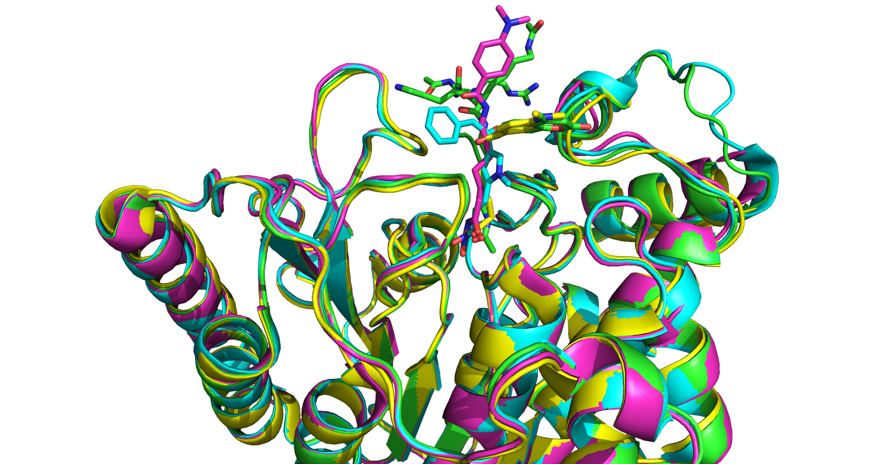

.. role:: ref

.. role:: label

.. raw::  latex

  \newcommand*{\docutilsroleref}{\ref}
  \newcommand*{\docutilsrolelabel}{\label}

==============
Lior's Thesis
==============

Introduction
=============
bla

Results
========

Description of the dataset
--------------------------

	The first step in training our classifier was obtaining a dataset of peptides that had their activity level with the respect to the HDAC8 enzyme verified experimentally. *Fierke et al* created a dataset composed of 361 6-mer peptides with the sequence GXK(Ac)YGC (where X,Y are all the amino acids except Cysteine). For each of these peptides, a level of activity with respect to HDAC8 was determined by measuring the percentage of deacetylation after 1 hour.(?) (**Add reference to the proper section in the supplementary material**)
	The dataset was divided to training and test sets by sorting the peptides by their activity , taking all the even rows to be the test set and all the odd rows to be the training set. That division assured even distribution of peptides with respect to their activity levels (avoiding a situation where one set holds a large number of high/low activity decoys).
	

Preparation of starting structure
---------------------------------

	For each of the peptide sequences a coarse model of the complex was generated based on the selected template, that coarse model is the starting structure that serves as input to the FlexPepDock protocol. We tested 2 approaches to create the starting complex, one involved threading the peptide sequence onto the backbone configuration taken from solved structures, the other approach included the extension of peptide to a complete linear polypeptide (all phi angles were set to -135.0 degrees, all psi angles to +135.0 degrees) and superimposing only the acetylated Lysine onto a position taken from the crystal structure. 

	The *no free lunch* theorem suggests that all search algorithms have the same average performance over all problems, and thus implies that to gain in performance on a certain application one must use a specialized algorithm that includes some prior knowledge about that problem. In previous studies we found that incorporating key interactions between the peptide and the receptor as constraints in FlexPepDock's search algorithm greatly improves the performance of the resulting predictor. 

	Unlike previous studies, where the key interactions from which the constraints were derived relied heavily on backbone atoms, we found that the dominant interactions in our case are mostly concentrated around the acetylated Lysine. 

.. figure:: images/figure_1.png
	:scale: 20%

	The key interactions from which the constraints were derived, taken from a solved crystal complex (PDB: 2v5w).

		For example, the interaction between D101 in the receptor and the N atom in the acetylared Lysine is critically important, a mutation D101A resulted in a complete loss of enzyme activity on the peptidic substrate and also on purified histones. [1]_ Additional constraints were derived from the interaction between the acetyl group and the two His, Asp in the active site - mostly in the purpose of fixating the acetylated Lysine in the active site.

Calibration of the protocol
------------------------------
	*London et al* [citation] developed a general framework for the prediction of binding specificity of flexible peptides to protein receptors. In general, the scheme of this framework follows a pipeline in which a collection of peptides are modeled in complex with the receptor using a high resolution peptide docking protocol [citation], then the energy estimations (termed *score*) for the modeled complexes are used as an input for a simple learning algorithm that results in a predictor that is able to distinguish binders from non-binders. In case the receptor is actually an enzyme that catalyzes a chemical reaction, we assume that binding = catalysis, although there are examples in which this assumption fails.[citation] 
	Previous studies have shown that a calibration process of a FlexPepBind protocol results in a more accurate predictor than a predictor that's created using a default set of parameters [citation]. The calibration process usually involves the selection of a template, adapting the scoring function[citation to bcl] and finding the right amount of sampling. 
	

Scoring function
.................

	The FlexPepDock simulations were performed using the standard Rosetta scoring schema (*score12*) and with a slightly modified *score12* that includes several minor adjustments that were shown to improve the resulting predictor. One such change was the introduction of a weak short range Coulombic electrostatic energy term (hack_elec). In our calibration process we validated some of these parameters, verifying that they indeed introduce an improvement to the resulting predictor.
	
	We've seen in several studies conducted in our lab that a slight *post-simulation* change to the scoring function might be beneficial in determining the relative binding affinity of the peptide to the receptor. In other words, the scoring function that is used for the modeling process might be slightly different than the scoring function used to evaluate the complexes after the simulation has been completed. These changes are:

	#) **Peptide score** - includes an estimation of the internal energy of the peptide
	#) **Interface score** - includes an estimation of the interactions across the interface
	#) **Reweighted score** - the sum of peptide score, interface score and total score.

	It is yet to be determined if the modification of the scoring function in the following fashion in the simulation phase itself also results in better estimation of the relative binding affinity.
	
	As we've previously discussed, there are several solved structures for HDAC8 each of them can serve as a potential template for our protocol. In addition, 
	To select the most suitable template for our protocol we modeled each of the peptide sequences in the library with a HDAC8 template and evaluated the resulting complex based on each of the above scoring schemes. 

Template selection
...................
	As we've previously discussed, our protocol models the interaction between a peptide and its corresponding receptor. FlexPepDock takes as input a three dimensional structure of the receptor and a low resolution approximation of the peptide. In our case, the receptor is HDAC8, its three dimensional structure was solved on numerous occasions and under different conditions in the last few years. In this study we tested multiple structures as templates for the FlexPepBind protocol, summarized in the table below.

	======	=========	============================================================
	PDB ID	Reference	Description
	------	---------	------------------------------------------------------------
	2v5w	[1]_		HDAC8 in complex with a p53-derived diacetylated peptide 
				with a Y306F catalysis abolishing mutation
	3f07	[2]_		HDAC8 complexed with APHA
	3ew8	[2]_		HDAC8 solved as a monomer, with a 
				catalysis abolished mutation: D101L
	1t67	[3]_		HDAC8 complexed with hydroxamate inhibitor (MS-344), 
				residues 62-68 were discarded from the model
	======	=========	============================================================

	Choosing the right template is a formidable challenge - some structures were solved with inhibitors - a thing that could induce a different *bound* structure than the actual real substrates. Others were solved with mutations that abolished catalysis and/or binding. And most of all, most structures were solved as dimers that interacted with their highly flexible regions, creating crystal contacts and potential interactions that might have altered the specificity profile of the enzyme.

	In order to select a template we applied a short FlexPepDock run on each of the above recetors, complexed with the top and bottom 5 binders while using Kolmogorov-Smirnov statistical to determine how well we could distinguish between the two classes. I also used a short round of minimization that proved useful in earlier studies. Both approaches nominated *2v5w* as the best candidate.
	

	An alignment of the structures from Table 1, demonstrating the conformational flexibility of the interface of HDAC8.

Sampling
..........
	The term *Sampling* in the context of FlexPepDock takes 2 different meanings. Since the entire Rosetta framework is based on non-deterministic simulation pathways, the resulting output is different from one simulation to the next and in order to capture the conformation of a complex, several simulation runs should be made in the hope that a large number of simulations converge to the lowest energy conformation. The other meaning of *sampling* in the context of FlexPepDock is the perturbation size of small/sheer moves of the peptide backbone. A large perturbation size increases the sampling space , causing the peptide to explore a larger number of conformations.
	
	Calibrating the amount of sampling in our FlexPepBind protocol in the context of number of simulations, requires us to find the trade-off between computation time (each simulation run is computationally intensive) and number of near-native output structures ( in optimal cases, the more we sample, the larger our signal/noise ratio). In the sampling space context, we aim at finding the trade-off between sampling different peptide conformations and the size of the sample space. If the peptide native structure is relatively different than the starting structure of the simulation (in term of phi/psi angles) then larger perturbations are a necessity in order to find it. Problem is, increasing the perturbation size also increases the space of possible conformations, potentially decreasing the signal/noise ratio.
	
	We found that a modest amount of sampling (in the context of number of simulation runs) is sufficient to generate a reliable predictor. Our findings correlate with an earlier study conducted by *London et al* [citation], that found that 200 simulation rounds are indeed sufficient for this purpose, and that a larger number of simulation rounds doesn't yield significant improvements in the perdictor's performance. However, in terms of the perturbation size, we found that the default amount of sampling that was sufficient for all previous studies, wasn't optimal in our case, perhaps since our simulation started from an extended peptide conformation, while all other studies reused an existing backbone conformation as a template that all the sequences were threaded on. It is important to note that we tested for this approach as well, threading the peptide on an existing backbone conformation - the *2v5w* PDB complex contains a 5 residues peptidic substrate, this approach didn't yield a better predictor than the one we got when we used an extended conformation, perhaps because of the nature of that particular peptidic substrate - 2 acetylated residues instead of 1, a fluorescenct Coumarin residue, and the fact that the complex was solved as a dimer - causing the peptide to maintain some interactions with the coupled receptor. [picture?]

	
Rigid body movements
.....................
	FlexPepDock applies rigid body movements to the peptide relative to the receptor. The transformations that define these movements are calculated using an axis and the point of center of mass of the peptide. By default , the axis equals to the vector that connects the closest peptide CA atom to the center of mass the peptide , to the closest receptor atom. Since the interaction between HDAC8 and its acetylated peptidic substrate involves a deep pocket in which the acetylated Lysine lies, we tested several axes 

.. figure:: images/anchor_arrows.png
	:scale: 30 %
	
	:label:`mc` The main axes we tested in the calibration process. One, rotating the peptide around the Lysine residue, the other around the vector that is formed by the linear conformation of the peptide .

Constraints
............
	HDAC8 has the ability to catalyze a deacetylation reaction with more than one substrate. We believe that its ability to maintain such a diverse specificity profile stems from the fact that its binding motif is encoded in the structure of its substrates. One of our most basic assumptions when applying the FlexPepBind protocol is that the ability to characterize the structural interaction motif properly correlates the capacity to reconstruct the entire specificity profile. To this date (10/2012) there is only one solved complex containing a peptidic substrate bound to HDAC8 (PDB *2v5w*) , so finding a motif in our case was somewhat a challenge. Figure :ref:`mc` illustrates the conserved interactions we derived from the solved complexes.
	
	Once a structural motif is determined, the scoring function must be modified to favor conformations that include that particular strucural motif. This is done via the introduction of constraints to the simulation. The most common constraints available in Rosetta are summarized below:
	
	
	=================	==========	=======================================
	Type of function	Parameters			Formula
	-----------------	----------	---------------------------------------
	Harmonic		x0, sd		.. image:: images/harmonic.png
							:scale: 50%
	Circular Harmonic	x0, sd		.. image:: images/circular_harmonic.png
							:scale: 50%
	Gaussian		mean,sd		.. image:: images/gaussian.png
							:scale: 50%
	=================	==========	=======================================
	
	Since we didn't want to alow much flexibility in the particular conserved interactions we defined as *conserved*, we used the harmonic function as our constraint, testing several standard deviations in our calibrations.
	
.. refer to supp for constraints.
	
Summary of calibration runs
............................
	The first calibration round was made by taking 5 best binders and 5 bad binders, trying to generate a set of parameters to be used for the entire training set.
	
	+---------------+----------------------+------------------+
	|Sequence	|	% deacetylation|	annotation|
	+===============+======================+==================+
	|GYK(ac)FGC	|93		       |		  |
	+---------------+----------------------+		  |
	|GYK(ac)FGC	|93		       |		  |
	+---------------+----------------------+   Good Binders	  |
	|GYK(ac)FGC	|93		       |		  |
	+---------------+----------------------+		  |
	|	s	|	    s          |		  |
	+---------------+----------------------+------------------+
	|GYK(ac)FGC	|93		       |		  |
	+---------------+----------------------+		  |
	|GYK(ac)FGC	|93		       |		  |
	+---------------+----------------------+   Bad Binders	  |
	|GYK(ac)FGC	|93		       |		  |
	+---------------+----------------------+		  |
	|	d	|	   d           |		  |
	+---------------+----------------------+------------------+
	
	
	This set of simulation allowed us to quickly distinguish between sets of parameters;
	
	======		================	===============================	===========	==================
	No.		Anchor (residue)	Sampling			Template	Scoring function
	------		----------------	-------------------------------	-----------	------------------
	1		366			* perturbation size = 30	2v5w		* Lazaridis-Karplus
						* 200 simulations per peptide.			* hack_elec = 0.5
	
	2		366			* perturbation size = 60	2v5w		* Lazaridis-Karplus
						* 500 simulations per peptide.			* hack_elec = 0.5
						
	3		366			* perturbation size = 90	2v5w		* Lazaridis-Karplus
						* 900 simulations per peptide.			* hack_elec = 0.5

	4		366			* perturbation size = 30	2v5w		* Lazaridis-Karplus
						* 500 simulations per peptide.			* hack_elec = 0.5
	
	5		366			* perturbation size = 20	2v5w		* Lazaridis-Karplus
						* 200 simulations per peptide.			* hack_elec = 0.5

	6		367 (chosen		* perturbation size = 20	2v5w		* Lazaridis-Karplus
			automatically		* 200 simulations per peptide.			* hack_elec = 0.5
			since its the 
			center of mass)	
			
	7		366			* perturbation size = 20	2v5w		* Rosetta's default
						* 200 simulations per peptide.			  score function
												  (score12)
	8		366			* perturbation size = 6 
						  (default)			2v5w		* Lazaridis-Karplus
						* 200 simulations per peptide.			* hack_elec = 0.5

	9		366			* perturbation size = 15	2v5w		* Lazaridis-Karplus
						* 200 simulations per peptide.			* hack_elec = 0.5

	10		366			* perturbation size = 15	2v5w		* Lazaridis-Karplus
						* 200 simulations per peptide.			* hack_elec = 0.25
	
	11		366			* perturbation size = 15	2v5w		* Lazaridis-Karplus
						* 200 simulations per peptide.	(threaded)	* hack_elec = 0.5
										[*]_	
														
	12		366			* perturbation size = 15	2v5w		* Lazaridis-Karplus
			(anchor was CH		* 200 simulations per peptide.			* hack_elec = 0.5
			atom, instead of
			CA)	
	
	13		366			* perturbation size = 15	3f07		* Lazaridis-Karplus
						* 200 simulations per peptide.			* hack_elec = 0.5
	
	14		366			* perturbation size = 15	3f07		* Lazaridis-Karplus
			(anchor was CH		* 200 simulations per peptide.			* hack_elec = 0.5
			atom instead of
			CA)								
	
	15		366			* perturbation size = 15	1t67		* Lazaridis-Karplus
						* 200 simulations per peptide.			* hack_elec = 0.5

	16		366			* perturbation size = 15	2v5w		* Lazaridis-Karplus
						* 200 simulations per peptide.			* hack_elec = 0.5
						* low resolution step 
						  (centroid mode)						
	
	18		366			* perturbation size = 15	2v5w		* Lazaridis-Karplus
			receptor anchor		* 200 simulations per peptide.			* hack_elec = 0.5
			was 289 
			(manually)
			[*]_
			
	======		================	===============================	===========	==================

.. [*] The sequence was threaded on the peptidic substrate backbone in the 2v5w crystal. Since this peptidic substrate was only 4 amino acid long (the train/test sequences were 6 residues long), the 2 extra amino acids backbone conformation attained an extended conformation.

.. [*] Setting the receptor anchor to be the 289 residue , creating an axis that aligns with the Lysine residue side-chain. This axis is directed inside the pocket , and allowed the peptide to rotate while the Lysine residue stays fixed (see figure :ref:`mc`)

After an initial phase of calibration , we were set to examine the parameters we learned from the brief simulations on the whole training set;

16	Whole data set , same conditions as 10
18	Threaded peptide, whole dataset, same as 16.				
21	made with same conditions of 10, only the starting structure was made by applying first prepacking and the a rough minimization with tolerance of 0.2. Also, the scoring term of disulfide distance was set to zero (2v5w)				
22	same as 21 only with 3f07 template				
23	Running was made with 10 configuration only, with - deacetylase_score_nodisulf
preparation of the starting structure was made with prepacking first then minimization with deacetylase_score_nodisulf
3f07	bad			
24	same as 23, with 2v5w				
25	same as 24, only minimization was performed before prepacking				
26	same as 25 , only with 3f07				
27	Structure prepared with minimization and then prepacking with deacetylase score, threaded on the 2v5w peptide				
28	same as 27 only prepacking without minimization. (Threading -> prepacking)				
29	Structure was prepared by applying minimization, then prepacking with deacetylase_score. then, same parameters as 10.				
30					
31	Structure was prepared like 29, only was ran with deacetylase_score_nodisulf.
Good separation.				
33	Whole dataset, 3f07 template, same as 10	KS=0.003

37	Threaded peptide (same conditions as 18) with peptide anchor atom set to be CH should be compared to 18				
38	Same as 10, setting the anchor to CH, whole dataset.				
39	Same as 10, with lowres_preoptimize flag set. whole dataset.				
40	Same settings as 10, preparing the structure with the deacetylase_score scoring function				
41	Same as 40 , sampling up to 500 decoys				
42	Same as 16, constraints are set to be 0.15				
43	Same as 16, constraints are set to be 0.25				
44					
45	Same as 10, only setting the receptor anchor to be 289, creating an axis that aligns with the lysine residue				

	
	
Whole data set analysis
--------------------------
	#) measures of success
	#) determination of cutoff
	#) statistical tests

Phosphosite database
----------------------

.. [1] Vannini A, Volpari C, Gallinari P, et al. Substrate binding to histone deacetylases as shown by the crystal structure of the HDAC8-substrate complex. EMBO Rep. 2007;8(9):879-84.
.. [2] Dowling DP, Gantt SL, Gattis SG, Fierke CA, Christianson DW. Structural studies of human histone deacetylase 8 and its site-specific variants complexed with substrate and inhibitors. Biochemistry. 2008;47(51):13554-63.
.. [3] Somoza JR, Skene RJ, Katz BA, et al. Structural snapshots of human HDAC8 provide insights into the class I histone deacetylases. Structure. 2004;12(7):1325-34.

.. footer::
	Page ###Page### of ###Total###
